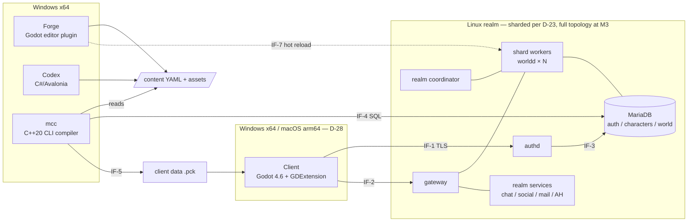

# System Architecture Overview

**Version:** 0.6 — 2026-07-05 (v0.6: packaging & CD per D-30 — §5 deployment view gains GHCR autopublish + Helm option. v0.5: macOS client per D-28/Baseline v0.5 — player-machine platform + client deploy row updated. v0.4: IF-8 schema authored per A-12 (`schema/content/asset.schema.yaml`, `amb.` prefix added per D-24); §4 mcc row corrected — Godot headless is used for resource *import* only, `mcc` assembles `.pck` containers itself (tools SAD §2.7). v0.3: sharded-realm scale-up per D-23 — gateway/coordinator/shard-worker topology, IF-2/IF-3 shard messages. v0.2: SAD reconciliation — IF-6/IF-8 drafts adopted per D-18/D-20, IF-10 registered per D-21)
**Status:** Binding system-level view. Every track SAD (`docs/sad/`) zooms into one container of this diagram and MUST reference the interface IDs (IF-x) defined here. Interface changes require cross-track sign-off, same rule as Baseline §5.1.
**Reads with:** [Game Design Baseline](00-GAME-DESIGN-BASELINE.md) (features/milestones), [Sync Decisions](01-SYNC-DECISIONS.md) (D-01..D-17), [Content Schema v1](../schema/content/README.md).

## 1. System context

## 2. Interface registry

Every SAD states which interfaces it **owns** (defines the contract), **implements**, or **consumes**.

| ID | Interface | Owner | Consumers | Contract location | Status |
|----|-----------|-------|-----------|-------------------|--------|
| IF-1 | Auth protocol: login, realm list, session grant (TLS over TCP, FlatBuffers, SRP6a-style verifier) | Server | Client | `/schema/net/auth.fbs` | to design (M0) |
| IF-2 | World protocol: movement, entity state, combat, chat, quests… (TCP, FlatBuffers, opcode-per-table). Client connects to the **gateway**; includes shard-transfer + AoI-refresh messages (D-23) | Server | Client | `/schema/net/world.fbs` | to design (M0, A-11) |
| IF-3 | Session handoff: authd writes gateway-scoped session grant to auth DB; gateway validates token on connect and routes to shard workers (D-23) | Server (internal) | — | server SAD | to design (M0, A-11) |
| IF-4 | Compiled world data: SQL schema of the world DB as produced by `mcc` (content hash + schema version manifest; worldd refuses mismatches) | Tools | Server | `/schema/sql/world/` | to design (M0) |
| IF-5 | Client data packs: `.pck` layout, resource naming by asset/content ID, pack manifest with engine pin + content hash | Tools | Client | `/schema/pck-layout.md` | to design (M0) |
| IF-6 | Zone chunk format: Forge-exported chunk scenes + zone grid manifest (geometry for client streaming, cell metadata for server AoI/navmesh). Working baseline: 128 m chunks, zone-local coords, 1 m heightfield, 32 m Recast tiles (tools SAD §3, adopted per D-20) | Tools | Client, Server | `/schema/chunk/` | **draft — A-08 sign-off walk due M0 exit**; M0 itself uses a flat bootstrap map (D-19) |
| IF-7 | Live-preview hot reload: GM-authenticated editor channel on worldd preview maps; `mcc --watch` push (D-07) | Server | Tools, Client | server SAD §hot-reload | to design (M1) |
| IF-8 | Asset registry: per-pack `assets/*.asset.yaml` manifests mapping asset IDs → LFS source files + provenance (TD-09) + import hints; `mcc` resolves them when building IF-5 packs; TLS-07 validates existence (lint L020–L022). Field set = D-18 union (core envelope + art + audio extension blocks); `amb.` prefix per D-24 | Tools | Art, Music, Client | `/schema/content/asset.schema.yaml` | **schema v1 authored (A-12); Art/Music sign-off + A-15 source-location ruling pending** |
| IF-9 | `idmap.lock`: committed string-ID → numeric-ID map with per-namespace ID bands (numeric id = band×2²⁰ + local index, core = band 0; tools SAD) | Tools | Server | tools SAD | draft (tools SAD) |
| IF-10 | Dev-realm deploy channel: `mcc` pushes compiled world SQL to a dev/test-realm DB + signals worldd reload (distinct from IF-7 preview-map hot reload) | Tools (push) / Server (reload signal) | — | tools + server SADs | to design (M1, per D-21) |

## 3. Shared architectural principles

1. **Server is law** — the client renders and predicts; every gameplay outcome is server-computed. No trust in client input beyond movement intent (validated, OPS-03).
2. **Schema-generated edges** — every process boundary (IF-1/2) uses code generated from `/schema` FlatBuffers definitions (D-01). No hand-written serializers.
3. **Single funnel** — only `mcc` produces runtime artifacts (IF-4/5). Forge, Codex, CI, and community packs all route through it; deterministic double-build hashing keeps it honest.
4. **Content is data** — gameplay systems (server) and presentation (client) are generic engines parameterized entirely by compiled content. Adding a quest touches zero code.
5. **Stable IDs** — string IDs in YAML, numeric IDs only via IF-9, asset references only via IF-8. Nothing references file paths.
6. **Clean room** — CMaNGOS/TrinityCore inform the architecture (grid AoI, map update loops, DB split); no GPL code crosses into the Apache-2.0 tree.

## 4. Technology summary

| Container | Language / runtime | Key deps | Deploy |
|-----------|-------------------|----------|--------|
| Client | Godot 4.6+ (GDScript UI, C++ GDExtension core) | FlatBuffers, custom net/prediction/streaming modules | Windows x64 installer + macOS arm64 notarized bundle (D-28), shared updater |
| authd | C++20 | OpenSSL (TLS), FlatBuffers, MariaDB connector | Linux, Docker |
| gateway / coordinator / realm services | C++20 (M2 gateway split, M3 full topology per D-23) | FlatBuffers, internal bus | Linux, Docker |
| worldd (shard worker) | C++20 | FlatBuffers, MariaDB connector, Recast (navmesh runtime) | Linux, Docker |
| mcc | C++20 CLI | yaml-cpp, FlatBuffers, Recast (navmesh bake), Godot headless (resource import only — `mcc` assembles `.pck` containers itself, tools SAD §2.7) | Win + Linux |
| Forge | Godot editor plugin (GDScript + `forge_core` GDExtension) | Terrain3D (pending A-09 spike) | Creator Kit bundle |
| Codex | C# / .NET 8, Avalonia 11 | YamlDotNet, node-graph control | Windows x64 |
| Art pipeline | Blender + Python export addon, glTF 2.0 | Godot import presets, LFS | — |
| Audio pipeline | DAW-agnostic WAV masters → `mcc` Ogg encode | Godot AudioStreamInteractive/Synchronized | — |

## 5. Deployment view (test realm, M0+)

Every green push to `main` autopublishes the daemon images to GHCR (SHA-tagged, digests in the build manifest — CI is the only image producer, D-30). Nightly CI: server build (Linux) + client export (Windows/macOS) + `mcc` compile of `/content` → deploy `authd`+`worldd`+MariaDB via Docker Compose (pulling the published images) to the test realm host; client installer + matching `.pck` published; content hash ties all three (IF-4/IF-5 manifests). A versioned Helm chart offers the same topology on Kubernetes (single-realm v0; sharded chart with OPS-04 at M3). Prometheus scrapes both daemons (OPS-01); the OTel collector re-exports per D-29.

## 6. SAD index

| Track | Document | Zooms into |
|-------|----------|-----------|
| Server | [server-sad.md](sad/server-sad.md) | authd, worldd, DB schemas, IF-1/2/3/4/7 server side |
| Client | [client-sad.md](sad/client-sad.md) | Godot client, GDExtension modules, IF-1/2 client side, IF-5/6 consumption |
| Tools | [tools-sad.md](sad/tools-sad.md) | mcc, Forge, Codex, IF-4/5/6/8/9 definitions |
| Art | [art-sad.md](sad/art-sad.md) | DCC→glTF→Godot pipeline, IF-8 art usage, LOD/validation tooling |
| Music | [music-sad.md](sad/music-sad.md) | Adaptive audio runtime + audio pipeline, IF-8 audio usage |
