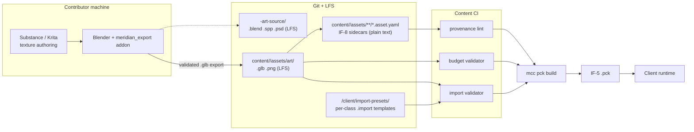
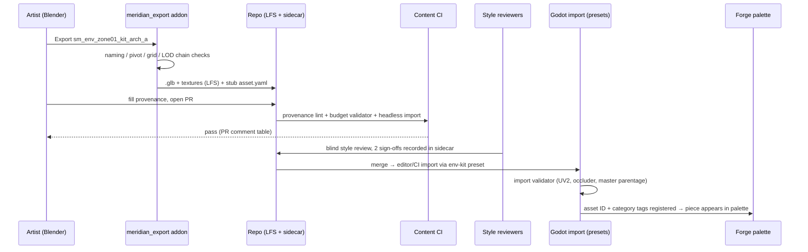
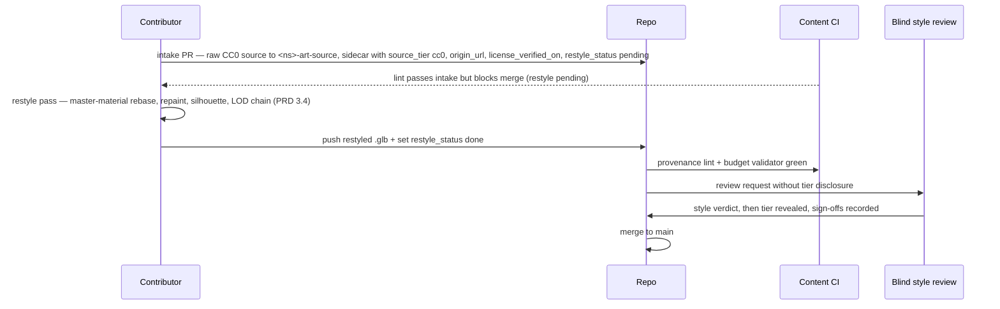
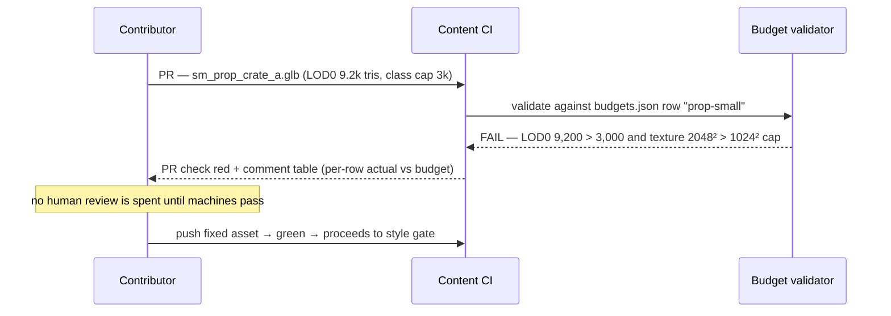

# Art Track SAD — Asset Pipeline Architecture

**Track:** Art
**Version:** 0.2 — 2026-07-06 (A-15 RESOLVED / D-31: asset source + IF-8 sidecars are pack-local at `content/<ns>/assets/**`, not the earlier repo-level `/assets/**`; §1, §2, §3.2, §7, §10 corrected. v0.1: initial draft)
**Status:** Draft for cross-track review
**Zooms into:** the "Art pipeline" container of the [Architecture Overview](../02-ARCHITECTURE-OVERVIEW.md) §4 — DCC→glTF→Godot pipeline, IF-8 art usage, LOD/validation tooling.
**Reads with:** [Art PRD v0.2](../prd/art-prd.md) (budgets, sourcing tiers, kit contract — binding requirements), [Content Schema v1](../../schema/content/README.md) (asset ID grammar), Tools SAD (IF-8 schema owner).

This is a **pipeline architecture document**. It describes the systems that move an asset from a Blender scene to a rendered frame on min-spec hardware — export tooling, directory contracts, import automation, provenance enforcement, budget validation, and review flow. It does not describe the assets themselves (that is the art bible and the PRD).

---

## 1. Purpose & scope

The art pipeline turns contributor work (Tier A/B/C sources per PRD §3.1) into deterministic, budget-compliant, license-clean Godot resources that `mcc` can pack into IF-5 client data. Everything between "artist saves a `.blend`" and "mesh appears in a `.pck`" is in scope: the Blender export addon, the pack-local asset LFS tree (`content/<ns>/assets/**`, A-15), IF-8 sidecar authoring, Godot import presets, validators, CI gates, and review tooling. Runtime rendering (scalability tiers, streaming) is Client track; `mcc` itself and the IF-8 schema are Tools track.

### 1.1 Interface table

| ID | Interface | Art role | Notes |
|----|-----------|----------|-------|
| IF-8 | Asset registry (`assets/*.asset.yaml` → LFS files + provenance + import hints) | **Consumes** the schema (Tools owns it); **owns** the art-class import-hint vocabulary and the provenance field requirements (§3.1) | No asset ships without a sidecar; TLS-07 validates existence, the art lint (§3.2) validates content |
| IF-5 | Client data packs (`.pck`) | **Feeds** — art resources enter packs only via `mcc` reading IF-8 manifests | Art never hand-builds packs; single-funnel principle (Overview §3.3) |
| IF-6 | Zone chunk format | Indirect — kit pieces referenced from Forge chunks by asset ID | Kit contract (§6) is the coupling point |

Art additionally owns the **art side of provenance** (TD-09): which fields exist, what values pass, and the CI lint semantics. Tools owns where those fields live in the schema file.

### 1.2 Out of scope

Audio sidecars (Music SAD), the `mcc` pck assembler internals (Tools SAD), runtime LOD selection and visibility ranges (Client SAD, tuned jointly), terrain system choice (open — PRD §10 Q9).

---

## 2. Pipeline architecture



The pipeline has one law: **the `.glb` in the repo is already correct**. Every enforceable rule (naming, scale, pivot, LOD chain, material parentage) is checked at export time by the addon and re-checked in CI — Godot import is a mechanical, preset-driven step with no per-asset human decisions.

### 2.1 Blender export addon (`meridian_export`)

A Python addon distributed in-repo (`/tools/blender/meridian_export/`), pinned to the Blender LTS the project standardizes on. It is the only sanctioned export path — the stock glTF exporter is wrapped, not replaced.

Responsibilities:

- **Naming enforcement.** Object/mesh names must match the `sm_`/`sk_`/`t_`/`a_`/`fx_` prefixes and the asset-ID-derived stem (PRD §4.2). Export refuses on mismatch with a fix-it panel (rename suggestions), not a silent warning.
- **Scale/transform enforcement.** Asserts 1 BU = 1 m, all transforms applied, no negative scales, no stray parent offsets. Axis conversion to Godot -Z forward / Y up handled by the exporter settings baked into the addon — contributors cannot get it wrong.
- **Pivot validation.** Per kit-piece category (floor/wall/prop/cliff — PRD §6.1), checks the origin sits at the contracted corner/edge/centroid within 1 mm tolerance, and that bounds land on the 50 cm grid (§6).
- **LOD chain export.** Collections named `LOD0..LOD3` export as suffixed meshes (`_lod0.._lod3`) in one `.glb`. The addon checks chain completeness per asset class (env kit needs LOD0-3; weapon LOD0-2; grass a single LOD — table from PRD §2.1 compiled into the addon as data, `/tools/blender/meridian_export/budgets.json`, shared with the CI validator so the two never drift) and checks vertex-snapped borders across LODs for kit pieces (§6).
- **glTF `extras` for material slots.** Each material slot is tagged with `meridian:master` (which of the ≤ 12 masters it instantiates, §2.4) and `meridian:params` (the override parameter set name). Godot's import script reads extras and rebinds slots to the in-repo master materials — Blender materials are never shipped, only referenced.
- **Sidecar scaffolding.** On first export of a new asset ID, emits a stub `*.asset.yaml` with the asset ID, file list, asset class, and empty provenance fields — so the contributor fills in a form, never writes YAML from memory.
- **Occluder/collision export.** Meshes named `occ_*` / `col_*` export as extras-tagged nodes that the import preset converts to `OccluderInstance3D` / simple collision shapes.

The addon is versioned; the exported `.glb` embeds `meridian:addon_version` in asset extras, and CI rejects exports from addon versions older than the repo's minimum (guards against stale local checks).

### 2.2 Pack-local asset directory layout (`content/<ns>/assets/**`, A-15)

Asset source and IF-8 sidecars live **pack-local** under each pack's `content/<namespace>/assets/**` tree (A-15 / D-31, §7.1 of the Sync Decisions), so a `.mcpack` is one self-contained subtree — the TLS-08 self-containment constraint. The tree mirrors asset-ID namespaces so path↔ID mapping is mechanical (PRD §4.3), one directory per asset holding the shipped files and the IF-8 sidecar next to them:

```
content/
  core/                                  ← namespace = pack root (content-schema grammar)
    pack.yaml
    assets/
      art/
        char/human/male/base/
          sk_char_human_male_base.glb        (LFS)
          t_char_human_male_base_bc.png      (LFS)
          base.asset.yaml                    ← IF-8 sidecar (plain text, diffable)
        env/zone01/kit/wall_stone_a/
          sm_env_zone01_kit_wall_stone_a.glb
          wall_stone_a.asset.yaml
  core-art-source/                       ← never packed; .blend/.spp/.psd (LFS, lock-enabled)
    char/human/male/base/...
```

- `core:art.env.zone01.kit.wall_stone_a` ⇔ `content/core/assets/art/env/zone01/kit/wall_stone_a/` — the manifest generator that `mcc` consumes derives one from the other; a CI check fails on any divergence. The IF-8 `source` field is pack-root-relative (`assets/art/...`).
- **LFS patterns** (`.gitattributes`): `*.glb *.gltf *.blend *.png *.tga *.psd *.exr` are extension-global, so they cover `content/**/assets/**` binaries without a path clause. Text stays in plain Git: `*.asset.yaml`, `*.gdshader`, `*.tres`, `*.tscn`, `*.import`, import presets. LFS locking enabled for shared rig/skeleton `.blend` sources.
- Community packs (TLS-08, M3) follow the identical layout under their own namespace directory; the pipeline tooling is namespace-agnostic — this is exactly the property pack-local layout guarantees.

### 2.3 Godot import-preset system

Godot decides import behavior per file via `.import` sidecars — left to defaults, every contributor's editor produces different resources. We ship **versioned per-class import templates** in `/client/import-presets/` plus an `EditorImportPlugin`-adjacent hook (`meridian_import` editor plugin, built with Tools track) that:

1. Classifies each incoming `.glb`/`.png` by its IF-8 `asset_class` import hint (falling back to path pattern),
2. Stamps the matching template into the asset's `.import` file,
3. Runs the import validator (PRD §4.2) and fails loudly in-editor and in headless CI.

| Preset | Applied to | Key settings |
|---|---|---|
| `character` | `sk_char_*`, `sk_npc_*` | Skeleton retained + BoneMap to shared rig; blend shapes on; LOD meshes bound to visibility ranges; no importer LOD generation |
| `env-kit` | `sm_env_*_kit_*` | Lightmap UV2 unwrap (fixed texel size), occluder node conversion, static collision from `col_*`, importer LOD generation **off** (hand-authored chains only) |
| `prop` | `sm_prop_*`, small clutter | Importer-generated LODs **allowed** (PRD §2.1), UV2 on, shadow-mesh simplification on |
| `foliage` | `sm_fol_*` | No UV2 (unlit-shadow path), MultiMesh-safe flags, custom AABB margin for shader wind, billboard LOD slot honored |
| `vfx-texture` | `t_fx_*` | No mipmaps-streaming assumptions, VRAM-compress per channel packing, sRGB/linear per suffix (`_bc` sRGB, `_orm`/`_n` linear) |
| `texture-std` | remaining `t_*` | BC-class VRAM compression, mipmaps on, source authored at 2× target (PRD §2.3) |

Preset files are plain text and versioned; a preset bump triggers a full headless reimport in CI so drift between editor caches and CI output is impossible (§8.1).

### 2.4 Material library architecture

- **≤ 12 masters game-wide** (PRD §2.4): Character, Hair, Eye, EnvOpaque, EnvTrimsheet, Foliage, Terrain, Water, Glass, VFX-Translucent, UI, Decal. Where `StandardMaterial3D` suffices (EnvOpaque, most props) the "master" is a `.tres` preset; the rest are hand-written `.gdshader` spatial shaders in `/client/art/materials/masters/`.
- **Instancing convention:** assets never own shader code. Each asset's slots resolve — via the glTF extras from §2.1 — to a `ShaderMaterial`/`StandardMaterial3D` **instance resource** (`mi_*.tres`) that overrides only parameters (textures, tints, scalar knobs). `mi_` resources live beside the asset; masters are core-team-owned and change under review with min-spec captures (PRD §2.4).
- The import validator hard-fails any material whose `meridian:master` extra names a shader not in the master list — "no one-off shaders merged, ever" is enforced mechanically, not socially.
- Per-kit discipline: one `mi_` set shared across a kit family (≤ 12 unique material sets per kit, PRD §2.3); the budget validator counts them (§4.2).

---

## 3. Provenance & licensing system

Design call: **the TD-09 provenance record is a block inside the IF-8 sidecar**, not a separate file in `/content/assets/provenance/` as PRD §3.3 sketched. One sidecar per asset carries files + import hints + provenance; one lint reads one file; nothing can drift. (PRD §3.3 location to be amended; flagged in §10.)

### 3.1 Required sidecar fields (art classes)

Tools owns `asset.schema.yaml` — **authored as of Schema v1.1 ([asset.schema.yaml](../../schema/content/asset.schema.yaml), A-12)**; the art-required fields, as landed (note vs. this SAD's original draft: `license` is a top-level core field, and `restyle_status`/`reviewed_by`/`tags` sit in the top-level art block per the D-18 union, not inside `provenance`):

```yaml
# <name>.asset.yaml — IF-8 (meridian/asset@1), art fields as landed
class: kit_piece                # enum drives import preset + budget row (§2.3, §4.2)
license: "CC0-1.0"              # SPDX, top-level core field; CI allowlist = CC0-1.0, CC-BY-4.0
provenance:
  source_tier: cc0              # original | ai | cc0 | cc_by   (engine-locked: no enum value exists)
  origin_url: "https://..."     # schema-required for ai/cc0/cc_by; license pinned to URL + date
  license_verified_on: 2026-09-14
  authors: ["github-handle"]
  attribution: "Rock030 by ambientCG"   # schema-required iff source_tier == cc_by → CREDITS generator (§3.3)
  ai:                            # schema-required iff source_tier == ai
    tool: "toolname vX.Y"
    prompts_file: prompts/rock_cliff03.txt   # auditable; no franchise/artist terms (PRD §3.2)
import_hints:                    # art-defined vocabulary (D-18 art block)
  lod_policy: authored           # authored | importer | single
  lightmap_uv2: true
  occluder: true
  multimesh_safe: true
contract_envelope:               # greybox snapshot for 1:1 art-pass swaps (§6.3)
  pivot: { x: 0, y: 0, z: 0 }
  aabb_min: { x: -1, y: 0, z: -1 }
  aabb_max: { x: 1, y: 3, z: 1 }
  collision_hash: "blake3:…"
restyle_status: done             # not_applicable | pending | done — tiers ai/cc0/cc_by cannot merge as pending
reviewed_by: ["art-lead-handle", "deputy-handle"]   # two-reviewer style sign-off (PRD §7.2)
tags: [wall, town]               # Forge palette filters (§10 Q4)
```

### 3.2 Provenance CI lint

A stage in content CI (shared implementation with TLS-07), run on every PR touching `content/**/assets/**`:

1. Every shipped binary under `content/<ns>/assets/**` is listed in exactly one sidecar; every sidecar file exists in LFS. (Existence — TLS-07.)
2. `license` ∈ {CC0-1.0, CC-BY-4.0}; anything else **fails outright** — there is no tolerated engine-locked tier (PRD §3.3). A denylist of known engine-locked origins (quixel.com, fab.com, unrealengine.com/marketplace, assetstore.unity.com URLs) fails even if the license field claims CC0.
3. Conditional-field completeness: `cc-by` ⇒ `attribution` + `origin_url`; `ai` ⇒ `ai.tool` + `ai.prompts_file` (and the prompts file exists and passes a franchise-term denylist grep); tier ≠ original ⇒ `restyle_status: done`.
4. `reviewed_by` has ≥ 2 entries before merge to main (populated by the review bot on approval, §8.3 — contributors don't self-attest).

### 3.3 CC-BY attribution generation

`tools/gen_credits.py` (invoked by `mcc` during IF-5 assembly, and standalone in CI):

- Walks all IF-8 sidecars in the packs being built, collects every `source_tier: cc-by` record, groups by origin/author, and emits `CREDITS-assets.md` plus a machine-readable `credits.json` that is **packed into the .pck** and rendered by the client credits screen (Client track consumes; format agreed at M1).
- Deterministic output (sorted by origin then asset ID) so the file only diffs when attribution actually changes.
- CI cross-check: a `cc-by` asset present in a pack but absent from the generated credits is a build failure — attribution can never silently lapse, which is the legal requirement CC-BY actually imposes on us.

---

## 4. LOD & budget tooling

### 4.1 LOD generation strategy — the per-class call

| Asset class | Strategy | Rationale |
|---|---|---|
| Characters, creatures, bosses | **Hand-authored** | Skinned silhouettes and bone-weight preservation defeat auto-decimation; silhouette-first pillar |
| Env kit pieces, hero landmarks | **Hand-authored**, addon-assisted | Vertex-snapped borders at every LOD (kit contract) cannot be guaranteed by decimation; addon provides a "propagate border verts" operator so LOD1-3 authoring is minutes, not hours |
| Weapons, armor pieces | Hand-authored LOD1, **scripted decimate** acceptable for the last step | Small silhouettes; final LOD is sub-1k tris where decimate artifacts don't read |
| Small props / clutter | **Godot importer-generated** (preset `prop`) | PRD §2.1 explicitly allows it; zero authoring cost, reviewed at style gate |
| Foliage trees | Hand-authored LOD1-2 + **scripted billboard imposter** (LOD3) via the addon's imposter baker (orthographic atlas render in Blender) | Imposters are mechanical; leaf-card LODs are not |
| Grass/ground cover | Single LOD + distance cull | Per PRD §2.1 |

Scripted decimate lives in the export addon (`Generate draft LODs` operator) as a **starting-point tool for every class** — contributors refine from a draft rather than from scratch — but only the classes marked above may ship it unedited. Community LOD-authoring tasks (PRD §7.1) consume accepted LOD0 assets and submit the chain as a follow-up PR; the budget validator treats an incomplete chain as a hard failure only once the asset is referenced by content.

### 4.2 Per-asset budget validator (CI stage)

`tools/validate_asset_budgets.py`, running headless (no Godot needed — parses glTF directly via `pygltflib`), driven by the same `budgets.json` the addon uses (single source of truth, §2.1):

- **Triangles:** per-LOD counts vs the PRD §2.1 table row for the sidecar's `asset_class`, including chain-percentage tolerances (±20% of the target ratio).
- **Textures:** resolution vs PRD §2.3 class caps (2× source rule), channel-packing suffix conventions, estimated VRAM after BC compression vs the class VRAM budget.
- **Materials:** slot count, `meridian:master` extras all resolve to the master list, per-kit unique-material-set count ≤ 12 (aggregated across the kit family directory).
- **Bones:** skeletal class caps (≤ 120 hero / ≤ 90 mob / ≤ 150 boss / ≤ 40 critter).
- Output: a PR comment table (per-LOD actual vs budget, pass/fail per row) so failures are self-explanatory to contributors — review throughput depends on machines saying "no" before humans do.

### 4.3 In-Godot perf harness

`tools/perf-harness/` — a headless-launchable Godot project (with Client track):

- **Capture scenes:** the standard review map, per-kit "assembly rooms" (every piece of a kit family auto-instanced in a grid + a representative dressed vignette), and from M2 Zone-01/Dungeon-01.
- **Bench script** drives camera paths across LOD switch-distance bands, capturing per band: frame time, draw calls, rendered primitives, video memory (`RenderingServer` viewport statistics + profiler), and a screenshot at each LOD transition for pop review (PRD §8.1).
- Runs weekly on the min-spec bench machine (GTX 1060/16 GB, 1080p Low) and on-demand for category-new assets, attaching the capture to the PR. Gate values: 33 ms / ≤ 2,500 draw calls / class VRAM budgets. The harness emits a machine-readable `bench.json` so trend regressions are graphable, not anecdotal.
- CI runs the same harness on a non-min-spec runner in "relative mode" (draw-call and VRAM counts are hardware-independent; frame time is advisory only) — so every PR gets draw-call/VRAM truth even between weekly bench runs.

---

## 5. Runtime views

### 5.1 New env-kit piece → Forge palette



### 5.2 Restyle of a CC0 asset



### 5.3 Budget violation rejected in CI



---

## 6. Kit contract enforcement

The PRD §6.1 contract (50 cm grid, category pivots, seam-free tiling at every LOD, instancing/occluder/collision rules) is enforced at **two mechanical layers plus one procedural rule** — never by reviewer eyeballs alone:

1. **Export addon (fast feedback, artist's machine):** pivot-position check per category; bounds modulo 50 cm (walls on 1 m/2 m/4 m modules, heights 3 m/4.5 m, apertures 1.5×2.5 m) within 1 mm; border-vertex snap comparison across LOD0-3 (border verts of each LOD must lie on the piece's tiling planes); presence of `occ_*`/`col_*` meshes for wall/cliff/building classes. Failures block export.
2. **CI (trust nothing local):** the budget validator re-runs the identical geometric checks on the committed `.glb` (same code, imported as a library) — a contributor bypassing the addon cannot bypass CI.
3. **Greybox→art-pass swap (procedural + validated):** greybox and final piece share one asset ID; the art pass is a file replacement in the asset's directory, not a new ID. The validator diffs the new `.glb` against the greybox's recorded **contract envelope** (pivot, AABB, collision shape hash — snapshotted into the sidecar at greybox merge as `contract_envelope:`) and fails on deviation beyond tolerance. Since Forge chunks and server collision reference the ID, a passing swap is invisible to every zone built from the piece (PRD §6.2); deviations require the Tools-track sign-off flag set in the sidecar by a Tools reviewer.

---

## 7. Milestone build plan

| Milestone | Pipeline deliverables | Proof |
|---|---|---|
| **M0** | `meridian_export` v0 (naming/scale/pivot/LOD checks, sidecar scaffolding); import presets v1 (all six classes); provenance lint in CI; `budgets.json` v1; `content/<ns>/assets/**` layout + LFS config landed | 1 character (`core:art.char.human.male.base`) + 1 env kit (~15 Zone-01 pieces) through the **full** pipe: Blender → addon export → sidecar → CI green → preset import → `mcc` pack → visible in client (IT-M0) |
| **M1** | LOD tooling (draft-decimate operator, border-propagate operator, imposter baker); budget validator as blocking CI; perf harness v1 + weekly bench; Forge palette registration (asset ID + tags → TLS-02 browser); credits generator v1; contract-envelope snapshotting for greybox kits | Zone-01 greybox kit (~80 pieces) authored and placed entirely via the pipeline; 50-player bench scene inside §2.5 budgets |
| **M2** | Art-pass swap tooling at scale: envelope-diff validator, batch swap reports (which greybox IDs remain), assembly-room capture scenes per kit; per-zone VRAM roll-up in the harness | Zone-01 art pass replaces ~150 greybox pieces 1:1 with zero Forge rework; beautiful-corner bench.json published as the budget template |
| **M3** | Community submission flow: namespaced `content/<pack>/assets/` support end-to-end, contributor kit (addon + presets + review map + templates), deputy-review tooling (blind queue), provenance lint hardened for third-party packs | Community-built zone from released kits passes style + perf gates on an unmodified pipeline (IT-M3); 100% shipped-asset provenance coverage |

---

## 8. Quality attributes

### 8.1 Pipeline determinism

Same input must produce the same import result on every machine and in CI: addon version pinned and embedded in exports (§2.1); import presets versioned with full headless reimport on preset bumps (§2.3); Godot editor version pinned repo-wide (matches IF-5 engine pin); `mcc` double-build hashing (Overview §3.3) extends to art — two headless imports of the same `.glb` + preset must hash identically, checked nightly. Any nondeterministic import setting (e.g. parallel unwrap seeds) is configured to a fixed seed or disabled.

### 8.2 LFS scale

Projection at PRD asset counts (M3 ≈ 700 shipped assets + sources): shipped `.glb`+textures average ~8 MB/asset ⇒ ~6 GB packed art; source `.blend`/`.spp` average ~40 MB/asset for authored tiers ⇒ 20–30 GB of LFS by M3. Mitigations: contributors clone with `GIT_LFS_SKIP_SMUDGE` + pull only their working namespace paths (documented one-liner in the contributor kit); `art-source/` excluded from CI checkouts (CI validates shipped files only); LFS server budget reviewed at each milestone; prune policy for superseded source revisions (keep last 2). A repo split (`assets-source` submodule) is the escape hatch if source growth outpaces this — decision checkpoint at M2 exit.

### 8.3 Review throughput

The gates are ordered so human attention is the last filter: CI (provenance, budgets, kit geometry) rejects mechanically; the style gate sees only machine-green PRs with the validator's screenshots and bench captures pre-attached. Blind review is tooled, not honor-system: the review request template omits tier; the sidecar's `source_tier` is displaced into a CI-only file view during review (a bot posts the tier in a spoiler comment after the verdict, then writes `reviewed_by` into the sidecar). Target: ~30 contributor assets/month at M1 review capacity (PRD §7.2), with deputy onboarding tracked as a throughput metric.

---

## 9. Technology decisions & rejected alternatives

| Decision | Chosen | Rejected | Why |
|---|---|---|---|
| Convention enforcement | Blender export addon with hard checks | Manual discipline + docs | Open-source contributor base has unbounded variance; every rule not enforced by a machine will be violated weekly. The addon also makes the *correct* path the *easy* path (stubbed sidecars, one-click LOD drafts) — enforcement that gives value back gets adopted |
| Interchange format | glTF 2.0 (`.glb`) | FBX | glTF is an open ISO standard matching the all-open stack mandate; Godot's first-class import path; FBX is a closed Autodesk format needing FBX2glTF conversion anyway (lossy, another moving part); glTF extras give us a sanctioned metadata channel (§2.1) FBX lacks |
| LOD automation | Blender decimate scripts + hand-authoring per class (§4.1) + Godot importer LODs for small props | Simplygon / commercial mesh-reduction SDKs | Simplygon-class tools are proprietary, per-seat/licensed, and would sit on the critical path of an Apache-2.0 project every contributor must be able to run. Decimate is inferior per-click but is scriptable, free, and we spend the difference on hand-authoring exactly where it matters (silhouette classes). meshoptimizer (MIT) is the upgrade path if scripted quality needs a lift — it can slot into the addon without workflow change |
| Provenance storage | Provenance block inside the IF-8 sidecar | Separate `/content/assets/provenance/` tree (PRD §3.3 draft) | One file per asset, one lint, no ID-sync drift between two YAML trees; `mcc` already reads the sidecar for IF-5 |
| Import consistency | Committed per-class `.import` templates + stamping plugin | Trusting editor defaults / per-asset hand tuning | `.import` files silently diverge per machine; presets make import a pure function of (glb, preset version) — required for §8.1 determinism |
| Texture authoring | Substance recommended, ArmorPaint/Krita fully-open path | Substance required | Nothing license-bound may sit on the contributor critical path (PRD §7.1) |

---

## 10. Risks & open questions

### Risks

| # | Risk | Impact | Mitigation |
|---|---|---|---|
| AR1 | **IF-8 schema lands without the art fields** (§3.1) or with incompatible shapes — Tools owns the file, Art owns the requirements | Provenance lint and import-hint automation blocked; TD-09 unenforceable at M0 | This SAD's §3.1 field list submitted to Tools track as the art requirement for `asset.schema.yaml` **before** its M0 design freeze; joint review of the schema PR |
| AR2 | **Addon/CI check divergence** — two implementations of the same geometric rules drift | Contributors pass locally, fail CI (or worse, inverse) | Single shared library (`meridian_asset_checks`, Python) imported by both the addon and CI; `budgets.json` as common data |
| AR3 | **Godot import nondeterminism** across editor patch versions breaks §8.1 | Pack hash churn; mcc double-build failures blamed on art | Editor version pinned to the IF-5 engine pin; nightly double-import hash check catches regressions on engine bumps before they land |
| AR4 | **LFS cost/scale** exceeds §8.2 projections (contributor source files are unbounded) | Hosting cost; clone friction driving contributors away | Source-size lint (warn > 100 MB, block > 250 MB per file); M2 repo-split checkpoint |
| AR5 | **Blind review leaks tier** (path names, PR history reveal CC0 origin) | Style-gate bias returns; R2 (PRD) mitigation weakened | Review bot presents assets via the review map only; origin fields masked in the PR view during verdict window; accepted-imperfection: determined reviewers can peek — the process reduces, not eliminates, bias |
| AR6 | **Contract-envelope tolerance disputes** at M2 swap time (what counts as "same bounds"?) | Swap PRs stall; TLS-02 rework risk (PRD R6) | Tolerances defined numerically with Tools track at M1 (proposal: pivot ±1 mm, AABB ±2%, collision hash exact); deviations get an explicit sidecar sign-off field, never a silent pass |

### Open questions

1. **IF-8 schema fields — RESOLVED (A-12):** `asset.schema.yaml` is authored and carries every §3.1 field (`class`, the `provenance` block, `import_hints`, `contract_envelope`, `restyle_status`, `reviewed_by`, `tags`); §3.1 shows the as-landed shape. Remaining: Art sign-off review of the schema PR. **The source-file location split (A-15) is RESOLVED (D-31):** asset source + sidecars live **pack-local at `content/<ns>/assets/**`** — the Tools SAD's location, not this SAD's earlier repo-level `/assets/**` tree; §1 and §2.2 are corrected to match, and it ratifies the existing `core` layout. Pack-local was chosen because it makes `.mcpack` self-containment (TLS-08) automatic.
2. **PRD §3.3 amendment — RESOLVED:** Art PRD v0.3 §3.3 now specifies the in-sidecar provenance record.
3. **Credits screen contract (to Client):** format/placement of `credits.json` in the pack and the render surface — agree by M1 so the generator (§3.3) isn't retrofitted.
4. **Forge palette registration mechanism (to Tools):** does TLS-02 read category tags directly from IF-8 sidecars, or from a Forge-side index built by `mcc`? Art needs to know where kit `tags:` live — sidecar preferred (one file per asset, again).
5. **Perf-harness ownership split (to Client):** bench script and `RenderingServer` capture code proposed as jointly owned under `/tools/perf-harness/`; confirm Client track staffing for the min-spec bench machine operation.
6. **Terrain solution (PRD §10 Q9, unresolved):** the import-preset set has no `terrain` class until the Client/Tools terrain decision lands (early M1); Zone-01 greybox terrain is the forcing deadline.
7. **`mcc` headless-import interface (to Tools):** IF-5 assembly uses Godot headless for pck assembly (Overview §4) — confirm whether `mcc` invokes the project's import step (and thus our presets/validator) or consumes pre-imported `.res` artifacts from CI; determinism guarantees (§8.1) attach at that boundary.
