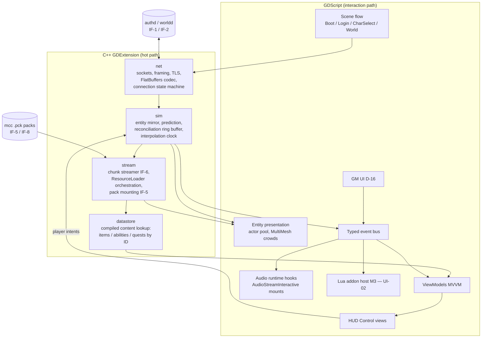
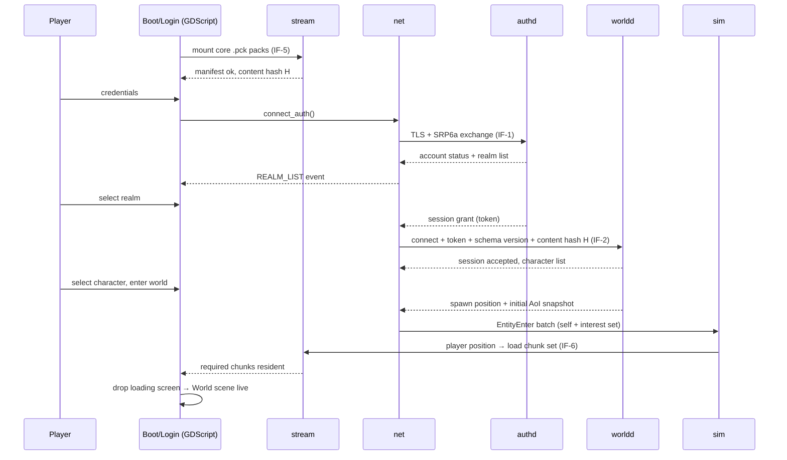
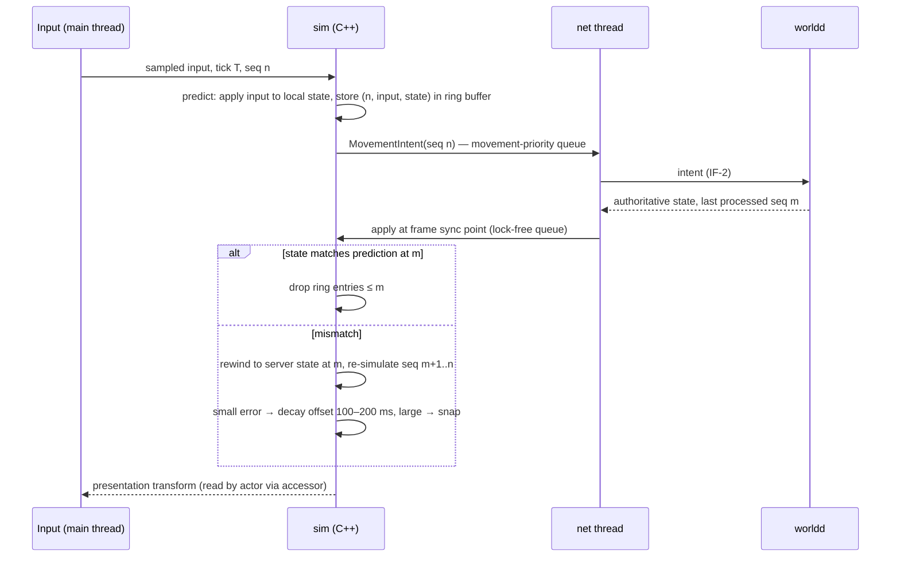
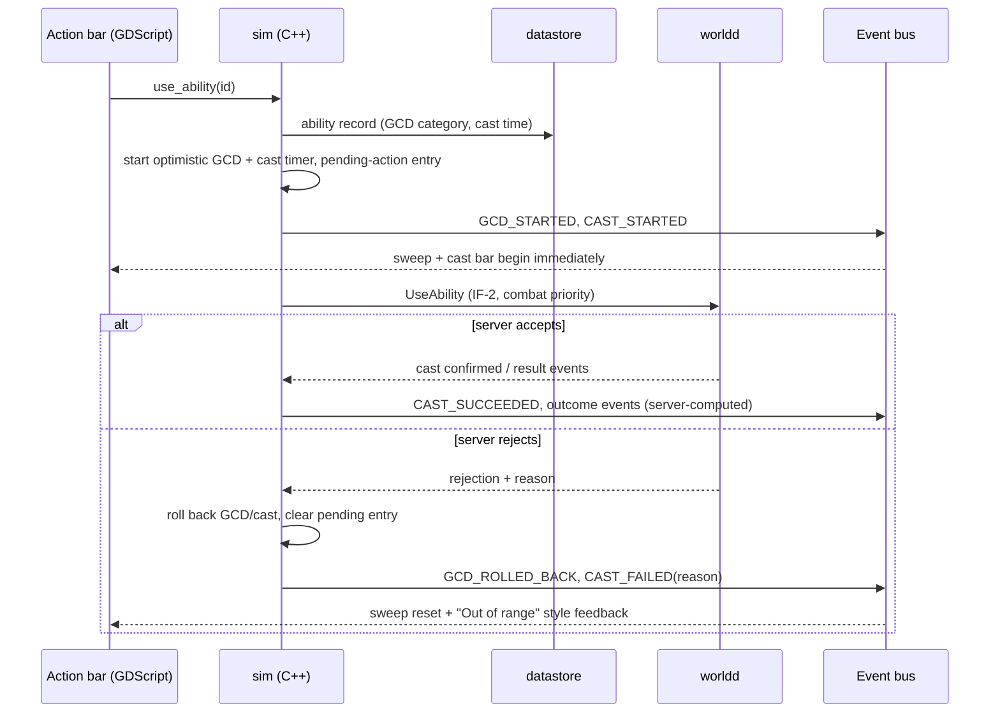
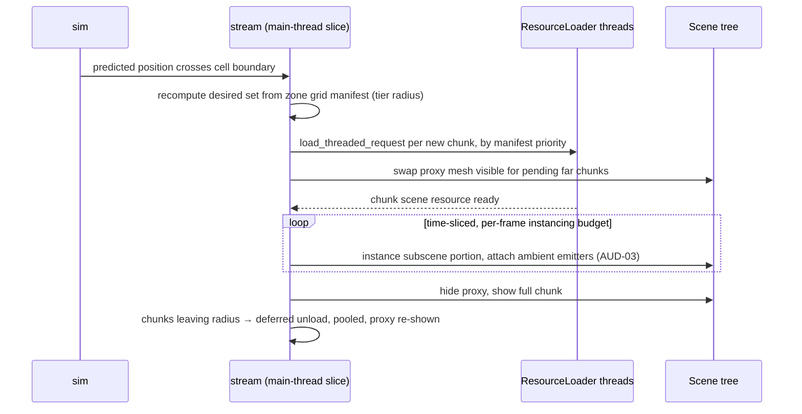
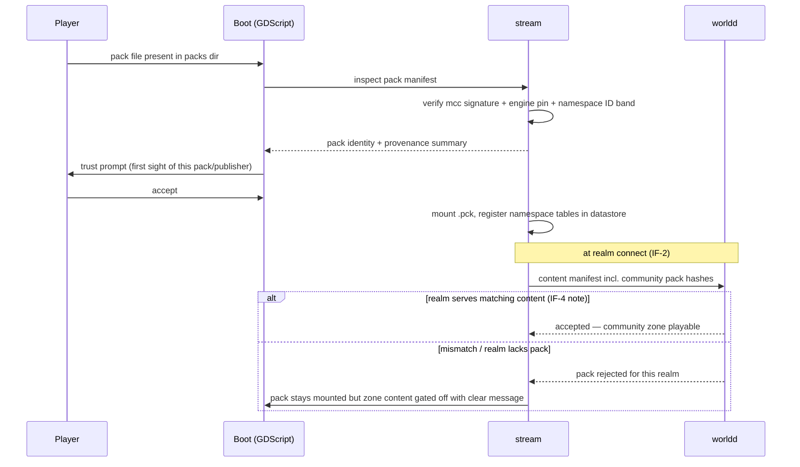

# Client Software Architecture Document — Project Meridian

**Track:** Client (Godot 4.6+ Windows x64 game client)
**Version:** 0.1 — 2026-07-04
**Status:** Draft for cross-track review
**Zooms into:** the Client container of the [System Architecture Overview](../02-ARCHITECTURE-OVERVIEW.md) §1.
**Reads with:** [Client PRD v0.2](../prd/client-prd.md), [Sync Decisions v1.1](../01-SYNC-DECISIONS.md) (D-01..D-17), [Content Schema v1](../../schema/content/README.md).

---

## 1. Purpose & scope

This SAD specifies the internal architecture of the Meridian game client: a Godot 4.6+ Forward+/D3D12 application (TD-02) whose hot path — networking, prediction, entity mirroring, zone streaming, content lookup — lives in C++ GDExtension modules, and whose UI/flow layer lives in GDScript behind an MVVM boundary (PRD §1.1). The client is a *predictor and presenter*: server is law (Principle 1); the client predicts only its own movement (CHR-02) and the GCD/cast start (D-10), and reconciles on correction.

In scope: all client-process components, the headless bot client (same binary, `--headless`), and the client side of every interface below. Out of scope: server internals (server SAD), the chunk *export* pipeline and pack *production* (tools SAD — the client only consumes), sound design and adaptive-music resources (music SAD — the client provides mount points only).

### 1.1 Interface table

| IF | Role | Client obligation | Contract |
|----|------|-------------------|----------|
| IF-1 | **Implements client side** | TLS connection to `authd`, SRP6a-style credential exchange, realm list consumption, session grant receipt | `/schema/net/auth.fbs` |
| IF-2 | **Implements client side** | `worldd` connection with session token, movement intents, entity/combat/chat/quest message consumption, clock sync | `/schema/net/world.fbs` |
| IF-5 | **Consumes** | Mounts `mcc`-built `.pck` packs at startup and on demand (community packs, TLS-08); verifies pack manifest (engine pin, content hash) against the realm; owns all mount UX per D-09 | `/schema/pck-layout.md` |
| IF-6 | **Consumes** (runtime streamer side) | Streams Forge-exported chunk scenes per the zone grid manifest; §5.3 lists the requirements the client places on the format (feeds A-08) | `/schema/chunk/` |
| IF-7 | **Consumes** | Joins and renders GM-authenticated preview maps on dev `worldd`; applies hot-reloaded content (D-07: Client owns joining/rendering; Server owns the channel; Tools owns the push loop) | server SAD §hot-reload |
| IF-8 | **Consumes** | Resolves asset IDs (`core:art.…`, `core:mus.…`, `core:sfx.…`) to `res://` paths via the compiler-generated resolution table shipped inside IF-5 packs; typed placeholders on miss | `/schema/content/asset.schema.yaml` |

The client does **not** consume IF-9 (`idmap.lock`) directly: numeric IDs reach the client pre-baked inside IF-5 pack tables (§4.2), and IF-2 carries numeric IDs on the wire. IF-3 and IF-4 are server/tools internal.

---

## 2. Component decomposition

Dependency rule: GDScript never calls `net` directly and never reads entity scenes for state — everything crosses the boundary through `sim` accessors, `datastore` lookups, and the event bus. Arrows from HUD to `sim` are intent submissions (ability press, target change), which `sim` forwards to `net`.

### 2.1 `net` — network module (C++)

- Engine-agnostic core (plain sockets + mbedTLS for the IF-1 auth connection; `StreamPeerTCP` avoided in the core so the bot client and unit tests link without Godot) with a thin GDExtension binding.
- **Framing:** length-prefixed frames, opcode-per-FlatBuffers-table per IF-2; generated code from `/schema` compiled in as a versioned dependency (D-01). Schema version exchanged at connect; mismatch → typed `ClientOutOfDate` error surfaced to the Login flow, never UB.
- **Connection state machine:** `Disconnected → AuthConnecting → Authenticated → RealmSelected → WorldConnecting → InWorld → Reconnecting`. Owns the reconnect-with-token path (§5.1) and emits state transitions onto the event bus (`CONNECTION_STATE_CHANGED`).
- **Send queues:** per-channel priorities movement > combat > chat > bulk; coalescing for movement intents.
- Runs its own thread (§6.1); decoded messages cross to the main thread via a lock-free SPSC queue.

### 2.2 `sim` — client simulation mirror (C++)

- **Entity mirror:** registry keyed by server entity ID; the C++-side source of truth for all entity state (§4.1). Applies `EntityEnter/Update/Leave` per IF-2 interest management; never assumes an entity list.
- **Prediction/reconciliation:** fixed-tick input sampling; kinematic movement controller (custom character-shape sweeps, *not* `CharacterBody3D`) applying the same movement constants the server validates, sourced from shared content data. Ring buffer of `(sequence, input, state)`; on server ack/correction: rewind to authoritative state, re-simulate unacked inputs; error offset decayed over ~100–200 ms, snap on large error.
- **Interpolation clock:** filtered server-clock estimate (ping/offset); remote entities rendered at `server_time − interp_delay` (~2× server tick), hermite interpolation, extrapolation capped at ~250 ms then freeze/fade.
- **Optimistic GCD/cast (D-10):** on ability use, `sim` starts a local GCD/cast timer immediately and records a pending-action entry; server accept confirms, rejection rolls back within one RTT (§3c). Outcomes (damage, resource spend) are never predicted.

### 2.3 `stream` — pack mount & chunk streamer (C++)

- **Pack mounting (IF-5):** mounts versioned `.pck`s via `ProjectSettings::load_resource_pack()` at boot; verifies pack manifest (engine pin, schema version, per-pack content hashes) and holds the aggregate content hash for realm validation at IF-2 connect. Community packs (TLS-08, M3): signing/trust prompt and per-realm manifest match before mount — Client-owned UX per D-09 (§3e).
- **Chunk streamer (IF-6):** tracks predicted player position from `sim`, computes desired chunk set per tier radius, issues threaded `ResourceLoader::load_threaded_request` loads, and instantiates via time-sliced deferred subscene instancing (per-frame instancing budget, hitch gate ≤ 50 ms). Unloads deferred + pooled. Beyond the radius: baked proxy meshes from the same manifest. Streaming radius ≥ server interest radius; entities arriving ahead of their chunk stand on server-authoritative position (never fall through world).

### 2.4 `datastore` — compiled content lookup (C++)

- Loads the compiled content tables from IF-5 packs at mount time: items, abilities, quests, NPC display data, localization, and the asset-ID → `res://` resolution table (IF-8).
- Read-only after mount; keyed by numeric ID (the wire format) with a string-ID reverse index for tooling/GM/addon use (§4.2). O(1) lookup on the combat path (tooltip data, GCD category, cast time for the optimistic timer).
- Unresolvable IDs return typed placeholders (magenta-checker mesh, default icon, silence) + telemetry event — never crash, never block.

### 2.5 GDScript scene-tree architecture

Autoload singletons (`Net`, `Sim`, `Datastore`, `EventBus`, `Settings`) wrap the GDExtension modules. Scene flow: `Boot` (pack mount, settings load, auto-benchmark on first run) → `Login` (IF-1, realm list) → `CharacterSelect` (D-11 stub at M0: name + class over one placeholder model) → `World` (streamed zone + HUD). Failure UX at every step is an M0 deliverable. `World` is re-entered on map change (instance portals, GRP-02) with a loading screen; in-zone streaming is seamless.

### 2.6 Entity presentation

Spawns/despawns presentation scenes from `sim` registry events. Scene-instance pools for common archetypes (players, humanoid mobs, loot objects) sized for the 50-player interest-boundary crossing (IT-M1). Crowd LOD ladder: full anim → reduced anim rate → static-pose **MultiMesh imposters** beyond N meters (N per tier). Appearance arrives as IF-8 asset IDs resolved through `datastore`.

### 2.7 HUD / UI MVVM and the typed event bus

- Control-node views + single project Theme; views are dumb — all state flows through ViewModels fed by `sim`/`datastore`.
- The **typed event bus** is a registry of named events with typed payloads (`UNIT_HEALTH_CHANGED`, `PLAYER_TARGET_CHANGED`, `GCD_STARTED`, `GCD_ROLLED_BACK`, …), published from C++ (batched per frame) and subscribed from GDScript. This registry **is** the M3 Lua addon event system (UI-02): the Lua host binds to the bus and the read-only ViewModel query API, never to Control internals or raw scenes. Enforced in review from M1; one first-party panel is rebuilt against the API at M2 as proof.
- Perf discipline: no per-frame `_process` polling; pooled floating combat text/nameplates/buff icons with hard caps and priority eviction.

### 2.8 Audio runtime hooks

Client owns mount points only (TD-11 split): a gameplay audio-event emitter (combat/foley/UI events with context payloads, routed by IF-8 asset ID) and a **music state component** feeding zone/subzone ID, explore/tension/combat state, time-of-day, and death into the Music track's `AudioStreamInteractive`/`AudioStreamSynchronized` resources. Ambient emitters/beds instantiate on chunk stream-in (AUD-03) — hence emitter placements must ride the IF-6 chunk data (§5.3). Bus layout + ducking are client-owned; mix profiles Music-owned.

### 2.9 GM UI (D-16)

Chat-based `.` command entry routed verbatim over IF-2 (server owns execution/permissions), GM-visibility flag rendering, and at M2 the editor-connected preview client mode (TLS-06/IF-7). No GM logic client-side.

---

## 3. Runtime views

### (a) Boot → login (IF-1) → handoff (IF-2) → enter world

Content-hash mismatch at world connect → realm rejects with a typed reason; version mismatch at either hop → "client out of date", never UB.

### (b) Movement frame

### (c) Ability press — optimistic GCD/cast (D-10)

Rollback completes within one RTT; no resource, damage, or cooldown state beyond the GCD timer is ever predicted.

### (d) Chunk stream-in/out at a cell boundary (IF-6)

Hitch gate: no frame > 50 ms attributable to streaming at run speed on Low tier (SATA SSD floor, D-05).

### (e) Community pack mount at startup (IF-5, D-09, M3)

---

## 4. Data & state architecture

### 4.1 Sim entity store — C++ side of truth

All runtime entity state (transform, velocity, health/resources, auras, cast state, target) lives in the `sim` module in SoA-friendly C++ storage keyed by server entity ID. GDScript reads via **thin accessors** — `Sim.get_unit_health(id)`, batched snapshot structs for ViewModels — and never holds references into the store. Presentation actors pull transforms via accessor each frame in C++ (the binding writes directly to `RenderingServer`/`Node3D` where possible); state *changes* reach the UI only as bus events. Nothing in GDScript mutates entity state; the only writes crossing the boundary are player intents. This is what keeps the ≤2 ms GDScript combat budget honest (§6.2): GDScript reacts to deltas, it never scans entities.

### 4.2 Content datastore

- Loaded from IF-5 packs at mount: flat, immutable record tables per content type (item, ability, quest, NPC display, loot presentation, vendor lists, localization), keyed by **numeric ID** — the same numeric IDs `mcc` assigned via IF-9 and that IF-2 carries on the wire. Memory layout: contiguous per-type arrays + a numeric-ID → index hash; records reference other records by numeric ID and assets by IF-8 resolution-table index.
- **String ↔ numeric mapping:** packs embed the string-ID reverse index (`core:item.rusty_pickaxe` ↔ its numeric ID). Gameplay never uses string IDs; the reverse index exists for GM commands, logs/telemetry, and the M3 Lua API (addons address content by string ID — stable across recompiles, per Content Schema v1, while numeric IDs are an `idmap.lock` implementation detail).
- Namespaced community packs (TLS-08) add tables under their own non-overlapping numeric ID band; lookup is uniform.

### 4.3 Settings & scalability persistence

Data-driven preset profiles (Low/Medium/High/Epic per PRD §2.2) stored as a user settings file (Godot `user://`), every knob individually overridable; first-run auto-benchmark selects a starting preset. Persisted alongside: keybinds, audio bus volumes, interface layout, per-character addon saved-variables (M3, isolated per addon per character). Settings are versioned with a migration shim so preset schema changes don't reset player configs.

---

## 5. Interface contracts (client side)

### 5.1 IF-1 / IF-2 — connection lifecycle, reconnect, clock sync

- **Lifecycle:** IF-1 is short-lived (login → realm list → session grant → close). IF-2 is the persistent session; the password never travels to `worldd` — only the token.
- **Reconnect policy:** on transient IF-2 loss, `net` enters `Reconnecting` and retries with the session token (exponential backoff, ~30 s window before the grant is presumed expired); `sim` freezes remote entities (fade past extrapolation cap) and suspends prediction sends; UI shows a non-blocking reconnect banner. On token rejection or window expiry → full re-login through IF-1. The reconnect window length is server-owned — client needs it surfaced in the session grant (flagged §10).
- **Clock sync:** client maintains a filtered server-clock estimate from ping/offset samples (dedicated lightweight ping message or piggybacked timestamps — needs an explicit message in `world.fbs`, flagged §10). All snapshot buffering and the interpolation delay key off this clock.
- **Conformance:** golden-message round-trip tests against the shared `/schema` fixtures used by the server track.

### 5.2 IF-5 — pack manifest verification

Client verifies at mount: engine pin (pack built for this Godot/export-template version), schema version, per-pack content hash, and — for community packs — `mcc` signature and namespace declaration. At IF-2 connect the client sends its aggregate content manifest; the realm accepts only on content-hash match (the same hash discipline IF-4 applies server-side, per the overview's deployment note). Mismatch is a clear rejection message plus updater hand-off, never a silent degrade.

### 5.3 IF-6 — requirements the streamer places on the chunk format (input to A-08)

The Client track requires the following of the Forge-exported chunk contract; this list is our formal input to **A-08** (format sign-off due M0 exit):

1. **Grid definition in the zone manifest:** fixed square cell size (meters), grid origin, world-to-cell transform, and zone bounds. One grid per zone; cell size uniform within a zone.
2. **Per-chunk scene reference:** one instantiable Godot scene resource per cell, referenced by asset ID (IF-8) resolved to a `res://` path — never a raw path in the manifest.
3. **Proxy/imposter reference per chunk:** a baked low-poly proxy mesh (or explicit `none`) for distant representation, cheap enough that the full proxy ring fits the Low-tier draw-call budget; proxies must be loadable independently of the full chunk.
4. **Load priority & dependency metadata:** per-chunk priority hint (e.g. ground/collision vs. decoration split, or an ordinal) and a shared-dependency list (kit scenes/materials used by many chunks) so the streamer can pre-warm shared resources once instead of N times.
5. **Per-chunk AABB and content hash** — AABB for visibility/priority scoring; hash for pack verification and patch-granularity (PRD §6).
6. **Ambient audio placements (AUD-03)** riding the chunk data — emitter/bed volumes instantiate on stream-in, so they must be part of the chunk scene or its manifest entry.
7. **Manifest format version field** + the A-08 versioning/migration policy (re-export vs. loader back-compat) decided by M1 start.
8. **Deterministic export:** identical Forge input ⇒ identical chunk bytes/hashes (double-build honesty, Principle 3), so nightly pack diffs are real diffs.
9. **Interest alignment guarantee:** cell metadata consumed by the server for AoI must use the *same* grid definition, so "client streaming radius ≥ server interest radius" is checkable from the manifest alone.

Budgets the format must respect (informative, enforced our side): time-sliced instancing must be able to bring in a chunk within the 50 ms hitch gate on a SATA SSD; chunk memory sized so the Low-tier radius fits the 6 GB VRAM / 12 GB RAM budget.

### 5.4 IF-7 — preview map join

Client provides an editor-connected client mode (TLS-06, M2): joins a GM-authenticated preview map on a dev `worldd`, renders live spawn/patrol placement, and applies hot-reloaded content pushed by `mcc --watch` (D-07). The client treats a preview session as a normal IF-2 session plus a reload message class; content reload reuses the pack-mount path with an in-place datastore table swap. Connection UX ownership inside the Forge editor is an open question (PRD §12 Q4; flagged §10).

### 5.5 IF-8 — asset resolution

Resolution table (asset ID → `res://` path) is compiler-generated into each pack; `datastore` merges tables across mounted packs by namespace. Misses yield typed placeholders + telemetry (hard rule: visible placeholder, never a crash or stream stall).

---

## 6. Threading & performance architecture

### 6.1 Thread model

| Thread | Owner | Work |
|---|---|---|
| Main | Godot | Input sampling, `sim` fixed-tick prediction + interp apply, message-apply sync point, scene tree, GDScript UI, per-frame streaming slice |
| Render | Godot | RenderingServer prep + submission (Forward+/D3D12) |
| Net | `net` module | Socket IO, TLS, framing, FlatBuffers decode; hands decoded messages to main via lock-free SPSC queue, drained at a fixed point *before* the prediction/interp update |
| Streaming IO | Godot `ResourceLoader` pool | Threaded chunk/resource loads; only *instancing* touches the main thread, time-sliced |
| Crash handler | Crashpad | Out-of-process minidump capture |

Rules: FlatBuffers decode never runs on the main thread; scene-tree mutation never runs off the main thread; `sim` state is written only at the tick and the message sync point, so GDScript accessors read a coherent frame.

### 6.2 The ≤2 ms GDScript combat-path budget

- **Boundary (PRD §1.1 rule):** per-entity-per-frame or per-message work is C++; per-user-interaction work is GDScript. Enforced in code review + by the budget gate.
- **Mechanisms:** event-driven UI only (no `_process` polling on HUD widgets); C++ batches bus events per frame and delivers one flush; ViewModels receive deltas, not scans; pooled Control nodes for floating combat text/nameplates/buff icons with hard caps and priority eviction (your target > party > others).
- **Measurement:** Godot profiler GDScript-time capture in the nightly crowded-scene replay (50+ players, 20 mobs, combat VFX — canned replay so runs are identical); Tracy instrumentation in the GDExtension modules for the C++ sub-budgets. GDScript-in-combat > 2 ms, or a >10% regression on any sub-budget, fails the nightly.

### 6.3 Frame budget per tier (crowded-scene benchmark, PRD §9)

| Tier | Total | Main thread | Render prep | GPU | Sub-budgets (main thread) |
|---|---|---|---|---|---|
| Low — GTX 1060, 1080p/30 | 33.3 ms | ≤ 12 ms | ≤ 10 ms | ≤ 30 ms | net decode+apply ≤ 1.5 ms · interp/prediction ≤ 2 ms · animation ≤ 3 ms · UI ≤ 1.5 ms · **GDScript total ≤ 2 ms** |
| High — RTX 3070, 1440p/60 | 16.7 ms | ≤ 8 ms | ≤ 7 ms | ≤ 14 ms | same sub-budgets apply |

### 6.4 Draw-call discipline

No Nanite, no VSM (TD-02) — classic pipeline only. Budget ≤ ~2,000 draw calls on Low in the benchmark. Mechanisms: MultiMesh/GPU instancing for crowds, foliage, kit pieces; mesh merging in the Forge chunk export (IF-6); per-tier LOD bias + visibility ranges as scalability knobs; occlusion culling tuned per zone; proxy meshes for distant chunks (few draws); crowd imposters beyond per-tier N meters; FSR2 render-scale as the pressure valve on Low. Tracked via `RenderingServer` statistics in the nightly perf run on physical Low/High machines; hard-locked at the M2 "beautiful corner" gate.

---

## 7. Milestone build plan

| Milestone | Client build delivers | Gate |
|---|---|---|
| **M0** | `net` v1 (IF-1 TLS + IF-2 token handoff, reconnect, schema-version check); Login/realm/error UX; CHR-01 stub per D-11; `sim` v1 (predicted walk/run/jump, remote interp, WoW-style camera) on the empty test map; `stream` v1 (core pack mount IF-5, no chunk streaming yet); **headless bot client** (same binary, `--headless`, scripted login/move); crash reporting live; IF-6 format signed (A-08); movement-controller spike locks shared constants | IT-M0: two real clients complete the full session flow, smooth mutual interp at ≤150 ms simulated latency, reconnect works, 30-min soak zero crashes |
| **M1** | Chunk streamer live on Zone-01 (IF-6) with proxies + hitch gate; combat presentation (targeting, nameplates, cast bars, optimistic GCD per D-10, floating combat text); quest/loot/vendor/bags/chat/GM-console UI on the MVVM bus; `datastore` full (items/abilities/quests); audio hooks (AUD-01/02 basic); event-bus registry established as the future addon surface; bot gains quest verbs | IT-M1: fresh 1060-class install → level 5 quest chain with 50+ CCU at Low/30 FPS; budgets §6.3 hold |
| **M2** | Instance portal flow (GRP-02) + map-change loads ≤ 30 s Low; AH (server-paged), mail, crafting, trade, talents, bank UI; live-preview join (IF-7/TLS-06); first-party addon experiment proves the bus API; Lua VM choice locked (§9.3); day/night per-tier lighting; bot gains group/dungeon verbs | IT-M2: 5-player group clears Dungeon-01 + full economy loop entirely through shipped UI |
| **M3** | Lua addon API v1 on the event bus (registration, read-only queries, curated widget set, saved variables, error-isolated loader, docs); community pack mount UX (IF-5/D-09, trust prompts, realm manifest gating); battleground UI (PVP-02: queue, scoreboard, CTF HUD); guild/friends/LFG; multi-map transfers; bot gains BG queue verbs and drives the 500-CCU fleet | IT-M3: community zone pack plays on unmodified client+server; full 10v10 BG completes; budgets hold at a 500-CCU hotspot |

---

## 8. Quality attributes

| Attribute | Target | Mechanism |
|---|---|---|
| Startup | Cold boot → login screen ≤ 15 s on Low tier (SATA SSD); enter world (fresh zone) ≤ 30 s, matching the map-change budget | Pack mount deferred/parallel where safe; datastore tables memory-mapped-friendly layout; measured in nightly smoke |
| Memory | Low tier: ≤ 6 GB VRAM, ≤ 12 GB system RAM; caps honored by quality reduction, never crash | Per-tier texture import settings, VRAM tracking in nightly perf run, streaming radius per tier |
| Frame stability | §6.3 budgets; streaming hitch ≤ 50 ms | Canned-replay benchmark on physical tier machines; >10% regression pages the team |
| Reconnect robustness | Transient drop ≤ reconnect window: session resumes without relog; IT-M0 gate | `net` state machine + token retry (§5.1); soak-tested from M0 via bot client |
| Crash reporting | 100% of test-realm builds ship telemetry from M0 end | Crashpad in the GDExtension layer → project-hosted Sentry-compatible endpoint; missing-content placeholder events ride the same channel |
| Content robustness | Missing/unresolvable content never crashes or blocks | Typed placeholders + telemetry (§2.4, §5.5) |
| Update size | Testers never full-redownload after M1 | Bootstrap updater: manifest-hash delta pack downloads, verify, swap (embryo of the M4 patcher) |

### 8.1 Bot client architecture

Same binary, same `net`/`sim` GDExtension modules, run under `--headless` (no renderer/audio) — no separate build flavor. A behavior layer (scripted login/move/cast/chat, extended each milestone with that milestone's verbs) drives `sim` intents exactly as the HUD would, through the same accessor/intent boundary. Owned by Client (it shares the protocol code); primary consumer is the Server track's 500-CCU load tests (OPS-04, IT-M3). Because the bot exercises the identical prediction/reconciliation path, it doubles as our desync soak harness; combined with network replay capture (record server streams, deterministic re-play into a rendering client), presentation bugs found at scale are reproducible on a dev box.

---

## 9. Technology decisions & rejected alternatives

### 9.1 Custom FlatBuffers net module — not ENet / Godot high-level multiplayer

Rejected: `MultiplayerAPI`/`ENetMultiplayerPeer`/`MultiplayerSynchronizer`. (a) TD-07 mandates a schema-defined FlatBuffers protocol shared with a plain C++/Linux server that will never speak Godot's scene-replication wire format; (b) "server is law" requires full control over snapshots, deltas, and interest, which scene replication abstracts away; (c) prediction/reconciliation requires owning the message loop; (d) FlatBuffers zero-copy decode suits the movement/AoI hot path (D-01). TCP through M1; transport abstracted so the server-owned UDP go/no-go at M2 end (D-03) slots in without touching game systems.

### 9.2 C++ sim mirror — not GDScript

Per-entity-per-frame interpolation, N-times-per-frame re-simulation during reconciliation, and per-message decode are exactly the workloads GDScript cannot do inside the §6.3 budgets (interp/prediction ≤ 2 ms with ≥150 entities). The kinematic controller must be tick-deterministic and engine-loop-decoupled — incompatible with `CharacterBody3D` node-frame coupling. Engine-agnostic C++ cores also let the bot client and doctest suites run without an engine, and mirror server movement code structurally. GDScript remains the right tool above the boundary: per-interaction UI logic where iteration speed wins.

### 9.3 Lua embed for UI-02 — not sandboxed GDScript

Lua embedded via the GDExtension layer at M3. GDScript rejected: no hardened sandbox story, and Lua is the WoW-addon community's lingua franca — the exact audience UI-02 targets. **Lua 5.4 vs LuaJIT is decided by M2 end** (PRD §5.3); leaning Lua 5.4 — the addon API is event-driven UI code where JIT throughput is not the constraint, plain-C interpreter sandboxing is simpler to reason about, and LuaJIT's 5.1 dialect + maintenance status age poorly for a long-lived open project. LuaJIT re-enters only if M2 addon-experiment profiling shows interpreter cost threatening the UI budget. Sandbox: read-only state API, curated widget templates (no raw scene-tree access), no file IO outside the addon dir, no network construction, protected-action review at M2.

### 9.4 Custom chunk streaming — not an engine feature

Godot has no World Partition; WLD-01 is ours by necessity (D-17). Godot's threaded `ResourceLoader` + deferred time-sliced instancing over a Forge-owned format (IF-6) beats a from-scratch IO layer: engine-integrated resource lifetime, `.pck`-native, and the format contract keeps Tools/Server aligned via A-08.

### 9.5 Others (inherited, recorded)

Forward+/D3D12 with buildable Vulkan diagnostic fallback (TD-02); FSR2 over vendor upscalers (TD-03 spirit); Crashpad-class out-of-process crash capture because Godot ships no reporter; doctest for C++ modules + GUT for GDScript + golden-fixture protocol conformance shared with the server track.

---

## 10. Risks & open questions

### Risks

| # | Risk | Mitigation |
|---|------|-----------|
| R1 | D3D12 backend maturity on older/hybrid GPUs | Physical 1060/3070 validation from M0; Vulkan fallback buildable; crash telemetry from first test-realm build |
| R2 | Custom streamer owns hitching/memory/proxies where UE gave World Partition | IF-6 signed at M0 exit (A-08); hitch gates tested from M1 greybox; time-sliced instancing designed in from day one |
| R3 | Kinematic controller must match server simulation across slopes/stairs/swim | M0 spike locks shared movement constants + physics-query method; deterministic replay tests |
| R4 | GDExtension API churn across Godot minors with substantial C++ (net, sim, stream, Lua host) | Engine pinned per milestone, vendored godot-cpp, upgrade only at milestone boundaries with a soak week; engine-agnostic cores, thin adapters |
| R5 | Custom netcode: every desync bug is ours | Golden fixtures shared with server track; bot soak from M0; network replay repro |
| R6 | Lua sandbox is a classic exploit surface (automation, protected actions) | Read-only API, no raw messages constructible from Lua, M2 security design review before implementation |
| R7 | 50+ visible players stress animation + UI before art density does | Crowd LOD ladder, MultiMesh imposters, pooled UI are M1 deliverables, not polish |

### Open questions & interface gaps (existing IF/A numbers only — none invented)

1. **IF-2 clock sync:** no explicit time-sync message is specified in `world.fbs` yet; the interpolation clock (§5.1) needs one (dedicated ping or piggybacked server timestamps). Needs Server sign-off during IF-2 design (M0).
2. **IF-2 reconnect window:** the session-token validity window driving the client's `Reconnecting` policy (§5.1) is server-owned but must be surfaced in the session grant; belongs in the IF-1/IF-3 grant contents.
3. **IF-5 community-pack signing:** D-09 gives the client the mount UX, and the tools PRD provides `mcc`-verified packs — but the signature scheme and trust-root distribution (what exactly the client verifies in §3e) are not yet in `/schema/pck-layout.md`. Needs Tools+Client definition before M3, ideally sketched at M0 when IF-5 is designed.
4. **IF-6 versioning policy:** A-08 covers it (re-export vs. loader back-compat, due M1 start) — restating our preference: manifest version field mandatory in v1 (§5.3 item 7), loader supports N and N−1 during migration windows, mirroring the content-schema rule.
5. **IF-7 boundary inside the Forge editor:** who owns the connection UX for the editor-connected client mode — Client (runtime module) vs. Tools (editor UI)? PRD §12 Q4's proposed split needs D-numbered sign-off before M2 TLS-06 work starts.
6. **Login queue UX:** OPS-04 defines 500+ CCU but no queue feature ID exists (D-06 deferred to M4 planning); if world servers cap before M4, the client needs a queue screen with no home. Flag for baseline amendment.
7. **Localization infrastructure:** client externalizes all strings from M1 (Godot translation resources) but no feature ID covers it — baseline amendment flagged (PRD §12 Q2).
8. **Chunk-manifest linkage in content schema:** `meridian/zone@1` reserves `chunk_manifest` pending A-08 — the zone YAML ↔ IF-6 grid-manifest join must be defined in the same A-08 sign-off so `datastore` zone records can reference their grid.
