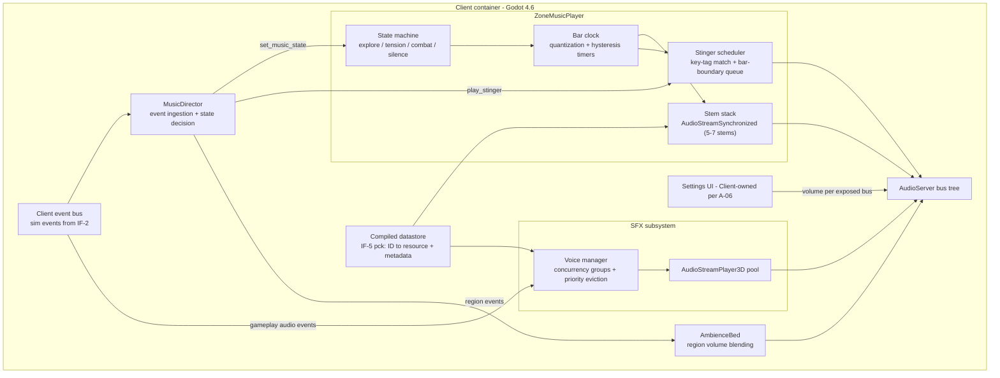
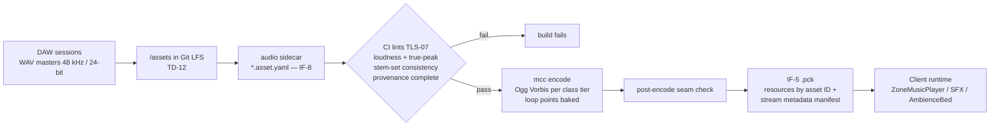
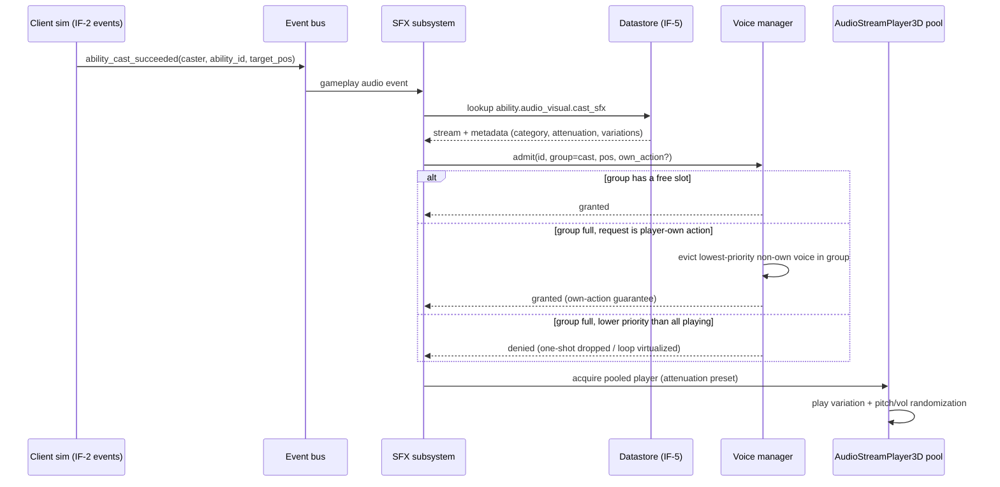

# SAD — Music / Audio Track

**Version:** 0.1 — 2026-07-04
**Status:** Draft for cross-track review. Zooms into the audio slice of the Client container plus the audio asset pipeline, per the [Architecture Overview](../02-ARCHITECTURE-OVERVIEW.md) SAD index.
**Reads with:** [Music PRD v0.2](../prd/music-prd.md), [Client PRD §7](../prd/client-prd.md), [Sync Decisions](../01-SYNC-DECISIONS.md) (D-12/13/14/17, A-04/06/07/08), [Content Schema v1](../../schema/content/README.md).

---

## 1. Purpose & scope

This SAD covers two systems owned by the Music track:

1. **Adaptive Audio Runtime** — client-side Godot 4.6 subsystems: `ZoneMusicPlayer` (AUD-02), the SFX framework with voice management (AUD-01), `AmbienceBed` (AUD-03), and the audio bus/mix contract. It lives *inside the Client container*; the client SAD provides the mount points (event bus subscription, scene-tree attachment, settings UI per A-06). All gameplay logic stays outside the audio layer — the runtime consumes states and IDs, never network messages directly.
2. **Audio Asset Pipeline** — DAW WAV masters through Git LFS, IF-8 audio sidecars, `mcc` Ogg encode, loudness/consistency CI lints, into IF-5 `.pck` packs.

Out of scope here: sound design itself (audio-direction.md), Forge volume-authoring UX (tools SAD; Music defines the primitives per PRD §7), VO (no feature ID, PRD §10).

### 1.1 Interface table

| ID | Role of this track | What we depend on / provide |
|----|--------------------|------------------------------|
| IF-8 asset registry | **Consumes; defines the audio-class sidecar fields** (§4.2) | Tools owns `/schema/content/asset.schema.yaml`; we require the audio fields listed in §4.2 to be in the M0 design |
| IF-5 client data packs | **Feeds** (via `mcc`) and consumes at runtime | Ogg/WAV resources named by asset ID, stream metadata (BPM, bars, key) in the pack manifest for `ZoneMusicPlayer` |
| IF-6 zone chunk format | Consumes (pending A-08) | Forge music-region / ambience-volume / emitter data must travel with chunk data; format sign-off is an A-08 dependency |
| IF-2 world protocol | Indirect consumer | Combat flags, aggro events, time-of-day, weather arrive over IF-2; the audio runtime sees them only as **client event-bus** topics (client SAD owns the plumbing) |
| IF-9 idmap.lock | Indirect | `mus.*`/`sfx.*`/`amb.*` string IDs registered like all content IDs; numeric keys never appear in audio code |
| Bus/mix contract (A-06) | **Defines** (§2.7) | Client owns the settings UI; we define bus names, ranges, defaults |

---

## 2. Runtime architecture



### 2.1 ZoneMusicPlayer state machine

States: **explore**, **tension**, **combat**, **silence**. One instance active per client; a set change (region crossing) re-parameterizes the same instance. States are vertical mixes over one `AudioStreamSynchronized` stack (§2.2); the state machine only changes per-stem gain targets and stinger cues — stems never stop while a set is active, so L1 continuity is structural, not scripted.

**Inputs** (from MusicDirector, §2.4): `combat_flag` (server-authoritative, CMB-01), `hostile_proximity` (client-observed aggro-warning range, CMB-02), `boss_encounter` (instance scripting, M2), `region_set_id` + region default state.

**Transition table.** Quantization is executed by the bar clock (§2.1.1): the requested transition is queued and fires on the next boundary of the given kind. Hysteresis timers are wall-clock and run *before* the transition is queued.

| From | To | Trigger | Hysteresis | Quantize | Fade | Stinger |
|------|----|---------|-----------|----------|------|---------|
| explore | tension | hostile enters aggro-warning range | none (enter fast) | next bar | 1-bar equal-power: L3 in, L2 out | — |
| explore | combat | combat_flag set | none | **next beat** (feels immediate, ≤500 ms) | beat-quantized L3+L4 in | combat-entry (key-matched) |
| tension | combat | combat_flag set | none | next beat | ≤500 ms L4 in | combat-entry |
| combat | tension | combat_flag clear, hostile still in range | **4 s** out of combat | next bar | 2-bar equal-power L4 out | victory/combat-end |
| combat | explore | combat_flag clear, no hostiles | 4 s | next bar | 2-bar L4+L3 out, L2 in | victory/combat-end |
| tension | explore | no hostile in warning range | **6 s** | next bar | 2-bar L3 out, L2 in | — |
| explore | silence | full loop pass completed in explore | n/a (loop-count condition) | end of loop | 2-bar all-stem fade to rest | — |
| silence | explore | rest timer expires (randomized 60–180 s) | n/a | immediate start at random valid section marker | 1-bar fade-in | — |
| silence | combat / tension | combat_flag / proximity | none — **overrides rest** | immediate stem start, state applied at first bar | ≤500 ms | combat-entry |
| any | any (set change) | region crossing / zone transition | none | §6.3 cross-set rules | 2-bar out, new set in at region default state | optional discovery |

Rapid flip-flop is absorbed twice: hysteresis timers cancel a pending exit if the trigger re-asserts, and the bar-clock queue holds at most **one** pending transition — a newer request replaces it (last-writer-wins) before the boundary fires.

#### 2.1.1 Bar clock & quantization

BPM, meter, and bar length come from compiled asset metadata (§4.2), mirrored into the streams' beat properties at import. Primary implementation delegates quantization to `AudioStreamInteractive` transition rules (timing = next bar / next beat, fade = equal-power, fade length in beats): each state is a clip wrapping the synchronized stack's mix snapshot. The runtime keeps its own **shadow bar clock** (sample-position derived, §3.1) regardless — it drives the stinger queue, silence scheduling, the M0 measurement harness, and is the seam the GDExtension fallback slots into.

### 2.2 Stem stack

- One `AudioStreamSynchronized` per zone set: 5–7 tempo/key-locked stems (L1 bed ×1–2, L2 melody ×1–2, L3 tension ×1, L4 combat ×1–2), identical length (64–128 bars), all playing sample-locked from set start.
- **Per-stem volume automation** is the vertical mix: state changes ramp per-stream volume (equal-power curves, ramp lengths from the transition table). Inaudible stems are held at silence (−60 dB floor), never stopped — bar positions stay aligned for free.
- Dungeon/boss sets (M2) reuse the layout with a hotter baseline and an added L4-boss stem + boss state (an extra row in the transition table driven by `boss_encounter`).

### 2.3 Stinger scheduler

- Each set declares a stinger pool (combat-entry, combat-end, discovery, level-up, death), each stinger **key-tagged** (§4.2). The scheduler matches stinger requests against the *active set's* key; a global chromatic fallback pool covers sets with no tagged match.
- Requests are queued to the **next bar boundary** by default (discovery, level-up); combat-entry/death fire on next beat to stay coupled to their transitions. Queue depth 2 (matches the stinger concurrency group); excess requests are dropped oldest-first.
- Stingers play on a dedicated one-shot player on the Music bus, preloaded per active set (§4.3).

### 2.4 MusicDirector

The thin decision node (the Client PRD's "music state component" — jointly specified, Client-mounted). Subscribes to client event-bus topics: `combat_started` / `combat_ended` (server flag via IF-2), `aggro_warning_entered/left` (client proximity, CMB-02), `region_entered/left` (region evaluator, §6.2), `poi_discovered`, `player_died`, `level_up`, `boss_encounter_state` (M2), `time_of_day` (night set variants). It reduces these to exactly three calls on the audio runtime: `set_music_set(set_id)`, `set_music_state(state)`, `play_stinger(kind)`. No audio object ever sees a network message.

### 2.5 SFX subsystem

**Bus tree** (owned by this track; Client mounts it in the default bus layout):

```
Master
├── Music
│   ├── MusicStems          (ZoneMusicPlayer synchronized stack)
│   └── Stingers
├── SFX
│   ├── SFX_Combat          (melee, cast, impacts, buffs)
│   ├── SFX_Foley           (footsteps, armor, jump/land)
│   ├── SFX_NPC             (vocalizations)
│   ├── SFX_World           (loot, interactables, gathering)
│   └── SFX_Occluded        (low-pass + −6 dB; occluded voices routed here)
├── UI                       (2D, never occluded/attenuated)
└── Ambience
    ├── Amb_Beds
    └── Amb_Emitters
```

Reverb (`AudioEffectReverb`) sits on zone/interior child buses driven by Forge reverb volumes; no convolution on min-spec (PRD §3.3).

**Voice manager** (GDScript at M0/M1, promoted to GDExtension only if profiling demands): gates every play request *before* a player node is created.

- **Caps:** 64 real voices global, soft target ≤48 at p95. Per-category concurrency groups (PRD §3.4): melee 8, cast/impact 10, footsteps 6 (nearest-N), NPC vocal 6, ambient emitters 10, UI 4, music stems 8, stingers 2.
- **Priority score** = base category priority + own-action boost + distance-weighted loudness. **Player-own actions always win**: an own-action request over a full group evicts the lowest-priority non-own voice in that group — this is an invariant, not a heuristic, and is asserted in IT-M1.
- **Eviction policy:** within-group steal-quietest first; if the global cap binds, steal lowest priority score across groups (own-action voices exempt). Evicted *loops* **virtualize** — the manager keeps advancing a virtual playback position and resumes when a slot frees; one-shots are dropped.
- Pooled `AudioStreamPlayer3D` nodes (pre-warmed per attenuation preset: small/medium/large/global) avoid scene-tree churn; UI uses pooled 2D `AudioStreamPlayer`. Round-robin variation + ±2 st / ±1.5 dB randomization via `AudioStreamRandomizer` wrappers resolved from asset metadata.
- **Occlusion:** one raycast per audible spatial voice, throttled round-robin across frames; occluded voices reroute to `SFX_Occluded`.

### 2.6 Ambience beds

`AmbienceBed` runtime: 2–3 looping slices per bed, plain looped streams (no interactive transitions needed). Region volume blending: the client region evaluator reports all overlapping ambience volumes + priorities; the bed crossfades 3–5 s on boundary crossing, highest-priority volume wins, day/night slices interpolate over the dawn/dusk window from server time-of-day, weather slices stack keyed to the WLD-02 weather state (taxonomy pending A-04). Beds mix at −38..−30 LUFS in-game.

### 2.7 Settings integration (A-06 contract)

Client owns the options UI; this track defines the contract:

| Exposed bus | Slider range | Default | Notes |
|-------------|-------------|---------|-------|
| Master | −60 dB..0 dB (UI 0–100%) | 100% | mute toggle |
| Music | −60..0 | 80% | covers stems + stingers |
| SFX | −60..0 | 100% | all SFX children follow |
| UI | −60..0 | 90% | separate so error sounds can be tamed |
| Ambience | −60..0 | 90% | beds + emitters |

Plus one non-bus setting: **voice-count tier** (64 / 48 / 32 real voices) bound to the client's scalability presets. Child buses (SFX_Combat etc.) are *not* user-exposed before M4 accessibility work. Sliders map to `AudioServer.set_bus_volume_db` on exactly these named buses — the bus names above are the stable API.

---

## 3. The M0 validation gate as architecture (TD-11)

The gate question: does `AudioStreamInteractive` + `AudioStreamSynchronized` hold **bar-accurate transitions (≤1 bar), zero audible drift over a full 64–128-bar loop pass, under a 50-client stress scene on min-spec**? The gate is designed as owned architecture, not a vibe check.

### 3.1 Measurement harness

- **Clock source:** sample position, not wall clock. Ground truth = `playback.get_playback_position() + AudioServer.get_time_since_last_mix() − AudioServer.get_output_latency()`, sampled per audio-mix step. Wall clock is recorded alongside only to correlate with frame hitches — it is never the pass/fail reference.
- **Transition-accuracy probe:** on every state flip the harness records (a) the shadow bar clock's predicted boundary sample, (b) the sample position at which the interactive stream actually switched/faded (detected by a −60 dB→ramp edge on the per-stem gain telemetry). Error = (b) − (a) in samples, reported in ms and in beats at set BPM.
- **Drift probe:** per-stem playback positions across the synchronized stack sampled every bar for a full 64–128-bar pass; drift = max pairwise delta, plus stack-vs-shadow-clock delta (catches whole-stack drift against the musical grid after repeated transitions).
- **Load rig:** the shared 50-client canned-replay benchmark (client SAD) on the GTX 1060/16 GB reference machine, with chunk streaming active; state flips scripted every 4–16 bars for ≥30 min.
- **Pass thresholds:** transition error ≤ ±10 ms from the intended boundary (well under the perceptual seam limit and under 1 beat at 110 BPM), *and* ≤ 1 bar worst case including queueing; stem lockstep drift ≤ 1 ms (≈48 samples) sustained; no monotonic drift trend over the full pass; zero audio-thread starvation events. Any threshold failed under load ⇒ fallback.
- Harness output is the debug HUD (region/state/bar/voice count, PRD §8.1) plus a CSV artifact attached to the gate review. The harness ships permanently — it reruns each milestone as a regression gate.

### 3.2 Fallback: GDExtension stem mixer (design sketch)

If the gate fails, the playback layer is swapped; everything above the `ZoneMusicPlayer` API (state machine, MusicDirector, assets, region data, sidecars) survives unchanged.

- A custom `AudioStream`/`AudioStreamPlayback` (C++ GDExtension, Apache-2.0 — FMOD/Wwise remain off the table per D-17) registered as one voice on the MusicStems bus.
- **Per-stem decode:** libvorbis decoders, one per stem, filling per-stem **ring buffers** (~500 ms) on a decode thread; the mix callback is lock-free (SPSC rings), never touches the decoder.
- **Sample-accurate bar clock:** integer sample counter over the shared stem length; bar/beat boundaries are exact sample indices (bars × meter × samples-per-beat from sidecar BPM). No float accumulation — drift is impossible by construction.
- **Gain ramps:** per-stem linear-segment gain automation evaluated per sample frame in the mix callback; equal-power crossfades compiled to segment pairs. Transitions are events scheduled *at* a boundary sample index — sample-accurate by definition.
- **Stinger lane:** N one-shot decode slots mixed in the same callback, triggered at boundary sample indices from the same queue.
- Scope if triggered: ~4–6 weeks, one engineer; owner (Client vs Music engineering) is decided at the gate review (PRD §10 open question 5 — flagged in §9).

---

## 4. Audio asset pipeline

### 4.1 Flow



Single funnel: only `mcc` produces the runtime artifacts; Forge, CI, and community packs route through it identically.

### 4.2 Audio sidecar — the IF-8 fields this track requires

IF-8 (`/schema/content/asset.schema.yaml`, Tools-owned, to design at M0) must carry these **audio-class** fields. This list is our formal input to that design:

```yaml
# assets/audio/mus/zone01/explore_l2.asset.yaml (illustrative)
schema: meridian/asset@1
id: core:mus.zone01.explore.layer2
class: music-stem            # music-stem | music-stinger | sfx | ambience-bed | ambience-emitter | ui
source: audio/mus/zone01/explore_l2.wav   # LFS path — the ONLY place a file path appears
loudness:
  lufs_integrated: -16.2     # measured, BS.1770-4 (target per class, §4.4)
  true_peak_dbtp: -1.1
provenance:                  # TD-09 — build fails if absent
  source: ai                 # original | ai | library
  tool_or_library: <tool>
  source_url: <url>
  license: CC-BY-4.0
  attribution: "<string for CREDITS-AUDIO.md>"
  author: <who>
  transform_notes: "re-cut to grid, stem split, re-orchestrated B section"
  date: 2026-07-01
music:                       # required when class is music-stem / music-stinger
  stem_set: core:mus.zone01  # set membership
  layer: L2                  # L1..L4 | boss | stinger kind
  bpm: 96
  time_signature: "4/4"
  length_bars: 96            # stems: loop length; must match across the set
  key: D_dorian              # drives stinger key-tag matching
  loop: true
sfx:                         # required when class is sfx / ui / ambience-emitter
  category: combat.impact    # maps to concurrency group + bus
  variation_group: core:sfx.combat.impact.pickaxe   # round-robin siblings share this
  attenuation: medium        # small | medium | large | global | ui2d
encode:                      # optional overrides of the class-default tier
  tier: default              # default | wav_passthrough (SFX ≤3 s, zero-decode latency)
  preload: false             # stingers: true per active set
```

**Encode tiers by class (mcc defaults):** music-stem / ambience-bed → Ogg q≈0.7 (~192 kbps), streamed; sfx / ui → Ogg q≈0.8, in-memory; sfx ≤3 s may declare `wav_passthrough` (PCM in pack); music-stinger → Ogg q0.8, preloaded per active set. Loop points are baked at import so seams survive compression.

### 4.3 Pack outputs

`mcc` emits, per pack: the encoded resources keyed by asset ID, and a **stream-metadata manifest** (BPM, meter, length_bars, key, stem_set membership, layer) that `ZoneMusicPlayer` reads to configure beat properties and the shadow bar clock — the runtime never parses YAML.

### 4.4 CI lints (TLS-07)

| Lint | Rule | Severity |
|------|------|----------|
| Loudness | measured `lufs_integrated` within ±1 LU of class target (music −16, beds −28, SFX −16 LUFS-S, UI −20, per PRD §5.4); sidecar value re-verified against the file by the analyzer (no stale hand-typed numbers) | fail |
| True peak | ≤ class ceiling (−1 dBTP music/SFX, −3 beds/UI) | fail |
| **Stem-set consistency** | all `music-stem` assets sharing a `stem_set`: identical bpm, time_signature, length_bars, key, and sample-exact WAV duration; every set has ≥1 L1; 5–7 stems per zone set | fail |
| Provenance | all TD-09 fields present; license ∉ {NC, ND, SA} | fail |
| Budgets | per-zone music set ≤60 MB, ambience ≤25 MB, global SFX bank ≤80 MB (M1) / ≤150 MB (M3) compressed | fail |
| Seam | post-Vorbis loop-boundary discontinuity check | warn → fail at M2 |
| References | every `mus.*`/`sfx.*`/`amb.*` ID referenced from content resolves to a sidecar | fail |

---

## 5. Data-driven SFX resolution

Runtime path, identical for every hook class — content carries IDs, the datastore resolves them, the voice manager admits them:

- **Ability cast:** `ability.audio_visual.cast_sfx` / `impact_sfx` (see `core:ability.pickaxe_slam` → `core:sfx.combat.impact.pickaxe`). Cast SFX may start optimistically with predicted cast presentation (D-10); server rejection stops the loop with the rollback.
- **Footsteps:** physics-material → surface tag (authored once per material) → `sfx.foley.footstep.<surface>` variation group, nearest-6 admission.
- **UI:** UI event registry → `sfx.ui.*`, 2D bus, group cap 4.
- **NPC vocals:** NPC definition carries a vocal-set ID; aggro/pain/death events select within the set.



---

## 6. Zone music data flow

### 6.1 Sources of truth

1. **Zone defaults** — `zone.music` in the zone manifest (`zone01.zone.yaml`: explore/tension/combat set refs, `explore` required). Compiled by `mcc` into the client datastore; this is what plays when no region volume overrides.
2. **Forge Music Region volumes** (TLS-02) — set ID, priority, default state, silence-scheduling overrides, day/night variant. Authored per-region, serialized with zone content, travel to the client **with chunk data (IF-6, format pending A-08)**. Overlaps resolve highest-priority-wins (camp sub-region beats zone-wide region).

### 6.2 Runtime flow

Region evaluation is Client-owned (chunk streamer instantiates region volumes on stream-in, WLD-01): the evaluator tracks which music region the player occupies and publishes `region_entered(set_id, default_state, overrides)` on the event bus. MusicDirector (§2.4) forwards a `set_music_set` on set *change* only — recrossing into a region playing the same set is a no-op (no restart). Combat/tension state stays orthogonal: it comes from sim aggro/combat events, never from volumes — the region says *what plays*, game state says *which layers*.

### 6.3 Set changes & cross-zone transitions

- **Same-zone region crossing (different set):** current set fades 2 bars (all stems), new set starts at the region's default state; if the player is in combat, the new set enters directly in combat state on next beat. Ambience beds crossfade independently (3–5 s), masking the music splice.
- **Cross-zone (chunk-streaming boundary, WLD-01):** identical mechanics — zone defaults are just the lowest-priority region. Music regions load/unload with chunks; the evaluator holds the last valid region until a new one is confirmed, so streaming hitches never hard-stop music.
- **Silence interaction:** a set change during scheduled silence cancels the rest timer and the *new* set begins per its region default.

---

## 7. Milestone build plan

| Milestone | Runtime | Pipeline | Gate/validation |
|-----------|---------|----------|-----------------|
| **M0** | `ZoneMusicPlayer` v0 (stem stack + state machine + shadow bar clock, debug state switching); ~10 placeholder SFX through the ID hook path | Sidecar fields into the IF-8 design; `mcc` Ogg encode + loudness lint v0; 1 adaptive track (5 stems, 2 stingers) | **Measurement harness (§3.1) + TD-11 gate decision** with evidence; IT-M0: two clients hear the track, bar-quantized flips, IDs resolve from compiled content |
| **M1** | SFX voice manager + bus tree + concurrency groups; MusicDirector on real combat flags; Zone-01 basic set (6 stems, 5 stingers); main theme on login; provisional Zone-01 bed | Stem-set consistency lint; provenance lint fails builds; footstep surface mapping | IT-M1 50-player scene: caps hold, own-action guarantee asserted |
| **M2** | Full adaptive score (7 stems, night variant, silence scheduling); dungeon/boss states + instance-script hook; `AmbienceBed` final (day/night, weather slices); reverb volumes | Forge music-region/ambience-volume authoring live (Tools implements, Music validates); seam lint → fail | IT-M2 dungeon clear: boss music on script; zero hand-placed audio nodes |
| **M3** | Battleground set + objective stingers; login theme full arrangement + race motifs; 5 zone-scale sets cumulative | Community-pack audio path documented (TLS-08); CREDITS-AUDIO.md generation | IT-M3: 500-CCU budgets; community zone with own regions plays on unmodified client |

---

## 8. Quality attributes

| Attribute | Requirement | How it is enforced/measured |
|-----------|-------------|------------------------------|
| Voice caps | ≤64 real voices, ≤48 at p95, in the 50-player IT-M1 scene on min-spec | Voice-manager telemetry (per-group counts, steals, virtualizations) sampled per mix step; exported to the debug HUD + Prometheus-style counters in review builds; the canned-replay benchmark asserts the p95 |
| Own-action audibility | Player-own combat actions always audible | Invariant in the admission path (§2.5); replay test injects own-actions into a saturated group and asserts zero denials |
| Memory | ≤150 MB resident audio per zone (streamed music excluded) | Build time: per-zone pack-budget lint (§4.4). Runtime: Godot resource monitor filtered to audio resources + voice-manager pool accounting, sampled in the benchmark; milestone gate on the reference machine |
| SFX latency | Own-action/UI trigger→audible ≤50 ms; other spatial SFX ≤100 ms | WAV-passthrough for ≤3 s one-shots (zero decode) + pooled players (zero node churn) + default low-latency mix block; measured by loopback capture against event timestamps at each milestone |
| Music transition accuracy | ≤1 bar, ±10 ms from boundary, no drift (§3.1) | Permanent harness, re-run per milestone |
| Audio CPU | Audio thread + voice manager ≤5% frame budget on min-spec | Engine profiler in the benchmark scene |

---

## 9. Technology decisions, rejected alternatives, risks

### 9.1 Decisions

| Decision | Choice | Rejected | Why |
|----------|--------|----------|-----|
| Adaptive engine | `AudioStreamInteractive` + `AudioStreamSynchronized`, gate at M0 (TD-11) | FMOD/Wwise | License-incompatible with a fully open, redistributable stack (D-17); community must build everything from source |
| | | GDExtension mixer *first* | 4–6 weeks of engine code before proving it's needed; the gate + shadow-clock seam makes fallback a playback-layer swap |
| Layering model | Vertical stem mixing (L1 never stops) | Horizontal re-sequencing | Vertical keeps harmonic continuity with 5–7 assets/zone; horizontal multiplies authoring cost and fights the loop-length lockstep that makes sync free |
| Runtime codec | Ogg Vorbis (native streaming) + WAV-passthrough for short SFX | Keep WAV everywhere | 150 MB/zone budget impossible in PCM; Vorbis q0.7 transparent for our material |
| Voice manager | Owned code, GDScript→GDExtension on evidence | Rely on engine polyphony/`max_polyphony` | Godot has no per-group concurrency or priority system; own-action guarantee and virtualization need owned logic |
| Occlusion | 1 raycast/voice + low-pass bus | Baked/geometric acoustics | Min-spec CPU budget; out of scope through M3 |
| Sidecar location | Audio metadata in IF-8 sidecars, not in ability/zone YAML | Inline metadata in content files | Content references IDs only (Principle 5); one registry serves mcc, TLS-07, and the runtime manifest |

### 9.2 Risks & open questions (no new interface IDs invented)

1. **IF-8 is "to design (M0)" and this SAD depends on it.** The §4.2 field list is our formal requirement to the Tools track for `asset.schema.yaml`: `class`, `loudness.*`, `provenance.*` (TD-09), `music.{stem_set, layer, bpm, time_signature, length_bars, key, loop}`, `sfx.{category, variation_group, attenuation}`, `encode.{tier, preload}`. If Tools ships IF-8 without these, the pipeline lints and the runtime manifest have no source. **Needs cross-track sign-off at the M0 IF-8 review.**
2. **A-08 / IF-6 dependency:** music-region and ambience-volume data ride the chunk format. Until A-08 signs off, region overrides can't reach the client; M0 works on zone defaults only (acceptable — the gate map has one region).
3. **A-06 unresolved:** the §2.7 bus contract is our proposal; Client must confirm slider→bus mapping and voice-tier binding by M1 settings UI.
4. **Nesting behavior risk:** `AudioStreamInteractive` wrapping `AudioStreamSynchronized` stacks is exactly what the M0 gate stresses (clip-level transitions only, script-driven per-stem mix). Mitigated by §3 — measured, with a costed fallback.
5. **Fallback ownership & time-box** (PRD §10.5): unassigned until the gate outcome; recommend deciding owner *at* the gate review, not after.
6. **Weather taxonomy (A-04)** blocks final weather ambience slices; M2 risk if unresolved by M1.
7. **Community audio provenance (A-07/TLS-08):** whether community packs may ship their own audio files (with TLS-07-lintable sidecars) or only reference shipped IDs — affects the M3 pipeline surface; owner Tools, we supply the lint rules either way.
8. **`zone.music` schema vs set model:** the current zone schema names explore/tension/combat as three refs; the runtime treats a zone set as one `stem_set` with layers. `mcc` maps the three refs onto one set for v1; a future `meridian/zone@2` may collapse them to a single set ref + variants (non-breaking until then).
