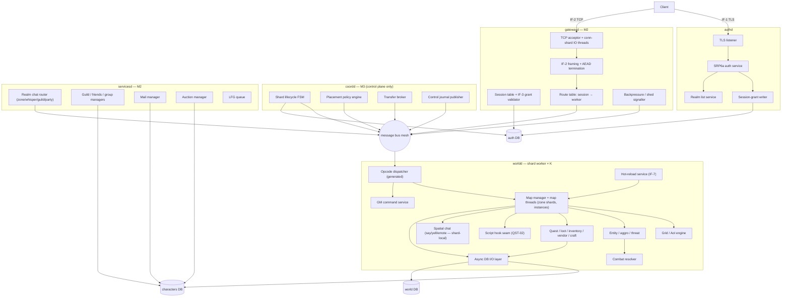
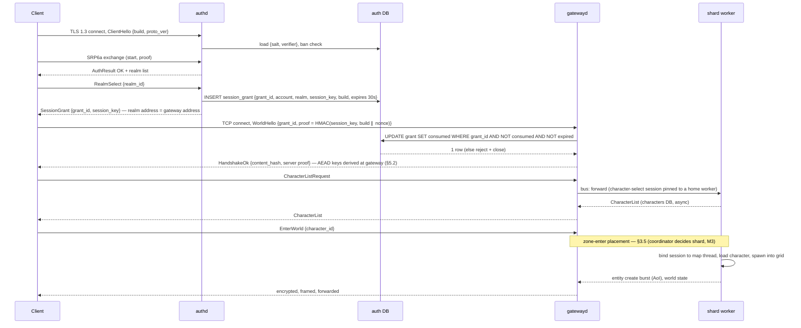
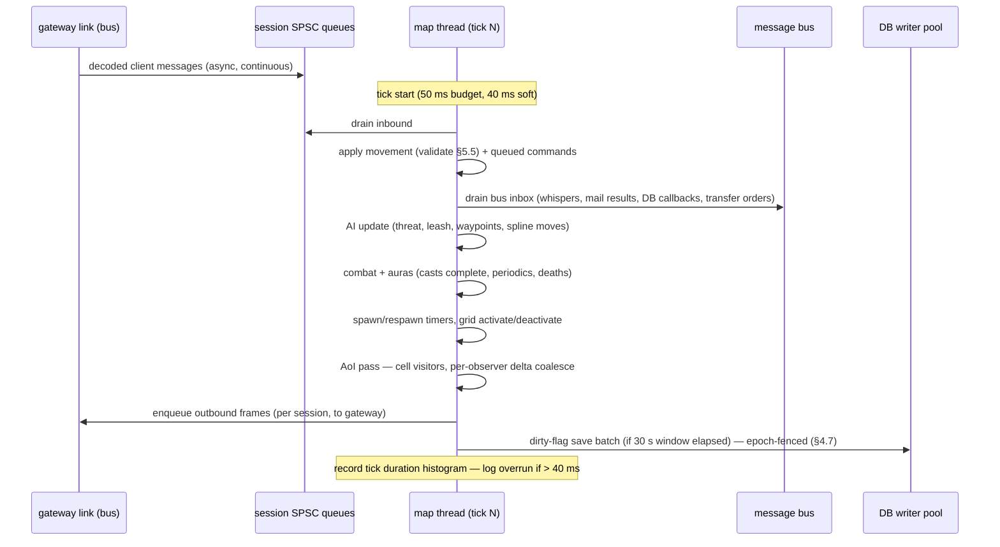
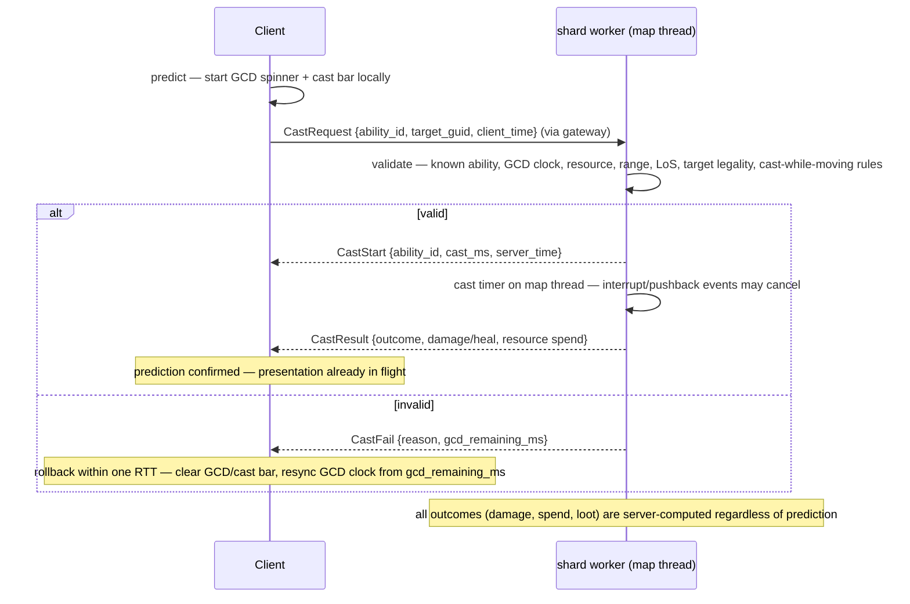
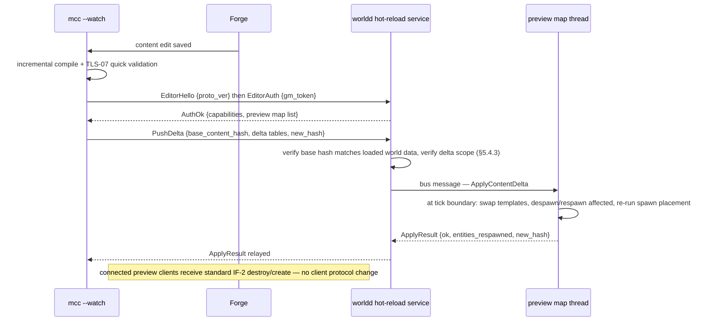
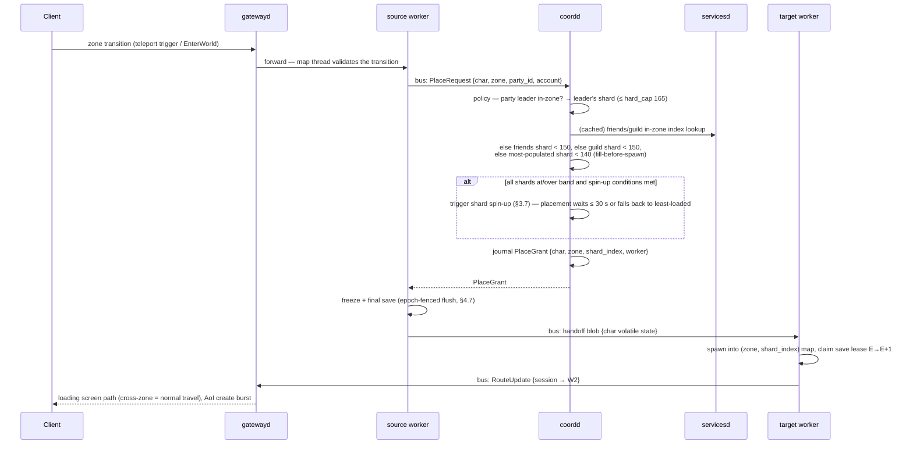
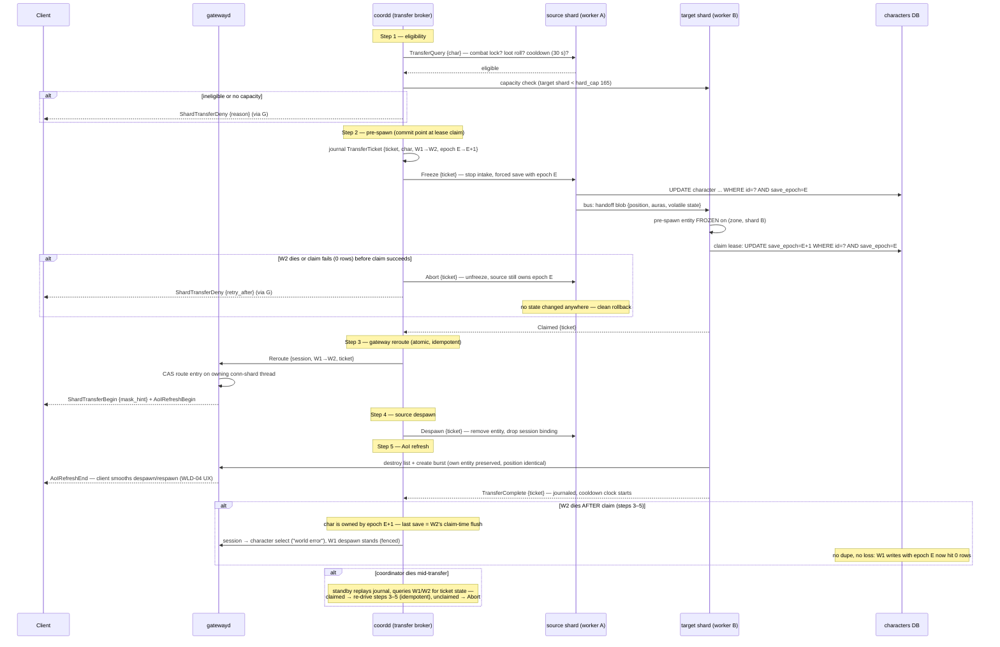
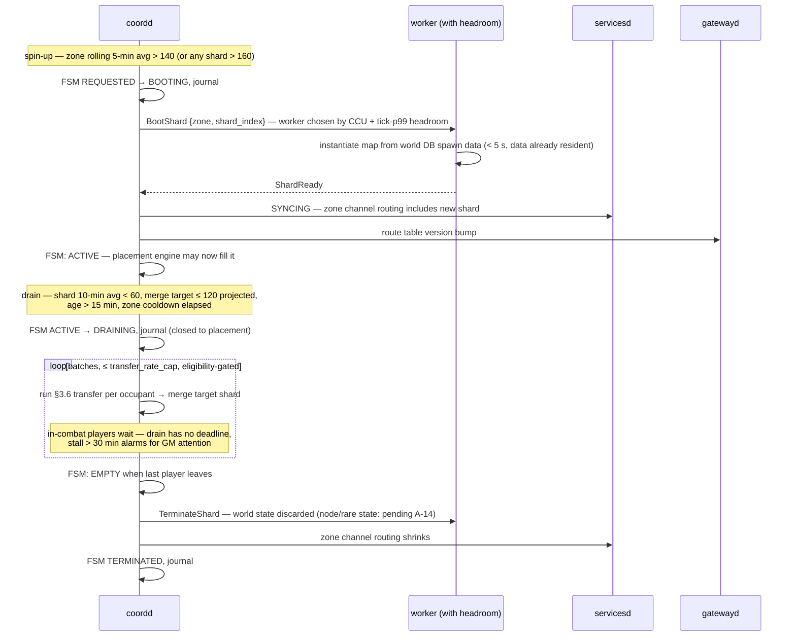
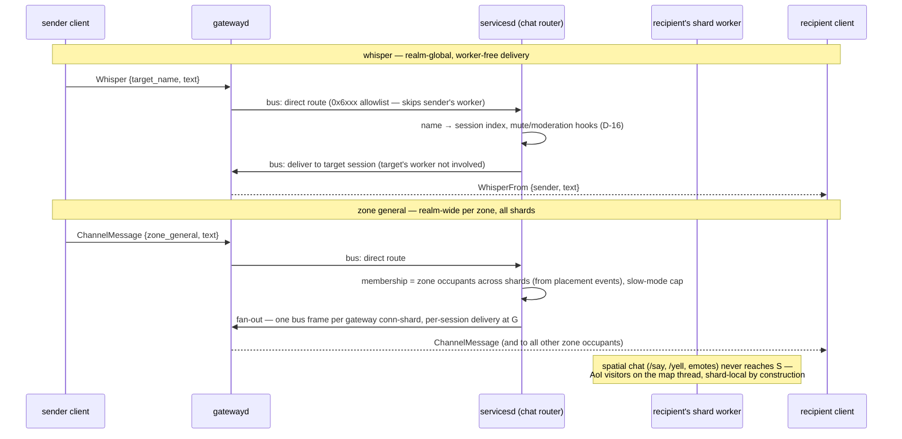

# Server Software Architecture Document — Project Meridian

**Track:** Server
**Version:** 0.2 — 2026-07-04 (v0.2: sharded-realm architecture per D-23 — gateway/coordinator/services/shard-worker decomposition, transfer protocol, save-ownership fencing, coordinator failover design. v0.1: initial draft)
**Status:** Draft for cross-track review
**Zooms into:** `authd`, `gatewayd`, `coordd`, `servicesd`, `worldd` (shard worker), DB schemas — per the [Architecture Overview](../02-ARCHITECTURE-OVERVIEW.md) SAD index.
**Reads with:** [Server PRD](../prd/server-prd.md), [Sync Decisions](../01-SYNC-DECISIONS.md) (D-01, D-03, D-07, D-10, D-16, D-19, D-22, **D-23**, §4–§6), [Baseline v0.4](../00-GAME-DESIGN-BASELINE.md) (OPS-04, WLD-04), [Content Schema v1](../../schema/content/README.md).

---

## 1. Purpose & scope

This SAD describes the architecture of the Linux C++20 server processes and the three MariaDB databases (`auth`, `characters`, `world`) that make up the server container group of the Overview §1 context diagram. Per D-23 the realm is **sharded**: a *realm* is the shared logical server (one auth domain, one character DB, one social graph, one economy); a *shard* is a running copy of open-world zone simulation inside a realm. The M0–M1 deployment is two daemons (`authd`, `worldd`); by M3 a realm is five process kinds:

| Process | Role | Lands |
|---|---|---|
| `authd` | login, realm list, session grants (unchanged) | M0 |
| `gatewayd` | owns every client TCP connection; IF-2 AEAD termination; session→worker routing | M2 |
| `servicesd` | realm-global services: chat channels, guilds, friends, groups, mail, AH, LFG | M2 (extracted) |
| `coordd` | realm coordinator: shard lifecycle, placement, transfer brokering — control plane only | M3 |
| `worldd` | **shard worker**: map simulation, no client listener, bus-attached | M0 (recast M3) |

Where the PRD states *what*, this document states *how*: component boundaries, threads, data flow, and the concrete server side of every interface the track touches. Everything here is clean-room (TD-09): CMaNGOS/TrinityCore are cited as architectural prior art only; no schema, protocol constant, or code is derived from them.

### 1.1 Interface ownership (Overview §2 registry)

| IF | Interface | Server role | Notes |
|----|-----------|-------------|-------|
| IF-1 | Auth protocol (TLS/TCP, FlatBuffers, SRP6a) | **Owns + implements** | Contract in `/schema/net/auth.fbs`; server side §5.1 |
| IF-2 | World protocol (TCP, FlatBuffers, opcode-per-table) | **Owns + implements** | `/schema/net/world.fbs`; §5.2. **D-23 adds shard-transfer/AoI-refresh/co-presence messages (§5.2.1)**; A-11 scope |
| IF-3 | Session handoff via auth DB | **Owns + implements** (internal, both ends) | §5.3. **Gateway-scoped from M2** — `gatewayd`, not `worldd`, consumes grants |
| IF-4 | Compiled world data (world-DB SQL + manifest) | **Consumes** | Tools owns; server-side load/refusal rules §4.3 |
| IF-5 | Client `.pck` packs | — (not involved) | Server only cross-checks the content hash at handshake |
| IF-6 | Zone chunk format | **Consumes cell metadata only** | Tools owns (A-08/D-20); server needs cell/navmesh metadata, §4.5 |
| IF-7 | Live-preview hot reload | **Owns + implements** | Contract §5.4; preview realms are unsharded (single worker) |
| IF-8 | Asset registry | — (not involved) | Assets never reach the server |
| IF-9 | `idmap.lock` string→numeric ID map | **Consumes** | Tools owns; consumption rules §4.6 |

### 1.2 Terminology (binding, per D-23)

- **Realm** — the shared logical server: one auth domain, one characters DB, one social graph, one economy. Players on any shard of a realm share chat channels (except spatial), guilds, mail, AH.
- **Zone shard** — one running copy of an open-world zone's simulation, identified by `(zone map_id, shard_index)`. D-20's zone-local coordinates + teleport zone transitions make each zone its own map, so a zone shard is exactly one map instance.
- **Shard worker** — a `worldd` process hosting N map threads; hosts multiple zone shards and/or a dungeon/BG instance pool. Capacity target **500–750 CCU per worker**; a 3000+ CCU realm ≈ 5–6 workers + gateway + coordinator + services.
- **Instances** (dungeons, BGs) are the pre-existing special case of sharding: `(map_id, instance_id)` with group binding; they are placed on workers by the same coordinator from M3 but have no population-band lifecycle.

---

## 2. Component decomposition

Shared static libraries (PRD §2.1): `libmeridian-core`, `libmeridian-db`, `libmeridian-proto` (generated from `/schema`, D-01; includes the bus envelope, §5.6), `libmeridian-game`. A `--monolith` build flag links gateway + services + one worker into a single process for M0–M1 parity and contributor `docker compose` — the bus stays in-proc but the component boundaries are identical, which is what keeps the M2/M3 splits transport-only.

### 2.1 authd

Stateless by design — no in-process session store survives a handshake, so N instances behind a TCP load balancer work from M0.

- **TLS listener** — TLS 1.3 (OpenSSL), one acceptor + small Asio I/O pool. Enforces protocol version and `client_build` floor from config before any auth exchange. IP-ban check (auth DB, cached with 60 s TTL) at accept.
- **SRP6a auth service** — original SRP6a implementation over a 2048-bit group; auth DB stores `{salt, verifier}` only. Constant-time proof comparison; per-IP and per-account attempt rate limits; failures audit-logged.
- **Realm list service** — realm rows from auth DB (address, port, population bucket, build range, flags). Realm address = gateway address from M2; population is heartbeat-written per-worldd M0–M2, aggregated and written by `coordd` from M3.
- **Session-grant writer** — on realm select, INSERTs the IF-3 grant row (§5.3) and returns `{grant_id, session_key}` to the client inside the TLS channel. Grants are single-use, 30 s expiry; an expiry sweep deletes stale rows.
- **New (M3):** the auth DB hosts the `realm_control` lease row used for coordinator leader election (§8.6) — chosen because auth DB is already the one store every control-plane process can reach.

### 2.2 gatewayd (M2)

**The gateway owns the client connection** (D-23 rule 1). Clients never connect to shard workers; a shard transfer is a server-side reroute — no reconnect, no loading screen within a zone.

- **IO model — decision (revisits v0.1 §9 io_uring deferral):** **epoll via Asio standalone, retained.** The 3000+ budget is ~3,000–5,000 connections × ≤ 20 kB/s ≈ 60–100 MB/s and ~60k small frames/s realm-wide — one to two orders of magnitude below where epoll's per-syscall overhead dominates (io_uring's batching win materializes at ~25k+ connections or very small-frame saturation). io_uring's costs stand: kernel-version sensitivity across contributor machines and container hosts, and a second IO backend to maintain. Mitigations that capture most of the win anyway: `writev` batching of per-tick coalesced frames, `TCP_NODELAY`, per-conn-shard `epoll_wait` with budgeted batch drains. The transport lives behind `libmeridian-proto`'s `IoBackend` interface; **checkpoint at IT-M2** — if measured p99 forwarding latency exceeds the 1 ms budget (§8.2a) at 2× M2 CCU, an io_uring backend is scheduled for M3, as a drop-in.
- **Connection sharding:** an acceptor thread hands sockets to C conn-shard IO threads (C = 2 at M2, 4 at M3+) by `session_id` hash. Each conn-shard owns its sockets, its slice of the session table, and its epoll set exclusively — no cross-thread socket access; a reroute or disconnect targeting another shard's session is a control message to the owning thread.
- **Session table:** `session_id → {account, character, aead_state, route: (worker_id, map_key), state, txq}`. Budget: 5,000 sessions × (16 KiB inbound ring + 64 KiB outbound ring + state) ≈ 400 MB buffers; gateway RSS budget < 2 GB (§8).
- **AEAD termination:** the ChaCha20-Poly1305 per-session channel (§5.2) terminates at the gateway. Workers and services see verified-plaintext FlatBuffer frames inside bus envelopes; `session_key` material never leaves authd/gatewayd. This is what makes reroute atomic — the crypto stream has no per-worker state.
- **Routing:** inbound frames are FlatBuffer-verified, then forwarded on the bus to the session's routed worker (dispatch to map thread happens worker-side; the gateway routes at worker granularity). A small opcode allowlist (`0x6xxx` whisper/zone chat, `0x8xxx` transfer requests) routes to `servicesd`/`coordd` directly, skipping the worker.
- **Backpressure:** per-session bounded outbound ring. A client that can't drain triggers, in order: AoI shed hint to the owning map (existing crowd-fade), chat-delivery drop for that session, disconnect after 15 s at ring-full. Bus-level flow control is credit-based per link (§6.3); gateway never blocks a conn-shard thread on a slow worker link.
- **What the gateway does NOT do:** no game logic, no rate-class enforcement beyond a raw frames/s cap (the generated dispatcher's per-opcode rate classes stay worker-side where session game-state lives), no persistence. It can therefore restart in seconds; sessions do not survive a gateway crash at M3 (accepted, §10.6) — clients re-authenticate.

### 2.3 coordd (M3) — realm coordinator

Control plane only. **No client traffic and no data-plane bus traffic transits the coordinator** — this supersedes the v0.1 §7.1 sketch that routed sessions and bus traffic through it (that sketch is retired; its SPOF flag is resolved in §8.6).

- **Shard lifecycle FSM** (per zone shard): `REQUESTED → BOOTING → SYNCING → ACTIVE → DRAINING → EMPTY → TERMINATED`, plus `QUARANTINED` on worker-reported map failure. `BOOTING` = worker instructed to instantiate the map from world DB spawn data; `SYNCING` = services informed (zone channel membership routing), gateway route table updated; `DRAINING` = closed to placement, occupants migrated (§3.7).
- **Population-band hysteresis — concrete parameters (config, OPS-01; defaults below):**

  | Parameter | Default | Meaning |
  |---|---|---|
  | `band_min / band_max` | 80 / 150 | target population band per zone shard (D-23) |
  | `spin_up_avg` | > 140 for 5 min (rolling mean) | OR any shard instantaneous > 160 → spin up a new shard of that zone |
  | `hard_cap` | 165 | pre-spawn admission ceiling; only party-pin placements may use 150–165 |
  | `drain_avg` | < 60 for 10 min | AND a merge target exists with projected merged population ≤ 120 → drain |
  | `min_lifetime` | 15 min | a shard is never drained before this age |
  | `zone_cooldown` | 10 min | minimum gap between lifecycle actions on the same zone |
  | `transfer_rate_cap` | 5 transfers/s per shard | smooths AoI-refresh bursts (§10.2) |

  Spin-up and drain thresholds deliberately overlap nothing (140↑ vs 60↓ with dwell times) so a zone oscillating around the band never flaps.
- **Placement policy engine** — on every zone-enter (all zone transitions are teleports per D-20, so every entry passes through placement). Pinned priority order (D-23): **party > friends > guild > load balance.** Concretely: (1) if in a party and the leader is in-zone → leader's shard, admissible up to `hard_cap`; (2) else the shard holding the most online friends in-zone, if under `band_max`; (3) else the shard with most online guildmates in-zone, if under `band_max`; (4) else the most-populated shard under `spin_up_avg` (fill-before-spawn, keeps shards merge-friendly). Friends/guild indexes are subscribed from `servicesd` (soft state, eventually consistent — a stale index misplaces a player, never breaks anything).
- **Transfer broker** — owns the WLD-04 transfer protocol (§3.6): eligibility, tickets, commit tracking, rollback.
- **Control journal** — every state-changing decision (shard FSM transition, placement grant, transfer ticket lifecycle, route-table version bump) is published as a sequenced record on bus topic `coord.journal`. This feeds the warm standby (§8.6) and is the audit trail for placement/transfer disputes.
- **Sizing:** decision rates are tiny — zone-enters at 3000 CCU ≈ tens/s, transfers capped at ~30/s realm-wide. Single-threaded event loop (§6.2); a Raspberry Pi could run it, which is exactly why making it highly available is cheap.

### 2.4 servicesd (M2) — realm-global services

One process at M3 hosting all realm-scope managers, each already bus-addressed (`Manager(kind)`) since M0 — extraction at M2 is a transport change. **Stated split path:** each manager is a self-contained bus endpoint with its own DB tables; if profiling ever demands it, any manager moves to its own process by re-pointing its bus address — no code change, same rule as the M3 worker split. Expected first candidate: chat router (fan-out CPU), not before M4 data says so.

- **Chat router — pinned scoping (D-23):** `/say`, `/yell`, emotes are **shard-local** (resolved by AoI visitors on the map thread; never leave the worker). **Zone general channel is realm-wide per zone** — membership = all players in that zone across all its shards; maintained from coordinator placement events. **Whisper / party / guild are realm-global.** Whisper routing: source worker → services (realm-wide `name → session/gateway` index) → target's gateway session directly; the target's *worker* is never involved (§3.8). Moderation (mute, slow-mode) hooks here per D-16.
- **Guild / friends / group managers** (SOC-02, GRP-01/03): rosters and online-presence index; publishes the presence/co-shard feeds consumed by the coordinator (placement) and the gateway (IF-2 `ShardPresence` co-presence indicators, §5.2.1). Group manager owns party membership and emits the party-pin facts the placement engine and WLD-04 auto-merge use.
- **Mail / AH managers** (ECO-03/04): unchanged transactional design (§4.2) — they were "coordinator-scoped" in v0.1 language; they are `servicesd`-scoped now. LFG queue (GRP-03) likewise.

### 2.5 worldd — shard worker (recast at M3)

What changes vs today's `worldd`:

- **No client listener.** The net gate is deleted; inbound arrives as bus envelopes from the gateway (already FlatBuffer-verified, AEAD-stripped); outbound is enqueued to the gateway per session. The generated opcode dispatcher, rate classes, and session-state checks are unchanged — they run against the gateway-forwarded stream.
- **Bus-attached:** the worker joins the bus mesh at boot, registers with the coordinator, and receives map assignments (`BOOTING` orders). It hosts a config-capped set of zone shards + a dynamic instance pool.
- **Map keying:** `MapKey = (map_id, instance_id, shard_index)` — continent/zone maps are singletons *per shard* rather than per realm; dungeon/BG instances keep `instance_id` with `shard_index = 0`. All bus addressing, metrics labels, and log context carry the full key (`realm/zone/shard-index` tagging per D-23).
- **Session façade:** the worker keeps a per-session lightweight record (state machine position, character binding, rate counters) but no socket, no keys. `LOADING → IN_WORLD` etc. unchanged.
- **Spatial chat stays here**; whisper/zone/guild/party forward to `servicesd` over the bus (in v0.1 they went "via the bus" to world-thread managers — same call sites, new address).

Retained in full from v0.1, unchanged by sharding:

- **Opcode dispatcher** — table generated from `world.fbs` (D-01): per opcode, the generated skeleton declares *required session state*, *processing thread* (map vs world), and *rate class* (OPS-03); hand-written bodies only. Wrong-state or over-rate messages are dropped and counted; repeat offenders kicked. Client and server can never disagree on opcode IDs — both consume the same generated table.
- **Map manager + per-map update thread** — a pool of M worker threads runs the tick; each tick, every active map is updated by **exactly one** worker (a map never runs on two threads concurrently), so all entity state on a map is single-threaded by construction. Tick order: drain inbound → movement/commands → AI → combat/auras → spawns/respawns → AoI delta build → flush outbound. 20 Hz, 40 ms per-map soft budget with overrun logging.
- **Grid / AoI engine** — 533 m grids × 8×8 cells (~66 m); grids activate on player proximity, deactivate on timer; inactive grids do not tick. Cell-visitor queries implement "notify observers within R of P" (default R = 90 m, per-map config). Per-observer per-tick coalescing → one update packet per tick; decimation and shed per PRD §3.3. Cell metadata (walkable extents, liquid, navmesh tile refs) from IF-6 exports via the world DB.
- **Entity / aggro / threat** — shallow class hierarchy (`WorldObject → Unit → {Player, Creature}`, `GameObject`, `Corpse`), not a generic ECS (§9). Threat table per creature, aggro radius by level delta, leash-to-home with evade/full-heal, respawn timers, waypoint patrols from compiled spawn tables. Creature movement = Recast/Detour navmesh spline paths broadcast as spline packets.
- **Combat resolver** — CMB-01: target/range/LoS validation, GCD enforcement, cast timers with interrupt/pushback, attack tables, damage/heal application, aura container (periodics, stat mods, stacking). All rolls server-side, seeded-RNG unit-testable.
- **Quest / loot / inventory / vendor / craft services** — quest state machine (QST-01/02), loot-table evaluation + loot sessions (ITM-02), inventory/equip validation (ITM-01), vendor/currency (ECO-01), crafting (ECO-02, transactional). AH/mail moved to `servicesd` (§2.4).
- **GM command service** — command execution + permission model (player < helper < GM < admin) server-owned (D-16); permission-gated, audit-streamed, string-ID capable via the loaded idmap (§4.6).
- **Script hook seam (QST-02)** — registry of typed C++ hook points (`OnQuestEvent`, `OnCreatureAI`, `OnAreaTrigger`, `OnGossipSelect`) keyed by content ID; capability-limited context object (no raw map access) so a future embedded-script binding is a backend swap, not an API change.
- **Hot-reload service (IF-7)** — §5.4; preview realms run one unsharded worker.
- **Async DB I/O layer** — `libmeridian-db`: per-DB connection pools on a dedicated worker pool, prepared statements only, completion callbacks marshalled back to the *owning* thread; no synchronous queries in the tick path except boot/shutdown. From M2, character writes are exposed only as epoch-conditional helpers (§4.7).

### 2.6 Message bus

The single mechanism for any effect that crosses a map boundary or targets a global manager — unchanged API: `bus.send(Destination, TypedMessage)`, FlatBuffer-typed, MPSC inboxes drained at tick boundaries; the CI architecture test still fails any cross-map reach that bypasses it. What v0.2 adds is the **inter-process topology and envelope** (§5.6): full mesh of persistent internal TCP links among `{gatewayd, workers, servicesd}` for the data plane; `coordd` links to all nodes for control only. Route tables (which worker hosts which `MapKey`, which gateway conn-shard owns which session) are distributed by the coordinator as versioned snapshots; a node holding a stale version gets a `WrongRoute` bounce and re-fetches — no data-plane traffic ever transits the coordinator.

---

## 3. Runtime views

### 3.1 Login → session grant → world handoff (IF-1 / IF-3 / IF-2, M2+ topology)

M0–M1: identical flow with `worldd` playing the gateway role in-process (`--monolith`).

### 3.2 One 50 ms map tick

Unchanged from v0.1 — reproduced for completeness (the tick is shard-agnostic; "IO thread" is now "gateway link" on the worker side).

### 3.3 Ability cast with client GCD prediction (D-10)

Unchanged in substance from v0.1; the gateway adds < 1 ms p99 each way to this path (§8.2a).

### 3.4 TLS-06 hot-reload push on a preview map (IF-7)

Preview realms are deployed unsharded — one worker, `--monolith` — so IF-7 never interacts with transfers.

### 3.5 Zone-enter placement (M3)

Party pin: when a party forms or its leader transfers, `servicesd` emits a party-pin fact; subsequent zone-enters by members hit rule (1). WLD-04 auto-merge = the same transfer protocol (§3.6) initiated by the group manager for members already in-zone on other shards, staggered by the transfer rate cap, with client-side prompt per WLD-04 UX (client-owned).

### 3.6 Same-zone shard transfer — the 5-step protocol (WLD-04), with failure handling

Pinned steps (D-23): eligibility → pre-spawn → gateway reroute → source despawn → AoI refresh. The **commit point** is the save-lease claim at the end of step 2 (§4.7).

Capacity race: two concurrent transfers targeting a nearly-full shard are serialized by the target map thread's admission check at pre-spawn (the coordinator's step-1 check is advisory; the map-thread check at pre-spawn is authoritative) — the loser aborts as the "claim fails" branch. Freeze window budget: ≤ 300 ms (final save + blob + claim); the client masks it behind the WLD-04 transfer UX.

### 3.7 Shard spin-up and drain-and-merge (M3)

Worker crash: all its shards go `QUARANTINED`; affected sessions fall back to character select (gateway holds the TCP connection — "world error" notice, re-enter without re-login); the coordinator re-places re-entering players across surviving shards and boots replacement shards only if the band demands it. This is the v0.1 map-quarantine story lifted to process granularity, with the same durable-state guarantee (§4.2: DB is truth; ≤ 30 s non-economic loss).

### 3.8 Cross-shard whisper and realm-wide zone chat (M3)

Fan-out budget at 3000 CCU: hottest zone ≈ 1,000 members across shards; slow-mode caps channels at 1 msg / 2 s per player and the router at 20 inbound msg/s per channel → worst-case ≈ 20k deliveries/s realm-wide ≈ 2 MB/s — noise next to entity traffic. Chat is capped at 2% of gateway downstream; excess is queued then dropped-with-notice (§8.7).

---

## 4. Data architecture

### 4.1 auth DB (owner: authd; gatewayd reads grants, coordd heartbeats realm + holds control lease)

| Table | Key columns | Notes |
|---|---|---|
| `account` | `id PK, username UQ, srp_salt, srp_verifier, gm_level, email, locked, created_at, last_login` | passwords never stored |
| `account_ban` / `ip_ban` | account/IP, `expires_at`, reason, banned_by | enforced in authd and gatewayd |
| `realm` | `id PK, name, address, port, build_min, build_max, population, flags, heartbeat_at` | address = gateway from M2; population heartbeat written by `coordd` (realm aggregate) from M3, per-worldd before |
| `session_grant` | `grant_id PK (random u64), account_id FK, realm_id FK, session_key BINARY(32), client_build, expires_at, consumed_at NULL` | IF-3; single-use (§5.3); consumed by `gatewayd` from M2 |
| `realm_control` **(new, M3)** | `realm_id PK, coord_epoch BIGINT, leader_id, lease_expires_at` | coordinator leader lease + fencing epoch (§8.6); CAS-updated only |

### 4.2 characters DB (owner: shard workers + servicesd; the only durable player state)

| Table | Key columns / relationships | Notes |
|---|---|---|
| `character` | `id PK, account_id, name UQ, race, class, level, xp, money, map_id, instance_id, pos_x/y/z/o, played_time, logout_at, `**`save_epoch BIGINT NOT NULL DEFAULT 0`** | account_id is a *soft* reference into auth DB (no cross-DB FK). **`save_epoch` (new, M2) is the save-ownership fence (§4.7); every character-state write is epoch-conditional. `shard_index` is deliberately NOT persisted — placement is recomputed on every zone-enter (shards are ephemeral)** |
| `character_inventory` | `char_id FK, bag, slot, item_guid FK` | slot layout server-validated |
| `item_instance` | `item_guid PK, item_template_id → world DB, stack, durability, suffix_id, creator` | template ref is an IF-9 numeric ID |
| `character_quest` | `char_id, quest_id → world DB, state, objective_counts, completed_at` | |
| `character_spell` / `character_talent` | learned abilities, talent points | M1 / M2 |
| `character_aura` | persisted auras on logout | M1 |
| `mail`, `mail_item` | `mail_id PK, sender, receiver, money, cod, expires_at` + attached item_guids | M2, transactional; **owner: `servicesd` from M2** |
| `auction` | `auction_id PK, item_guid, owner, bid, buyout, deposit, expires_at` | M2, escrow: item_guid owned by AH while listed; **owner: `servicesd` from M2** |
| `guild`, `guild_member`, `guild_rank` | | M3; owner: `servicesd` |
| `character_social` | friends/ignore | M3; owner: `servicesd` |
| `instance_bind` / `instance_state` | group↔instance binding, boss state | M2 |

**Write patterns** unchanged and binding: dirty-flag batch flush every 30 s + forced flush on logout, zone transfer, **shard transfer (freeze step)**, and trade; economy operations are never batched — single characters-DB transactions (mail send, AH list/bid/buyout, craft, trade commit), which is what keeps the IT-M2 kill-mid-loop test passing. New rule: **every character-state UPDATE carries `AND save_epoch = ?`** (§4.7) — a 0-row result is a fencing event: logged, alerted, write discarded (the writer no longer owns the character).

### 4.3 world DB — read-only mcc artifact (IF-4)

`world` is **never written by the server** and is replaced wholesale by the nightly content build. Table families (numeric keys assigned by IF-9): `manifest` (content_hash, schema_version, mcc_version, idmap_hash, built_at, pack list), `npc_template`, `item_template`, `ability`, `quest_template` (+ objectives, chains, conditions), `loot_table`/`loot_entry`/`loot_group`, `vendor_inventory`, `spawn_point`/`patrol_path`, `zone`/`area`/`area_trigger`/`graveyard`, `gossip`, `class_level_stats` (M2), `navmesh_ref`.

**Boot handshake:** every worker reads `manifest`, refuses to start on schema-version mismatch, logs the content hash; the gateway sends it in `HandshakeOk` (§3.1) so client `.pck` and server data are provably the same compile (warning M0–M1, hard fail on the test realm from M1). Full load into immutable in-memory template stores < 60 s at M3 volume. Sharding note: every worker holds the same immutable template store; a shard spin-up instantiates a map from already-resident data, which is why `BootShard` is seconds, not a process start. The coordinator refuses to admit a worker whose content hash differs from the realm's (mixed-content realms are structurally impossible).

### 4.4 Cross-DB reference rule

characters DB → world DB references are **numeric IDs only, stable across rebuilds** because `idmap.lock` is committed (IF-9). Nightly world-DB replacement is safe *only* under this invariant; `meridian-validate` re-checks that every referenced template ID in a characters-DB snapshot still exists after a rebuild (dangling refs = content CI failure, not a server crash).

### 4.5 IF-6 consumption (cell metadata)

The server consumes only the *server-facing slice* of the chunk format: per-cell walkable metadata, liquid volumes, and navmesh tile references, delivered inside the IF-4 artifact set (mcc bakes them; the server never parses Forge scene files). D-20 baseline adopted; A-08 sign-off walk pending — see §10.

### 4.6 IF-9 consumption

Numeric IDs are baked into IF-4 by mcc, so the tick path never touches `idmap.lock`. Workers additionally load the idmap snapshot embedded in the world DB (string↔numeric, per-namespace bands) for: GM commands by string ID, log/audit readability, and TLS-08 pack-band validation at load (a pack whose rows fall outside its allocated band is rejected before merge).

### 4.7 Shard-aware state ownership (D-23) — and the exactly-once save handoff

**Per-shard (volatile, discarded on shard termination):** entity/AoI state, spatial-chat scope, threat tables, spawn/respawn timers, loot sessions, **gathering-node and rare-spawn state (interim — the A-14 farming-vector mitigation may move these to zone-scoped shared state; the map/manager seam is kept so that's a data-location change, not a redesign)**.

**Realm-global (durable or services-owned):** character persistence (characters DB), social graph (guilds/friends/groups), economy (mail, AH, trade), chat channel membership, LFG queue, world-clock/weather phase (WLD-02 — one authority in `servicesd` broadcast to all shards, so day/night and weather are identical across shards of a zone).

**Character-save ownership during transfer — the correctness core.** At any instant, **exactly one process may write a character's durable state**, enforced not by trusting processes but by the database:

1. `character.save_epoch` is a monotonically increasing fence. The owner of epoch E is the only legitimate writer; **every** write is `UPDATE … WHERE id = ? AND save_epoch = E` (compare-and-set). A crashed, partitioned, or zombie source shard can never clobber state it no longer owns — its writes match 0 rows.
2. Ownership transfers by **claim, not by grant**: the target executes `UPDATE character SET save_epoch = E+1 WHERE id = ? AND save_epoch = E` after pre-spawn. Success (1 row) is the transfer's commit point; failure (0 rows) means someone else owns the character and the transfer aborts with zero side effects.
3. The source **freezes before the claim** (stops intake, forced flush at epoch E) so the handoff blob + DB row are consistent at the moment ownership moves. The target flushes an epoch-E+1 save immediately on claim, so a post-claim target crash loses at most the freeze-window delta (~0; blob state was just persisted).
4. Crash analysis: *target dies pre-claim* → source still owns E, unfreeze, retry later (no dupe: target never wrote; no loss: source flushed). *Target dies post-claim* → E+1 save stands; source is fenced; player re-enters from character select (crash-equivalent, ≤ 30 s rule holds). *Source dies mid-freeze* → coordinator aborts the ticket; character recovers from last epoch-E save like any worker crash. *Both die / coordinator dies* → journal + lease state in the DB fully determine the owner; the new coordinator leader re-drives or aborts by rule 2. There is no window in which two writers are both accepted, and no window in which a committed save can be lost — the epoch CAS makes duplication structurally impossible rather than unlikely.
5. Logout/zone-transfer/instance-entry use the same mechanism (they are transfers with a trivial target), so there is one ownership code path to test, not three. A distributed transaction / 2PC across processes was rejected (§9): the DB row *is* the shared arbiter; adding a second consensus layer would add failure modes, not remove them.

---

## 5. Interface contracts (server side)

### 5.1 IF-1 — auth protocol

- **Transport:** TLS 1.3 over TCP, default port `7100` (config). Server cert from realm operator PKI; client does standard verification.
- **Framing:** `u32 LE length ∥ FlatBuffer root table` (length excludes itself, max 8 KiB — auth messages are tiny).
- **Message set** (`/schema/net/auth.fbs`): `ClientHello{build, proto_ver} → ServerHello`, `SrpStart → SrpChallenge{salt, B}`, `SrpProof{A, M1} → AuthResult{M2 | error}`, `RealmListRequest → RealmList`, `RealmSelect{realm_id} → SessionGrant{grant_id, session_key} | Error`.
- **Lifecycle:** connect → hello → SRP → realm list → grant → server closes. No long-lived auth connections; reconnect = full re-auth.
- **Versioning:** `proto_ver` (u16) checked at hello; FlatBuffers additive-field evolution within a major, majors are incompatible (hard reject). Same rule for IF-2.
- **Sharding change:** the realm-list `address:port` points at `gatewayd` from M2 — shard workers are unreachable from the internet by construction.

### 5.2 IF-2 — world protocol

- **Transport:** TCP, default port `7200`, terminating at `gatewayd` from M2 (§2.2). Not TLS at M0; confidentiality/integrity from per-session keys: `k_c2s, k_s2c = HKDF-SHA256(session_key, "meridian-world-v1", direction)`. Payloads encrypted ChaCha20-Poly1305, nonce = direction ∥ 64-bit sequence counter. D-03 UDP gate and D-22 clock-sync/reconnect-window/nonce-budget items remain in A-11 scope; transport stays abstracted in `libmeridian-proto`.
- **Framing:** `u32 LE length ∥ u16 opcode ∥ u64 seq ∥ AEAD(payload)` where payload is the FlatBuffer table for that opcode. Length max 64 KiB client→server, 256 KiB server→client (entity-create and AoI-refresh bursts). Every inbound buffer passes the FlatBuffers verifier (at the gateway) before forwarding.
- **Opcode organization:** one FlatBuffer table per message; enum generated from `world.fbs` with reserved ranges per domain — `0x0xxx` session/system, `0x1xxx` movement, `0x2xxx` entity state, `0x3xxx` combat, `0x4xxx` quest/gossip, `0x5xxx` inventory/loot/economy, `0x6xxx` chat/social, `0x7xxx` group/instance, **`0x8xxx` shard/transfer (new, §5.2.1)**, `0xExxx` GM, `0xFxxx` hot-reload. Generated dispatcher metadata per opcode: required state, thread, rate class — enforced worker-side.
- **Session token (IF-3 presentation):** `WorldHello{grant_id (u64), client_build, nonce (16 B), proof = HMAC-SHA256(session_key, build ∥ nonce)}`; gateway replies with its proof over `nonce ∥ content_hash` so the client authenticates the realm too.
- **Compat rule:** `proto_ver` + content hash at handshake; version mismatch = reject with a human-readable reason; content-hash mismatch = warning (M0–M1) / reject (M1+ test realm).

#### 5.2.1 Shard messages (new range `0x8xxx`, per D-23; A-11 protocol-design scope)

| Opcode (range 0x8xxx) | Direction | Payload | Notes |
|---|---|---|---|
| `ShardTransferRequest` | C→S | `{kind: join_friend ∣ party_merge_accept, target_char_guid}` | join-friend is same-zone only; cross-zone = normal travel + shard pin |
| `ShardTransferDeny` | S→C | `{reason: combat ∣ loot_roll ∣ cooldown ∣ capacity ∣ cross_zone, retry_after_ms}` | anti-abuse surface (D-23 rule 6) |
| `ShardTransferBegin` | S→C | `{ticket, mask_hint_ms}` | client starts WLD-04 transfer masking |
| `AoIRefreshBegin` / `AoIRefreshEnd` | S→C | `{reason: shard_transfer ∣ recovery}` brackets | between them: standard destroy list + create burst; **own entity is never destroyed, position preserved** — client smooths surroundings swap |
| `ShardPresence` | S→C | `{entries: [{char_guid, same_shard: bool, shard_ordinal}]}` | co-presence indicator data for party/friends/guild members in the same zone — feeds nameplates + social UI (client-owned rendering); pushed on change by `servicesd` |

Client-side handling of these is A-13 (client track). AoI-refresh cost budget: one refresh ≈ one enter-world burst (≤ 256 KiB server→client frame ceiling applies); the coordinator's per-shard transfer rate cap keeps dense-transfer bursts bounded (§10.2).

### 5.3 IF-3 — session handoff (internal) — gateway-scoped from M2

Contract remains the `session_grant` table + rules of v0.1 (single-use atomic consume, 30 s expiry, bound to `{account, realm, client_build}`). Changes: (a) **`gatewayd` consumes grants** and holds `session_key`; workers and services never see key material; (b) the gateway mints an internal, bus-only `WorkerSessionBind {session_id, account_id, gateway_node, conn_shard}` when routing a session to a worker — workers authenticate the *bus link*, not the session; (c) a dropped client TCP still re-authenticates through authd (grants stay single-use; reconnect-window design remains an A-11/D-22 item).

### 5.4 IF-7 — live-preview hot reload (this SAD is the contract)

**5.4.1 Channel & auth.** Separate TCP listener, default port `7300`, **disabled by default** and refused outside maps flagged `preview` in config; never enabled on public realms (enforced: the service refuses to start if any non-preview map exists in the process — preview realms are dedicated, deployed `--monolith` with no gateway/coordinator, so IF-7's contract is untouched by sharding). Auth: `EditorAuth{gm_token}` where the token is an IF-1-issued session grant for an account with `gm_level ≥ GM` on a realm flagged `editor`; same single-use consumption as §5.3. All IF-7 frames use the IF-2 codec (§5.2) with the `0xFxxx` opcode range.

**5.4.2 Message set** (`world.fbs`, hot-reload section):

| Opcode | Direction | Payload |
|---|---|---|
| `EditorHello / AuthOk` | tool → server / reply | proto_ver; capabilities + preview map list |
| `PushDelta` | tool → server | `base_content_hash`, `new_content_hash`, per-table row deltas (upsert/delete) for whitelisted tables |
| `ApplyResult` | server → tool | ok/fail, reason, affected map, entities respawned, active hash |
| `RespawnRequest` | tool → server | force respawn pass for a spawn set / cell |
| `TeleportPreview` | tool → server | move the editor's GM character to coordinates on the preview map |
| `SubscribeLog / LogEvent` | tool ↔ server | stream validation warnings + apply logs back to Forge |

**5.4.3 Scope limits (binding).** Whitelisted delta classes: `npc_template`, `item_template`, `ability`, `quest_template`+deps, `loot_*`, `vendor_inventory`, `spawn_point`/`patrol_path`, `gossip`. **Out of scope:** world-DB schema changes, navmesh/geometry (map reload required), anything touching characters or auth DBs. `PushDelta` is rejected if `base_content_hash` ≠ the hash currently loaded (the tool must recompile against current state — no blind merges). Application happens at a tick boundary on the preview map thread only; creatures in combat with a player are despawned, not mutated in place (PRD Risk 4). Round-trip budget: edit → visible < 10 s (IT-M2).

### 5.5 Movement validation envelope (OPS-03, server side of IF-2)

Per movement packet (≤ 10/s/client + state changes): **speed** — displacement vs `server_speed(active_mode) × Δt × 1.15` per packet *and* over a sliding 2 s window (catches burst-then-idle cheats); **teleport** — displacement > window budget = hard violation; forced moves (knockback, GM teleport) carry an ack counter the client must echo — un-acked counters freeze intake; **bounds/geometry** — inside map bounds, z within ±4 m of heightfield/navmesh sample (plausibility, not collision honesty); **flag legality** — swim only in liquid volumes (IF-6 metadata), no fly flag. Policy ladder: correct (snap-back) → threshold N violations/min = kick → repeat = anti-cheat audit flag for GM review. All thresholds config (OPS-01). Executes on the map thread; the gateway does not participate. A shard transfer resets the sliding window (position is preserved across transfer, so the transfer itself can never trip a violation — asserted in tests).

### 5.6 Bus topology & message envelope (internal contract, `/schema/net/bus.fbs`)

- **Topology:** full mesh of persistent internal TCP links (IF-2 codec framing, no AEAD — the mesh runs on a private network segment; mutual auth by per-node static keys from config) among `{gatewayd × 1..2, workers × K, servicesd}`; `coordd` (+ standby) links to every node for control. Links carry multiplexed lanes: `control` (reserved, never backpressured by data), `session` (gateway↔worker per-session traffic), `bulk` (fan-out, DB-adjacent).
- **Envelope:** `BusEnvelope { ver: u8, coord_epoch: u32, src: NodeId, dst: Address, corr_id: u64, lane: u8, payload_type: u16, payload }` where `Address = { kind: SESSION ∣ MAP ∣ MANAGER ∣ WORKER ∣ COORD, realm_id, zone_map_id, shard_index, instance_id, session_id, manager_kind }` — the realm/zone/shard addressing pinned by D-23. `coord_epoch` on control messages implements coordinator fencing (§8.6): any node receiving a control command with an epoch below its high-water mark rejects it.
- **Delivery semantics:** at-most-once per link with per-lane sequence numbers; link loss = node-down event to the coordinator. Anything needing stronger guarantees (saves, economy) already goes through the DB, by design — the bus is never a durability layer.
- The in-process M0–M2 implementation (lock-free MPSC drained at tick boundaries) is the same API; `Destination` gains the shard fields at M2 with `shard_index = 0`.

---

## 6. Concurrency model

### 6.1 Thread inventory (per process, M3)

| Process | Thread(s) | Count | Owns | Never touches |
|---|---|---|---|---|
| worldd | world thread | 1 | tick orchestration, session façade lifecycle, bus routing | entity state on maps |
| worldd | map workers | M (≈ cores − 3) | per-tick exclusive update of assigned maps (zone shards + instances) | sockets, DB connections, other maps' entities |
| worldd | bus link IO | 2 | mesh link framing to gateway/services/coordinator | game state |
| worldd | DB workers | pool | prepared statements | game state |
| gatewayd | acceptor | 1 | accept + conn-shard assignment | session payloads |
| gatewayd | conn shards | C (2 M2 / 4 M3) | exclusive: socket set, session-table slice, AEAD state, epoll set | other conn shards' sessions, game logic |
| gatewayd | bus link IO | 1 per worker link | mesh framing, credit accounting | session table (hands frames to conn shards via SPSC) |
| coordd | control loop | **1** | all coordinator state: FSMs, placement, tickets, journal | — |
| coordd | DB/lease | 1 | lease renewal CAS, journal DB mirror | control state (message-passing only) |
| servicesd | manager threads | 1 per manager kind | that manager's state + bus inbox | other managers' state (bus-only, same rule as maps) |
| all | metrics/log | 1 | Prometheus endpoint, sinks | everything else (seqlock snapshots) |

### 6.2 Coordinator single-threaded control plane — rationale

Every correctness argument in §3.6/§4.7 leans on the coordinator observing and journaling a **total order** of placement grants, transfer tickets, and FSM transitions. At tens of decisions/s, parallelism buys nothing and would force locking or ordering protocols across the exact state we most need to reason about — the same argument as single-threaded maps, applied to the control plane. The journal is the replication mechanism (§8.6), so single-threadedness also makes standby replay trivially deterministic.

### 6.3 Data crossing rules & backpressure

v0.1 rules stand (SPSC session queues, bus-only cross-map, DB callbacks marshalled to owning thread, seqlock metrics, zero gameplay locks). Inter-process additions:

- **Credit-based flow control per mesh link + lane:** receiver grants byte credits; sender stops at zero. The `control` lane has reserved credits so a saturated `session`/`bulk` lane can never stall transfers, reroutes, or lifecycle commands.
- **Gateway → worker overload:** if a worker's inbound credits stay exhausted > 2 s, the gateway raises `WorkerSlow` to the coordinator (input: placement headroom scoring) and applies per-session raw-frame caps.
- **Worker → gateway overload** (client can't drain, §2.2): AoI shed hint → chat drop → disconnect at 15 s.
- **Services fan-out:** chat fan-out is one bus frame per gateway conn-shard (the gateway explodes it to sessions), keeping worst-case services egress O(conn-shards), not O(players).
- **Bus saturation guardrail:** per-link and per-lane depth metrics with alerts at 60% sustained (§8.5); the architecture test suite gains a rule that no map-thread code may block on `bus.send` (sends are enqueue-or-shed, never wait).

---

## 7. Milestone build plan (rephased per D-23 rule 7)

| Component | M0 | M1 | M2 | M3 | M4 |
|---|---|---|---|---|---|
| authd (TLS, SRP6a, realm list, grants) | ✅ full | — | — | `realm_control` lease table | LB hardening |
| Message bus (API + in-proc MPSC, bus-only CI rule from day one) | ✅ | — | mesh transport + envelope + lanes | full mesh at scale | — |
| Net gate, dispatcher, IF-2 codec | ✅ in worldd | rate classes full | codec moves to gatewayd; D-03 UDP gate decision | `0x8xxx` shard messages | — |
| Map manager + tick | ✅ 1 continent map, echo world state (movement + AoI relay only) | full tick order | InstanceMap lifecycle | shard-index map keying, multi-worker | — |
| Grid/AoI | ✅ basic visitors, activation | decimation, shed | per-instance spaces | AoI-refresh bursts for transfers | — |
| Movement validation | v0 (speed+bounds) | v1 full envelope | — | transfer window-reset rule | — |
| Combat / AI / death / auras | — | ✅ CMB-01..04 basic | aura matrix full, threat depth | PvP legality (PVP-01/02) | — |
| Quest / loot / inventory / vendor | — | ✅ QST-01, ITM-01/02, ECO-01 | QST-02 + script seam live, crafting | — | — |
| Economy managers (AH, mail) | — | — | ✅ ECO-03/04 transactional, **in servicesd** | — | — |
| Chat router | — | ✅ say/yell/whisper/zone | whisper/zone via servicesd | realm-wide zone channels across shards, guild chat (SOC-02) | — |
| GM commands / audit | — | ✅ basic set | — | moderation at scale | — |
| Hot-reload service (IF-7) | — | contract designed | ✅ TLS-06 live (unsharded preview realm) | — | — |
| DB layer + dirty-flag saves | ✅ | — | economy transactions; **`save_epoch` column + fenced writes land here** (all character saves epoch-conditional from M2) | — | — |
| **gatewayd** | — | — | ✅ **split: listener + AEAD + session table move out of worldd; IF-3 gateway-scoped** | conn-shards ×4, reroute support | io_uring backend iff IT-M2 checkpoint fails budget |
| **servicesd** | — | — | ✅ **extraction: chat/mail/AH/group managers behind their existing bus addresses** | guilds/friends/LFG (GRP-03), presence feeds | split-path per manager if data demands |
| **coordd** | — | — | design review (this SAD §2.3/§8.6) | ✅ lifecycle FSM, placement, transfer broker, journal, warm standby | failover drills in load tests |
| **Shard transfers (WLD-04)** | — | — | — | ✅ 5-step protocol, party auto-merge, join-friend | — |
| Multi-worker / shard lifecycle | — | — | — | ✅ 5–6 workers, spin-up/drain live | 3000+ CCU bot-fleet gate |
| Community pack loader (TLS-08) | — | — | — | ✅ | — |
| Metrics/logs | ✅ stub + tick histogram | dashboards | per-process aggregation, shard labels | transfer/placement/failover panels | — |

**M0/M1 are unchanged** (single `worldd`, bus discipline enforced from day one — that rule is precisely what makes M2/M3 transport swaps instead of rewrites).

**IT-M2 must prove about the gateway split:** (1) every existing IT-M2 criterion (dungeon clear, economy loop, kill-mid-loop no-dupe, hot-reload < 10 s) passes **through the gateway** unchanged; (2) measured gateway added latency p99 < 1 ms at 2× M2 CCU (300 bots); (3) AEAD termination relocated — workers demonstrably hold no key material (audit + test); (4) a worker restart while the gateway holds sessions drops clients to character select **without TCP disconnect** and they re-enter without re-login; (5) epoch-fenced saves active — a deliberately duplicated writer's flush hits 0 rows and alerts. IT-M2 also feeds the D-03 UDP gate and the io_uring checkpoint (§2.2).

**IT-M3 (Baseline v0.4):** 1500 CCU sustained across **≥ 3 zone shards live**, with party auto-merge and join-friend transfers exercised throughout; tick p99 in budget on every worker; transfer p95 < 500 ms (§8.2b); community pack loads on an unmodified server. **The full 3000+ CCU load test is an M4 gate using bot fleets** — M3 rates the architecture for it; M4 proves it.

---

## 8. Quality attributes

### 8.1 Tick budget (20 Hz)

50 ms hard / 40 ms soft per map. Sizing: 5,000 active ticking entities per worker process; the design point for a single crowded map is ~500 simultaneously ticking entities (AI + combat) — at that density the expensive passes are AoI (bounded by cell visitors + per-observer 120-entity typical / 250 hard cap with shed) and combat (O(active casts + auras)). Inactive grids don't tick; spawn/aura containers are flat arrays iterated linearly; zero allocation in the steady-state tick (pooled packets/events). p99 tick < 50 ms is a per-milestone release gate at 2× CCU nightly bot loads. Sharding *helps* here: the population band caps a zone shard at 150–165 players, which bounds the AoI worst case better than v0.1's open-ended hub-map risk.

### 8.2 Latency budgets

**(a) Gateway forwarding: < 1 ms added latency p99 each way** (decode/verify/route or encrypt/frame/flush), measured as the delta between gateway-ingress and worker-ingress timestamps under 2× milestone CCU. Blowing this budget triggers the io_uring checkpoint (§2.2).
**(b) Shard transfer: p95 < 500 ms, p99 < 1 s, request → AoI-stable** (client has received `AoIRefreshEnd` and one subsequent full tick of deltas). Freeze window ≤ 300 ms inside that. Measured by bot harness with transfer scripting from IT-M3.
**(c) Action RTT: < 150 ms p95 on the test realm.** Budget for a cast/attack round-trip: client send → gateway forward (< 1 ms) → wait for tick boundary (≤ 50 ms worst, 25 ms mean) → validate + apply (same tick) → outbound flush → gateway → client. Server-side contribution ≤ ~57 ms worst case, leaving ≥ 90 ms for network; D-10 prediction hides the perceived GCD latency entirely, and rejection rollback is bounded by one RTT. Measured via bot harness with latency injection and an RTT histogram metric.

### 8.3 Crash isolation

Within a worker, per-map quarantine stands: each map update runs inside a per-map exception boundary; an escaped exception (or a watchdog trip — a map exceeding 10× budget) **quarantines the map**, not the process: marked failed, sessions moved to character select with a "world error" notice, full state dump written, cold restart from spawn data + characters DB. Honest limit unchanged: this contains gameplay-logic faults, not memory corruption — `libmeridian-game` runs ASan/UBSan in CI and the sim harness fuzzes opcode inputs. New layers: **worker crash** → its shards `QUARANTINED`, sessions held at gateway → character select without TCP reconnect, coordinator re-places on re-entry (§3.7); **gateway crash** → sessions lost, clients re-auth via authd (accepted at M3 — second gateway + client retry is the M4 hardening item, §10.6); **services crash** → managers rebuild from characters DB on restart (their state is DB-truth by the economy rules), chat membership rebuilds from coordinator placement snapshots; **coordinator crash** → §8.6. Player durable state is safe by construction in every case (§4.2/§4.7: DB is truth, epoch-fenced, batched writes bounded at 30 s).

### 8.4 Anti-cheat validation points

(1) authd: SRP + build floor + bans; (2) session handshake: single-use grant + proofs (at gateway from M2); (3) dispatcher: state machine + per-opcode rate classes (worker-side); (4) movement envelope §5.5; (5) combat resolver: range/LoS/GCD/cooldown/resource re-checked server-side regardless of client claims; (6) inventory/economy: every move/trade/craft/AH op validated + transactional, economy audit stream; (7) statistical anomaly detection (M2): XP/gold-per-hour outliers → GM queue; **(8) transfer anti-abuse (new, M3):** 30 s cooldown per character, combat/loot-roll eligibility lock, deny-with-reason audit trail, per-shard transfer rate cap; farm-vector telemetry (per-character shard-hop × gather-event correlation) feeds the A-14 mitigation design and the anomaly queue. The instrumented cheat-client suite regression-tests points 3–6 and 8.

### 8.5 Observability

Prometheus (`/metrics` on every process): the v0.1 set — `meridian_tick_duration_seconds{map}`, `meridian_ccu`, `meridian_sessions{state}`, `meridian_opcode_total`/`_dropped_total`, `meridian_db_queue_depth{db}`/`meridian_db_latency_seconds{db}`, `meridian_aoi_entities{map}`, `meridian_grids_active{map}`, `meridian_instances_active`, `meridian_movement_violations_total{kind}`, `meridian_saves_batched_total`, `meridian_rss_bytes`, `meridian_action_rtt_seconds` — re-labelled with `{realm, zone, shard}` where map-scoped. Sharding additions: `meridian_shard_population{zone,shard}`, `meridian_shard_state{state}`, `meridian_transfers_total{result}` + `meridian_transfer_duration_seconds` histogram, `meridian_placement_decisions_total{rule}` (party/friends/guild/balance hit rates), `meridian_gateway_forward_seconds` histogram, `meridian_gateway_sessions`, `meridian_bus_lane_depth{link,lane}` + credit-stall counters, `meridian_save_fence_rejections_total` (**any nonzero page-worthy**), `meridian_coord_epoch`, `meridian_journal_lag_seconds` (standby). Alerts: fence rejection > 0, transfer p99 > 1 s, bus lane > 60% sustained, journal lag > 5 s, shard flap (> 2 lifecycle actions/zone/hour).

### 8.6 Coordinator failover — resolving the v0.1 SPOF flag (risk 9)

**Decision: warm standby + bus-journal replay + DB-fenced leadership.** (Raft/etcd-class consensus rejected — §9.)

- **Leadership:** `realm_control` row in auth DB (§4.1). The leader renews `lease_expires_at` every 2 s by CAS on `coord_epoch`; the standby watches, and on lease expiry (6 s, i.e. 3 missed renewals) claims leadership by CAS-incrementing `coord_epoch`. The CAS makes split-brain impossible at the arbiter; the **epoch in every control envelope** (§5.6) makes it impossible at the receivers — a deposed leader's commands are rejected by every worker/gateway/service holding the newer epoch.
- **State replication:** the standby subscribes to `coord.journal` continuously and applies records to a shadow copy of the (small) coordinator state: shard FSMs, route-table version, population counters, open transfer tickets, placement pins. Target journal lag < 1 s.
- **Takeover:** new leader replays any journal tail, then runs a **resync interrogation** — queries every worker/gateway for authoritative current state (hosted shards, session routes, in-flight ticket status) and reconciles; journal replay is the fast path, interrogation is the correctness backstop (also the cold-start path if both coordinators die: full state is reconstructible from the nodes + DB, because coordinator state is deliberately all *soft*).
- **In-flight transfers:** resolved by the §4.7 lease rule — claimed tickets are re-driven (steps 3–5 are idempotent), unclaimed tickets aborted. No transfer can dupe or lose state across failover because the DB epoch, not coordinator memory, is the commit record.
- **During failover (< 10 s target):** no new placements or transfers; gateways queue zone-enters up to 10 s, then fall back to the character's last-known shard of that zone or shard 0. Gameplay on all shards continues untouched — the control plane being down does not stop the data plane, which is the payoff of keeping the coordinator out of the data path.

### 8.7 Capacity budget table (per-realm, M3/M4)

| Metric | Target | Notes |
|---|---|---|
| Realm CCU | **3000+** (architecture rating; M4 bot-fleet gate) | IT-M3 proves 1500 across ≥ 3 shards |
| Worker CCU | 500–750 per `worldd` | 5–6 workers per 3000-CCU realm; < 8 GB RSS each (v0.1 budget held) |
| Zone shard population | band 80–150; hard cap 165 | §2.3 hysteresis table |
| Gateway | 5,000 connections, < 2 GB RSS, < 1 ms p99 added latency | 2 conn-shards M2 / 4 M3 |
| Transfer latency | p95 < 500 ms, p99 < 1 s request→AoI-stable | §8.2b; freeze ≤ 300 ms |
| Transfer throughput | ≤ 5/s per shard, ~30/s realm | rate cap; also bounds AoI-refresh burst load |
| Coordinator failover | leader loss → new leader < 10 s; zero data-plane interruption | §8.6 |
| Chat fan-out | ≤ 20k deliveries/s realm; ≤ 2% of gateway downstream | slow-mode + per-channel caps (§3.8) |
| Bus mesh | per-link sustained < 60% capacity; control lane never saturated | credit accounting §6.3 |
| servicesd | < 4 GB RSS at 3000 CCU | single process at M3; split path §2.4 |

---

## 9. Technology decisions & rejected alternatives

| Decision | Chosen | Rejected | Why — honest call |
|---|---|---|---|
| Serialization | FlatBuffers (D-01, settled) | protobuf, hand-rolled | Zero-copy reads in the movement/AoI hot path; verifier gives cheap untrusted-input hardening. Cost accepted: clumsier ergonomics than protobuf for deeply optional data, larger wire size for sparse tables — batching/AEAD framing absorbs it. |
| Entity model | Shallow class hierarchy + component-style containers (auras, inventory, threat) | Full ECS | ECS pays off with data-parallel iteration over homogeneous archetypes; our maps are *deliberately* single-threaded and gameplay is branchy and content-driven. ECS would complicate every hook the Tools track needs, for parallelism we've chosen not to use inside a map. Revisit only if cell-level parallelism (PRD Risk 2 escape hatch) is ever triggered. |
| Gateway network I/O (revises v0.1's io_uring deferral for the M2 gateway) | Asio standalone (epoll), `writev`-batched, conn-sharded | io_uring now | 3,000–5,000 conns at ~100 MB/s realm-wide is comfortably inside epoll territory; io_uring's kernel-sensitivity cost is real for contributors/containers and its win starts an order of magnitude above our budget. Behind `IoBackend`; the IT-M2 checkpoint reverses this if the 1 ms p99 budget is missed (§2.2). Same call holds for worker/services bus links (even lower rates). |
| Database | MariaDB (TD-04/05) | PostgreSQL | Honest: Postgres has stronger transactional tooling and we'd pick it greenfield-of-greenfields. But the CMaNGOS-heritage operational model (3-DB split, nightly world-DB replacement, community operators who know MySQL admin cold), connector maturity in the async layer, and mcc's SQL emitter simplicity all favor MariaDB — and nothing in our load profile (per-player row writes, escrow transactions, epoch CAS) needs Postgres-only features. Switching later costs a dialect port in mcc + `libmeridian-db` only. |
| World transport | TCP at M0–M2 | UDP from day one | D-03: server owns a go/no-go gate at end of M2 with IT-M2 latency data. Building reliable-UDP before we can measure whether HoL blocking actually hurts at our tick rate is speculative work; transport abstraction keeps the door open. |
| Internal mesh | FlatBuffers over internal TCP (IF-2 codec reuse) + lane/credit layer | gRPC | gRPC would introduce a second IDL beside D-01 FlatBuffers, an HTTP/2 stack, and codegen churn — for a closed, low-fanout, latency-sensitive mesh we fully control. |
| Scripting | Data-driven behaviors + typed C++ hook seam | Embedded Lua/etc. at M1 | Baseline: data first. The seam's capability-limited context keeps an embedded-script backend possible without API breakage; committing to a VM now would front-load sandboxing/versioning work with no M1 customer. |
| Movement pathing | Recast/Detour (zlib) | custom navmesh | License-compatible, battle-tested, Tools already bakes with Recast (D-15) — one mesh format both sides trust. |
| Coordinator HA | Warm standby + `coord.journal` replay + auth-DB lease with fencing epoch | Raft (self-hosted or etcd/ZooKeeper) | Coordinator state is small and *soft* (reconstructible from workers + DB). Consensus buys ordered replicated durability we don't need, at the price of an ops dependency or a from-scratch Raft. The lease CAS + envelope epoch gives the one property that matters — never two accepted leaders — with two moving parts we already run. |
| Transfer correctness | DB epoch fence (CAS on `save_epoch`), claim-based handoff | 2PC / distributed transaction across source, target, coordinator | The characters DB is already the single durable arbiter; a CAS row update is atomic, observable, and crash-legible. 2PC adds a coordinator-durability requirement and in-doubt states — strictly more failure modes for the same guarantee. |
| Realm services topology | Single `servicesd` at M3, per-manager bus addresses | Per-service microprocesses from day one | One process = one deploy unit, trivial ops for community realm operators; the bus addressing already provides the seam, so splitting later is configuration, not surgery. Fan-out math (§3.8) shows no M3 scaling need. |
| Shard identity | `(map_id, shard_index)` map instances inside generic workers | Dedicated process per shard | Process-per-shard multiplies ops surface ×20+ and makes spin-up a cold start; map-in-worker reuses quarantine, tick pooling, and resident world data (spin-up in seconds). Worker crash blast radius is bounded by the CCU cap and §8.3. |

---

## 10. Risks & open questions

Risks the PRD §10 already carries are owned there. Architecture-level items carried from v0.1, still open: **(a)** IF-6 cell-metadata dependency — resolved for M0 by D-19's flat bootstrap map, but the A-08 sign-off walk and the assumption that mcc bakes the server-facing slice into IF-4 artifacts (§4.5) still need Tools confirmation; **(b)** navmesh binary artifacts under IF-4 have no registry coverage — registry owner to clarify whether IF-4 includes non-SQL artifacts or a new IF is needed; **(c)** TLS-08 pack signing/trust model undefined (now tracked as A-10); **(d)** the ~500-ticking-entities-per-crowded-map budget (§8.1) is not a PRD-ratified number — ratify before M1 load tests; **(e)** IF-2 AEAD is TCP-sequence-dependent — a D-03 UDP move forces a nonce/replay redesign, costed into that gate (D-22); **(f)** world-DB delivery at scale (nightly full swap vs incremental) open before any 1.0 community-server story; **(g)** authd single-use grant consumption is safe only as one atomic UPDATE — invariant goes in the `/server/CONTRIBUTING.md` review checklist; **(h)** IF-7 GM-token issuance assumes Forge embeds an IF-1 login flow — Tools UX sign-off pending (D-07 follow-up); **(i)** Prometheus scrape format is a de-facto external contract with no IF number. **v0.1 item 9 (coordinator SPOF) is RESOLVED by §8.6** — flag removed; failover drills become an M3 exit test. New items surfaced by the sharding design:

1. **A-14 — per-shard farming vector (open, due M2).** Gathering nodes and rares per shard multiply spawn availability by shard count; transfer cooldown alone won't stop coordinated hop-farming. Candidate mitigations (node/rare tagging, zone-shared spawn state, diminishing returns) are a Server + Design item; §4.7 keeps the state-location seam open so any of the three lands without redesign. Telemetry lands at M3 regardless (§8.4).
2. **AoI-refresh spam on dense transfers.** A party auto-merge of 5, or drain batches, each cost a full create burst per player (≈ enter-world sized). Bounded by the transfer rate cap and merge staggering, but a worst case (drain during a world event) could visibly load the gateway link. Mitigation designed (rate cap + drain has no deadline); needs IT-M3 measurement before we trust the numbers.
3. **Bus saturation under pathological fan-out.** The credit scheme protects the control lane, but sustained `bulk` starvation (e.g., a mail-storm event) degrades services invisibly to players until queues back up. Depth metrics + 60% alerts from M2; a load test with deliberate lane saturation is added to IT-M3 prep.
4. **Placement-index staleness.** Friends/guild placement inputs are eventually consistent from `servicesd`; a stale index yields sub-optimal (never incorrect) placement. Accepted; worth a metric (`placement_decisions_total{rule}`) to observe how often social placement actually wins.
5. **Party-pin vs capacity deadlock.** Party pins may fill a shard to `hard_cap`, starving rule-4 placements and pressuring spin-up; a 40-player raid-adjacent group could pin past the band's intent. Current answer: pins respect `hard_cap` absolutely and spin-up covers overflow; revisit with WLD-04 UX data (may need "party split" messaging at extreme sizes).
6. **Gateway as SPOF/DoS surface at M3.** Accepted for M3 (single gateway, sessions die with it; clients re-auth). M4 hardening: second gateway + client retry-with-grant, and a SYN/handshake-flood posture review — the gateway concentrates what used to be per-worldd exposure.
7. **Cross-shard world-event coherence.** WLD-02 weather/day-night is services-broadcast (coherent), but future scripted world events (M4 raids, invasions) that mutate open-world state will observe per-shard divergence. Flagged for M4 encounter design — not solvable generically here.
8. **`save_epoch` migration discipline.** Every character-write site must carry the fence from M2 onward; a missed site is a silent correctness hole. Enforced the same way as the bus rule: `libmeridian-db` exposes only epoch-conditional character-write helpers, and CI greps/arch-tests reject raw `UPDATE character` outside the layer.

---

*End of Server SAD v0.2. Interface changes require cross-track sign-off per Overview §2 / Baseline §5.1.*
