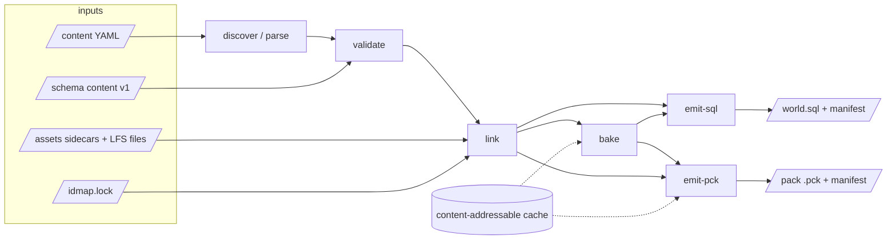
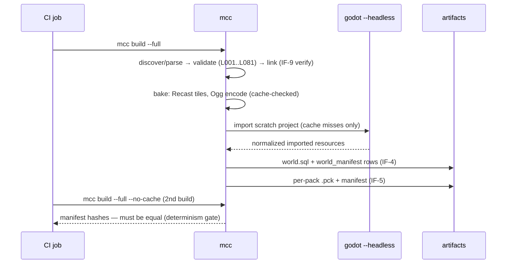
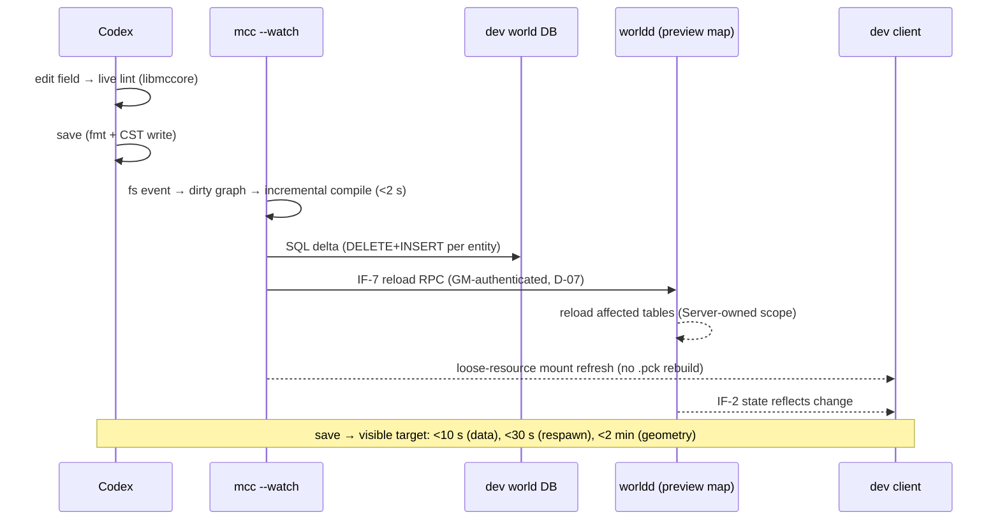
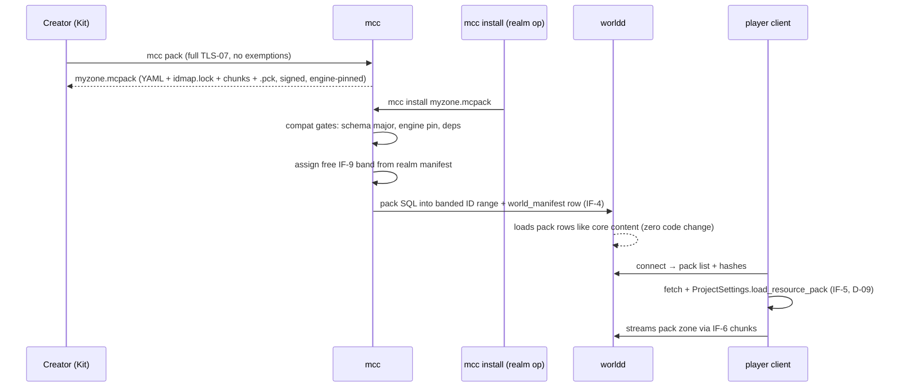

# Tools Track — Software Architecture Document

**Version:** 0.1 — 2026-07-04
**Status:** Draft for cross-track review. §3 (IF-6) and §4 (IF-8) are contract DRAFTS that require sign-off before M0 exit (A-08).
**Zooms into:** the Creator-machine containers of [02-ARCHITECTURE-OVERVIEW.md](../02-ARCHITECTURE-OVERVIEW.md) — `mcc`, Forge, Codex.
**Reads with:** [Tools PRD](../prd/tools-prd.md) v0.2, [Sync Decisions](../01-SYNC-DECISIONS.md) (D-07/D-08/D-09/D-17, A-08/A-09), [Content Schema v1](../../schema/content/README.md).

---

## 1. Purpose & scope

The Tools track builds the entire authoring-to-runtime content pipeline: two editors (Forge for spatial data, Codex for game data) and one compiler (`mcc`) that is the **single funnel** producing every runtime artifact (Overview §3.3). Tools is the M1 critical path and owns more interfaces than any other track because content is the product.

Scope: `mcc` (all stages), Forge plugin suite + `forge_core`, Codex + `libmccore`, content CI (TLS-07), community packaging (TLS-08), and the contract definitions below. Out of scope: IF-7 transport (Server owns, D-07), client pack-mount UX (Client owns, D-09), the runtime chunk streamer (Client), DCC/asset creation (Art/Music).

### 1.1 Interface ownership

| ID | Interface | Role | Defined in | Counterparties |
|----|-----------|------|-----------|----------------|
| IF-4 | Compiled world data: SQL DDL+DML + manifest table | **Owner** | §2.6, `/schema/sql/world/` | Server (consumer; DDL co-reviewed) |
| IF-5 | Client `.pck` layout, resource naming, pack manifest | **Owner** | §2.7, `/schema/pck-layout.md` | Client (consumer, D-09) |
| IF-6 | Zone chunk format: grid manifest + per-chunk payloads | **Owner** (A-08) | §3, `/schema/chunk/` | Client (streamer), Server (heightfield/navmesh/cells) |
| IF-8 | Asset registry: `assets/*.asset.yaml` sidecars | **Owner** | §4, `/schema/content/asset.schema.yaml` | Art, Music (producers), Client (indirect) |
| IF-9 | `idmap.lock`: string→numeric ID authority, namespace bands | **Owner** | §2.4 | Server (consumes numeric keys via IF-4) |
| IF-7 | Live-preview hot reload RPC | Consumer | Server SAD | Tools drives it from `mcc --watch` (D-07) |
| IF-1/2/3 | Net protocols / session handoff | — (none) | Server SAD | Codex GM console uses a Server-provided GM channel, not raw IF-2 |

Interface changes follow Baseline §5.1: cross-track sign-off, versioned in `/schema`.

---

## 2. `mcc` — Meridian Content Compiler

C++20 static-linked CLI, zero Godot dependency for every stage except `.pck` resource import (§2.7). One binary, Windows x64 + Linux x64, shared schema-generated code with `worldd`. Key deps: yaml-cpp, FlatBuffers, vendored Recast/Detour (same tree as `forge_core` and `worldd`, PRD §3.2/R4), vendored BLAKE3 (hashing), libvorbis/libogg (audio encode), MariaDB client (dev-realm push only).

The compiler is a DAG of pure stages over an immutable in-memory **content model**; every stage is separately testable and cacheable.



### 2.1 discover / parse

- Walks `/content/<namespace>/` trees (multiple packs per invocation); `pack.yaml` roots a pack, `assets/*.asset.yaml` sidecars register into the IF-8 registry (§4).
- Parses YAML into a **typed content model**: one C++ struct per schema type, generated from `/schema/content/*.schema.yaml` at `mcc` build time (the same generator emits the Server's table-loading structs — Baseline §5.1 "schema-generated edges"). Unknown fields under the declared schema major = parse error; unknown newer minors pass through untouched for forward compatibility.
- Envelope (`schema:`, `id:`) is parsed first so version dispatch (N / N−1 readers, `mcc migrate`) happens before typed decoding.
- Output: `ContentModel { entities: map<ContentId, Entity>, assets: AssetRegistry, packs: vector<PackManifest> }` plus a per-file source map (file, line) for diagnostics.

### 2.2 validate — Content Schema v1 + lint engine

Two layers, both producing structured diagnostics (`rule id, severity, entity id, field path, file:line, fix hint` — JSON output via `--diag-format=json` for Codex/Forge/CI consumption):

1. **Schema validation** — the same JSON Schema 2020-12 documents `validate_content.py` uses, evaluated by `mcc`'s embedded validator (`common.defs.yaml` `$defs` merged per the schema README contract). `validate_content.py` remains the reference implementation; a CI job cross-checks both validators over the corpus until `mcc` subsumes it, then the Python script is retired with rule IDs kept stable.
2. **Lint rules (`mcc check`)** — absorbs the existing rules verbatim and extends them. Numbering is banded; IDs are permanent:

| Band | Rules | Status |
|------|-------|--------|
| L001 | file suffix / envelope mismatch | absorbed from validate_content.py |
| L002 | id namespace ≠ owning pack namespace | absorbed |
| L010 / L011 | duplicate id / unresolved content reference | absorbed |
| L012 | reference to `deprecated: true` entity (warn) | new, M0 |
| L015 | `idmap.lock` drift: unmapped id, mapped id with no entity, band violation | new, M0 (runs in link, reports here) |
| L020 / L021 / L022 | asset ref not in IF-8 registry / registry `source` missing from LFS tree / missing license or provenance | new, M0 — **replaces the "pending asset registry" info line in validate_content.py** (TLS-07, §4.3) |
| L030–L033 | orphan/unreachable quest; prerequisite cycle; kill/collect target spawns/drops nowhere; reward-XP outlier (warn) | M1 (graph walker shared with Codex §6.4) |
| L040 / L041 | wander_radius+patrol both set (already cited by spawn.schema.yaml); spawn off-navmesh or outside zone bounds | M0 / M1 (L041 needs the §3 bake) |
| L050 / L051 | loot probabilities invalid or empty group; orphan loot table (warn) | M1 |
| L060 / L061 | vendor sells nonexistent/deprecated item; trainer teaches unknown ability | M1 |
| L070 | placeholder text, missing localization keys (warn; error on release branches) | M1 |
| L080 / L081 | ITM-03 stat-budget violation (warn M1 → error M2); chunk budget violation at export | M2 / M1 |

Same engine everywhere: `libmccore` (a thin C-ABI shared library built from the same objects) hosts parse+validate+lint for Codex live validation (§6.3) and Forge's validation dock.

### 2.3 link

- Builds the global reference graph: every `*Ref` field resolved to a `ContentId` (namespace defaulting per schema README), every asset ref resolved through the IF-8 registry to a concrete source artifact.
- Produces the **backlink index** (find-usages for Codex, orphan detection for lint) and the **dependency graph** used by incremental builds (§2.8).
- Assigns numeric IDs via IF-9 (below); emits `idmap.lock` updates for new entities (write requires `--allocate-ids`, default in editor-invoked builds; CI runs read-only and fails on L015 drift).

### 2.4 IF-9 — `idmap.lock` (this section is the contract)

**Purpose:** sole authority mapping string IDs → numeric runtime IDs used as DB keys in IF-4. Numeric IDs never appear in YAML; they never shuffle between builds; they are never reused.

**File placement:** one lock file per pack at `/content/<namespace>/idmap.lock`, so a community pack carries its own map inside its `.mcpack`.

**Format:** YAML, machine-written, human-diffable, append-only map section:

```yaml
schema: meridian/idmap@1
namespace: core
band: 0                      # assigned once, immutable (see banding)
released_watermark: 214      # highest local index frozen by a tagged release
map:                         # append-only; local index (not full numeric id)
  core:npc.kobold_miner: 1
  core:item.rusty_pickaxe: 2
  core:quest.culling_the_kobolds: 3
retired:                     # ids of deleted entities; never reallocated
  core:npc.old_test_dummy: 4
```

- **Numeric ID derivation:** runtime id = `band * 2^20 + local_index`, a `uint32`. Each *entity type* has its own DB key space (per-table keys, like classic emu cores), but the band applies uniformly within each: band 0 covers local indices 1..1,048,575 (0 reserved as null). 4,095 further bands remain for packs — far beyond any realistic realm.
- **Banding:** `core` is band 0 by definition. A pack's band is **realm-local**, assigned by `mcc install` from the realm manifest (next free band) — two independently authored packs can both ship `band: null` and coexist on any realm. A repo working alone may pin a band for dev convenience; the shipped `.mcpack` stores only local indices.
- **Collision policy on merge conflicts (PRD R6):** the `map` section is append-only, so a Git merge conflict means both branches allocated new entities. Resolution is mechanical: accept both sides (union), then run `mcc idmap verify` — if two strings landed on the same local index, `mcc idmap reassign` renumbers every entry **above `released_watermark`** deterministically (lexicographic by string id). Indices at or below the watermark are frozen forever (they exist in released artifacts and player DBs); indices above it have never left CI and are safely renumbered. CI runs `mcc idmap verify` on every `/content` PR; releases bump the watermark as part of tagging.
- **Retirement:** deleting an entity moves its entry to `retired:`; L015 fails a build that re-declares a retired string id with different semantics (`superseded_by:` in content is the sanctioned path).

### 2.5 bake

Heavy artifact generation, all outputs content-addressed into the build cache (§2.8):

- **Navmesh:** vendored Recast bake over IF-6 chunk geometry (heightfield + collision-relevant kit placements). Tile size fixed at 32 m (4×4 tiles per 128 m chunk, §3.2) so a geometry edit re-bakes only dirty tiles — this is what makes the <2 min geometry target reachable. Identical Recast code and parameters as `forge_core` (in-editor preview bakes) and `worldd` (runtime queries): bit-identical tiles by construction (PRD R4).
- **Audio:** WAV masters (from IF-8 `mus.*`/`sfx.*` sidecars) → Ogg Vorbis via embedded libvorbis with pinned encoder version and fixed quality settings per asset class — never shelling out to a system ffmpeg, for determinism.
- **Texture transcode hooks:** stage exists at M0 as pass-through; M2 art-pass wires per-class import hints (§4.2) into Godot import (§2.7) and, where mcc can do it natively (KTX2/BasisU candidate), into an in-process transcoder. Flagged open (§10.3) pending Art-track SAD.

### 2.6 emit-sql — IF-4 (this section plus `/schema/sql/world/` is the contract)

- **DDL** lives as hand-maintained SQL in `/schema/sql/world/*.sql`, co-reviewed with the Server track (they own the daemon that reads it; we own that the compiler fills it). `mcc` embeds the DDL at build time and emits it verbatim — one source of truth.
- **DML:** full deterministic dump per build — tables ordered by DDL declaration, rows ordered by primary key, `INSERT` batches of fixed size, no timestamps, no `AUTO_INCREMENT` reliance (all keys come from IF-9). Incremental **dev-realm** pushes (§7 view b) emit `DELETE`+`INSERT` deltas per dirty entity; release/CI paths always use the full dump (PRD §5 — nightly realms are rebuilt from clean artifacts, never hot-patched).
- **Manifest table** (worldd refuses mismatches, Overview IF-4):

```sql
CREATE TABLE world_manifest (
  pack_namespace   VARCHAR(32)  NOT NULL,
  pack_version     VARCHAR(32)  NOT NULL,
  id_band          INT UNSIGNED NOT NULL,
  content_hash     CHAR(64)     NOT NULL,  -- BLAKE3 of the pack's canonical source tree
  schema_version   INT UNSIGNED NOT NULL,  -- content schema major
  mcc_version      VARCHAR(32)  NOT NULL,
  PRIMARY KEY (pack_namespace)
);
```

The same `content_hash` appears in the IF-5 pack manifest — this is the three-way tie (server DB / client pack / source tag) the deployment view in the Overview §5 depends on.

### 2.7 emit-pck — IF-5 (this section plus `/schema/pck-layout.md` is the contract)

- **Resource layout is by ID, never by source path:** `res://meridian/<namespace>/<type>/<name>.<ext>` derived from the content/asset ID (e.g. `core:art.char.kobold.miner` → `res://meridian/core/art/char/kobold/miner.scn`). Compiled data tables (client-visible subset only — no drop rates, no AI internals) ship as FlatBuffers blobs at `res://meridian/<namespace>/tables/<type>.bin`. Pack manifest at `res://meridian/<namespace>/pack.manifest.json`: pack id, semver, content hash, content-schema major, **pinned Godot version** (PRD R8), resource list with per-resource BLAKE3.
- **The Godot headless determinism problem, addressed.** Source assets (glTF, PNG, WAV) must become engine-imported resources (`.scn`, `.ctex`, `.oggvorbisstr`), and only Godot's importer can produce some of those. Godot import output is *not* byte-deterministic across runs (embedded metadata, hash-salted cache paths, parallel import ordering). Split the responsibility:
  1. **Import** — `godot --headless --import` runs against a scratch project generated by `mcc` (pinned engine build from the Creator Kit; refuse to run against any other version). Imported artifacts are **normalized** (strip volatile metadata via a small Godot-side normalizer script) and stored in the content-addressable cache keyed by `(source BLAKE3, import hints, godot version, importer version)`. A cache hit skips Godot entirely.
  2. **Assemble** — `mcc` writes the `.pck` container itself (the format is simple: magic, version, aligned file table + blobs): entries sorted by resource path, zeroed timestamps, fixed alignment. Byte-identical output given identical entry blobs.
  - Double-build determinism therefore holds *unconditionally* for the container and tables, and for imported assets holds via the cache (second build is all cache hits). CI's double-build job additionally runs one build with `--no-cache` and compares **manifest hashes** (per-resource payload hashes), which catches real content divergence while tolerating any residual importer noise the normalizer misses; any such tolerance is logged and tracked as a bug.

### 2.8 Incremental builds

- **Dirty tracking:** per-file, keyed by `(file BLAKE3, schema version, mcc version, stage version)`. The link-stage dependency graph maps a dirty entity to its downstream artifacts: the entity's own SQL rows/table blob entries, plus indexes that embed it (backlink-driven, e.g. a renamed item dirties vendors listing it).
- **Content-addressable cache** at `.mcc-cache/` (workstation) and a shared CI cache: bake and import outputs stored by input-key hash; eviction by LRU size cap. The cache is an optimization only — `mcc build --full --no-cache` must produce identical manifests (verified nightly).
- Targets: single-entity rebuild < 2 s; see §9.2 for the full table.

**CLI surface (v1):** `mcc build [--full|--watch] | check | fmt | diff A B | pack | install | uninstall | migrate | idmap verify|reassign` (PRD §2.2/§7).

---

## 3. IF-6 — Zone chunk format v1 **DRAFT** (discharges A-08)

> **Status: DRAFT. Requires Client-track (runtime streamer) and Server-track (heightfield/navmesh/cell metadata) sign-off before M0 exit.** Contract files land in `/schema/chunk/` (`chunk-manifest.schema.yaml`, `chunk-payload.md`); the reserved `chunk_manifest` field in `zone.schema.yaml` then points at the manifest.

### 3.1 Coordinate system (settles the question `common.defs.yaml` and `spawn.schema.yaml` left open)

- **Zone-local coordinates, permanently.** Every zone is its own map with its own origin; there is no global world-space stitching in 1.0 (zone transitions are server-side teleports, WoW-instance style). Rationale: (a) single-precision float error grows past ~8–16 km from origin — zone-local keeps every coordinate small on both the Godot client and the server physics/AoI path with no origin-rebasing machinery; (b) all existing content (`spawn`, `zone.pois`, `graveyards`) is already authored zone-local; (c) `worldd` maps are per-zone anyway (grid AoI per map, CMaNGOS-informed). The `position` def's provisional note in `common.defs.yaml` becomes permanent wording.
- Axes: Godot convention — right-handed, **Y-up**, X east, −Z north. The chunk grid tiles the **XZ plane**. Server adopts the same axes for these artifacts (no per-consumer axis flips; Server confirms in sign-off).
- Zone origin is authored in Forge (default: terrain bounds min-corner snapped to the grid); chunk indices may be negative (existing Zone-01 spawns at x ≈ −300 stay valid).

### 3.2 Grid & headline numbers

| Parameter | Value | Justification |
|---|---|---|
| Chunk size | **128 m × 128 m** | At 7 m/s run speed a chunk crossing is ~18 s — comfortable streaming cadence; a 2×2 km zone is a manageable 16×16 grid; fine enough that per-chunk LFS/node budgets (PRD §2.4) are meaningful; coarse enough that a chunk is a sensible AoI cell for `worldd` interest management. Divides cleanly into Recast tiles and terrain regions (A-09 evaluation criterion: Terrain3D regions must align to 128 m). |
| Heightfield | 129×129 samples/chunk, 1 m spacing, f32, row-major, shared-edge convention (row/col 128 duplicates the neighbor) | 1 m resolution suffices for movement validation (OPS-03); 66 KB/chunk raw. |
| Navmesh tile | 32 m ⇒ 4×4 tiles/chunk | Small enough for sub-2-min dirty re-bakes; matches Recast sweet spot at agent radius ~0.5 m. |
| LOD rings | ring 0–1 (chunk distance ≤ 1): full scene; ring ≥ 2: per-chunk **proxy mesh** (merged low-poly bake, no gameplay nodes); beyond `far_ring` (manifest field, default 6): unloaded, terrain clipmap only | No Nanite equivalent (D-17 risk); proxies keep draw calls inside the ≤2,500 Low budget. Client streamer may tighten rings per min-spec findings — ring policy is a *client* runtime choice; the format only guarantees a proxy exists per chunk. |

### 3.3 Zone grid manifest (`<zone>.chunks.json`, emitted by Forge, consumed by mcc/Client/Server)

```json
{
  "format_version": 1,
  "zone": "core:zone.zone01",
  "chunk_size_m": 128,
  "origin": { "x": -1024.0, "z": -1024.0 },
  "grid": { "min_cx": -8, "min_cz": -8, "max_cx": 7, "max_cz": 7 },
  "far_ring": 6,
  "chunks": [
    { "cx": -3, "cz": 0, "hash": "blake3:…", "scene": "…", "proxy": "…",
      "server": "…", "deps": ["core:art.kit.greybox.rock01"] }
  ]
}
```

Sparse chunk list (holes allowed); `deps` lists asset IDs so pack installers and the streamer can prefetch; `hash` covers both payloads for incremental invalidation.

### 3.4 Per-chunk payload

Two artifacts per chunk, split exactly on the client/server consumer line:

- **Client payload** (into the IF-5 `.pck`): compiled Godot scene `res://meridian/<ns>/zones/<zone>/chunks/<cx>_<cz>.scn` — terrain tile reference, kit placements resolved from asset IDs at export, baked lighting hooks, ambience/music volume nodes; plus the proxy mesh `…/<cx>_<cz>.proxy.scn`. No server-meaningful data.
- **Server payload** (loaded by `worldd`, referenced from IF-4): one FlatBuffers file `<zone>/<cx>_<cz>.chunk.bin` (schema in `/schema/chunk/chunk.fbs`) containing:
  - `format_version` (uint16) — also the first field of every chunk file; loaders reject unknown majors,
  - heightfield block (§3.2),
  - collision: heightfield collider params + static collider list (shape, transform) for collision-relevant kit placements (the `dressing-only` flag in Forge excludes props),
  - navmesh: 4×4 Recast tile blobs (Detour serialized, versioned by Recast vendored rev),
  - cell metadata: AoI cell id (= chunk coord), liquid regions (type + surface height), zone-line/instance-entrance markers, PvP/rest flags, graveyard/leash volume references by content id.

**Versioning/migration policy (A-08 second half, due M1 start):** `format_version` bumps are re-export events — Forge re-exports all zones; loaders keep at most N−1 read support for one milestone. Cheap because export is automated and content volume is small pre-M2; policy revisited at M2 when community zones exist.

---

## 4. IF-8 — Asset registry v1 **DRAFT**

> **Status: DRAFT — requires Art and Music track sign-off** (they author the sidecars). Schema lands at `/schema/content/asset.schema.yaml` (`meridian/asset@1`), validated like any content type.

### 4.1 Sidecar schema — `content/<ns>/assets/**/*.asset.yaml`

One sidecar per asset ID (asset classes with multi-file sources list them all):

```yaml
schema: meridian/asset@1
id: core:art.char.kobold.miner            # same grammar as content ids (art|mus|sfx prefix)
class: character_model                     # enum: character_model | kit_piece | texture_set |
                                           #       icon | music | sfx | ambience_bed
source: assets/art/char/kobold/miner.glb   # path relative to pack root, in the LFS tree
license: CC0-1.0                           # SPDX expression — required (TD-09)
provenance:                                # required (TD-09, A-07)
  origin: polyhaven                        # original | polyhaven | ambientcg | kenney | ai | other
  url: https://…                           # required unless origin=original
  author: "…"
  modified: true                           # derivative-work flag
import:                                    # per-class hints, class-specific sub-schema
  # character_model example:
  lod_bias: 0
  collision: none
  # texture example: srgb: true, compress: bptc
  # music example: loop: true, bpm: 96, bars: 8   (feeds AudioStreamInteractive)
```

Deliberately *not* in the sidecar: display metadata (lives in content files) and numeric IDs (assets get IF-9 entries like any entity, in the `art./mus./sfx.` type spaces).

### 4.2 Resolution: asset ref → `.pck` resource

At link time, `core:art.char.kobold.miner` → sidecar → `source` file → import pipeline (§2.7, hints from `import:`) → `res://meridian/core/art/char/kobold/miner.scn`. The resource path is derived from the **ID**, so Art can move/rename source files freely (Overview §3.5 "nothing references file paths"); kit re-exports never break placements (Forge's `KitInstance` resolves by ID at load). The IF-5 pack manifest records the ID→resource→hash triple, which is also what the client's pack verification checks.

### 4.3 TLS-07 existence lint

L020/L021/L022 (§2.2) turn `validate_content.py`'s parting info line — *"asset existence checks pending asset registry"* — into hard gates: every `art./mus./sfx.` ref must resolve to a sidecar (L020), the sidecar's `source` must exist in the LFS checkout (L021; CI runs with `GIT_LFS_SKIP_SMUDGE` and checks pointer presence + size only, so lint doesn't force a full LFS pull), and license/provenance must be complete (L022 — warn in dev, error in `mcc pack` and release branches, per A-07). Interim: until Art publishes first sidecars (M0), L020 runs as warn behind `--assets=warn`; flips to error at M0 exit.

---

## 5. Forge — architecture

Godot 4.6 editor plugin suite: GDScript for UI/glue, `forge_core` GDExtension (C++20) for heavy ops. Ships inside the game's Godot project; heavy logic stays in `forge_core` behind a thin editor-facing layer to shrink the API-churn surface (PRD R7).

### 5.1 Module layout

```
addons/meridian_forge/
  plugin.cfg / forge_plugin.gd        # EditorPlugin entry: registers docks, node types, gizmos
  docks/                              # zone_dock, kit_palette (IF-8-fed), validation_panel,
                                      #   build_panel (mcc invoker UI), preview_overlay (M2, TLS-06)
  nodes/                              # custom node classes + EditorNode3DGizmoPlugin per type:
    kit_instance.gd                   #   KitInstance — resolves kit asset ID → scene at load
    spawn_point.gd                    #   MeridianSpawnPoint — spawn-table ref, respawn, leash gizmo
    patrol_path.gd                    #   MeridianPatrolPath (Path3D) — waypoints + wait times
    volume.gd                         #   MeridianVolume — subtype: leash|ambience|music|poi|graveyard|entrance
  terrain/                            # ITerrainBackend seam (§5.2)
  export/                             # chunk_exporter.gd → forge_core; yaml round-trip (§5.3)
gdextension: forge_core/              # C++: chunk export, Recast bake, terrain ops, heightfield export
```

### 5.2 Terrain behind an interface (A-09 swap seam)

All Forge terrain interaction goes through `ITerrainBackend` (a `forge_core`-defined interface): `sculpt/paint ops`, `paint layer ↔ art.* terrain-set binding`, `region alignment query (must tile on the 128 m grid)`, `export_heightfield(chunk) → f32[129×129]`, `collision-relevant geometry enumeration for navmesh input`. Terrain3D (adopted or forked, per the A-09 gate at M0 exit) and a potential in-house GDExtension are both implementations of this seam; docks, chunk exporter, and navmesh bake never touch the terrain plugin's API directly. The A-09 evaluation explicitly scores Terrain3D on: 128 m region alignment, clipmap LOD on min-spec, paint-layer count, heightfield extraction fidelity.

### 5.3 YAML round-trip without destroying hand-edits

The scene (`.tscn`) is authoritative for **spatial** data; `/content` YAML is the export target the server actually reads (PRD §2.1 spatial exception). Rules:

- Export is a **canonical projection**: node tree → typed model → serialized via the same `mcc fmt` emitter (via `libmccore`), so an untouched re-export is byte-identical and diffs are semantic.
- Every exported file's BLAKE3 is recorded in the scene's Forge metadata. On zone open, if the YAML on disk differs from the recorded hash (a hand-edit or a Git pull), Forge **imports the YAML back into the nodes** field-by-field before allowing edits — the YAML wins, because it is what shipped.
- Fields present in YAML that Forge doesn't model (e.g. a newer schema minor's optional field) are preserved as opaque per-node metadata and re-emitted verbatim on export — hand-edits survive even when Forge is older than the schema.
- Conflict (both scene and YAML changed since last sync) surfaces a three-way diff dialog; no silent overwrite in either direction.

### 5.4 Chunk exporter & mcc invoker

`chunk_exporter` (forge_core) partitions the zone on the §3 grid, validates per-chunk budgets against Client-track streaming budgets (L081 at export time, PRD §2.4), writes the grid manifest + client scenes + server FlatBuffers payloads, and triggers `mcc build` scoped to the zone. The **mcc invoker** is a shared GDScript service: spawns `mcc` with `--diag-format=json`, streams diagnostics into the validation dock (click → select offending node), manages the `--watch` session for the M2 live loop, and exposes "teleport my dev character here" via the IF-7 GM channel.

---

## 6. Codex — architecture

C#/.NET 8 LTS + Avalonia 11, MVVM (CommunityToolkit.Mvvm). Zero engine dependency. Talks to the pipeline two ways: **in-process** `libmccore` (C ABI: parse/validate/lint/fmt/id-index) for anything interactive, and **subprocess `mcc`** for builds and dev-realm pushes.

### 6.1 MVVM structure

```
Meridian.Codex/
  Models/          # generated from /schema/content (same generator as mcc's structs, C# target)
  ViewModels/      # per-editor VMs (NpcEditorVm, ItemEditorVm, QuestGraphVm, …)
                   #   + shared: IdIndexVm (pickers, backlinks), DiagnosticsVm, GmConsoleVm
  Views/           # Avalonia XAML; schema-driven form generator renders leaf editors from
                   #   schema metadata (types, enums, ranges, units) — new optional fields
                   #   appear in forms without hand-written UI
  Services/        # LibMcCore (P/Invoke), MccRunner (subprocess), YamlCst (§6.2),
                   #   ContentWorkspace (file watcher, Git status surface), DevRealm (IF-7 trigger)
```

### 6.2 YAML round-trip fidelity — concrete approach

**Decision: a CST-preserving layer (`Meridian.Yaml.Cst`) built on YamlDotNet's low-level parser, not YamlDotNet object (de)serialization.** YamlDotNet's serializer round-trip loses comments, anchors, key order, and scalar styles — unacceptable for hand-annotated content files. `Scanner(…, skipComments: false)` does surface comment tokens, so we build a lossless concrete syntax tree from the event/token stream; edits mutate CST nodes in place; emission replays untouched tokens **verbatim** (original bytes), serializing only mutated subtrees.

**Honest trade-off:** this is ~2–3 kLOC of owned infrastructure with real edge cases (multi-line scalars, flow style, anchors — anchors are banned by `mcc fmt` anyway, which helps). We accept it because comment preservation is the difference between "Codex is safe on files humans also edit" and "Codex is Codex-only." Guarantees, in order of strength: (1) *semantic identity* on every round-trip — property-tested (open→save→reparse ≡ parse, PRD §11.2); (2) *byte identity for untouched regions*; (3) key order: preserved for existing keys, new keys inserted at canonical position — and since every save runs `mcc fmt` (canonical order) anyway, ordering churn converges to zero after one save. Escape hatch: files the CST layer cannot faithfully represent open read-only with a "reformat with mcc fmt to edit" prompt — never silent destruction.

### 6.3 Validation-as-you-type

Keystroke → VM change → debounced (~150 ms) `libmccore.validate_entity(json, workspace_handle)` → schema + lint diagnostics rendered inline on the exact field (schema `json_path` maps to the form control). Workspace-scope rules (L010/L011/L015, backlinks) run against `libmccore`'s incremental in-memory index, updated by the file watcher — the on-disk index persists so a 10k-entity workspace opens warm (PRD M3 perf risk).

### 6.4 Quest graph editor

Node-graph canvas over quest entities: nodes = quests, edges = prerequisites; branch/exclusive groups as grouped ports (M2, QST-02). **Control decision:** custom Avalonia canvas (virtualized panel + connection layer) rather than adopting a third-party node control — surveyed options (NodeNetwork is WPF/ReactiveUI-bound; Nodify is WPF-only; Avalonia-native options are immature). A quest DAG needs ~10% of a general node editor: acceptable build, no license/abandonment exposure. The **graph walker** (reachability, cycle detection, "walk the chain" simulation) lives in `libmccore` — the same code that powers lint L030/L031, so the canvas and CI can never disagree.

### 6.5 mcc invocation & live preview trigger

Save → `mcc fmt` (via libmccore, in-process) → write via CST layer → `MccRunner` fires `mcc build --watch`-attached incremental compile → on success, `mcc` pushes SQL delta + IF-7 reload (D-07) to the `dev-realm.toml` target; Codex surfaces the push result and round-trip latency (the §9.2 targets are measured here and reported to tools-CI perf telemetry). GM console panel (OPS-02): connect via GM auth, spawn-this-NPC / give-item / set-quest-state buttons on editor pages, sharing the DevRealm service.

---

## 7. Runtime views

### 7.1 (a) Cold full compile: `/content` → SQL + `.pck`



### 7.2 (b) TLS-06 live loop (<10 s data edit)



### 7.3 (c) Community pack: author → player (unmodified server)



---

## 8. Milestone build plan

| Milestone | mcc | Codex | Forge | Contracts |
|---|---|---|---|---|
| **M0** | v0: discover/parse/validate/link, `emit-sql` (NPC+item+ability+loot+vendor+quest+spawn+zone), basic `emit-pck` (tables + assets, no chunks), `build/check/fmt`, IF-9 allocator + `idmap verify`, deterministic double-build in CI (Win+Linux), golden corpus | alpha: shell, schema-driven forms, ID index/pickers, NPC + item editors round-tripping via CST layer, live validation via libmccore | terrain spike (A-09 gate) + EditorPlugin skeleton: one dock, one gizmoed node, one forge_core call | **IF-6 + IF-8 drafts signed** (this doc §3/§4 → `/schema`); IF-4 DDL v1 with Server; validate_content.py cross-check job |
| **M1** | v1: incremental builds + cache, full lint bands L01x–L07x + L081, `mcc diff`, chunk ingestion (bake navmesh from IF-6), nightly artifacts | v1: NPC (AI+abilities, D-08), item, **quest graph editor**, loot, spawn tables, vendors, curves; GM console basic | v1: terrain (per A-09), kit placement, spawn/patrol/volume nodes + gizmos, Recast bake, **chunk export end-to-end** (Zone-01 = capability bar) | IF-6 migration policy (A-08 pt 2); semi-live loop (targets ×2) |
| **M2** | `--watch` full live loop on IF-7; texture transcode hooks live; L080 → error | recipes, talents, AH taxonomy, aura forms, QST-02 objectives; live-preview trigger | art-pass kit-remap, WLD-02 day/night authoring, live spawn preview overlay, instance markup | localization decision due (PRD open Q2) |
| **M3** | `pack/install/uninstall`, band assignment, compat gates, `.mcpack` signing | 10k-entity index perf | Creator Kit packaging (pinned Godot + Forge + docs) | IT-M3: external pack on unmodified server |

M0 exit criteria (hard, per PRD R3): compiler pipe proven end-to-end on IT-M0 content; A-09 terrain decision made; IF-6/IF-8 signed; Forge feature set for M1 frozen.

---

## 9. Quality attributes

### 9.1 Determinism
Same source tree + same `mcc` + same pinned Godot ⇒ byte-identical SQL and `.pck` containers, content-identical manifests (§2.7 mechanism). Gates: per-PR double-build hash compare on Windows **and** Linux runners (they must agree with each other, PRD §11.1); nightly `--no-cache` full rebuild vs cached manifest equality. Any nondeterminism is a P0 tools bug — it silently breaks pack verification (TLS-08) and the three-way content-hash tie (§2.6).

### 9.2 Speed targets (tracked as tools-CI perf tests)

| Path | Target |
|---|---|
| Single-entity incremental compile | < 2 s |
| Save → visible (data / respawn / geometry) | < 10 s / < 30 s / < 2 min (M1: ×2) |
| Full zone build from clean | < 15 min |
| Full-world build (M3, 4 zones) | < 30 min |
| Codex open on 10k-entity workspace / keystroke validation | < 5 s warm / < 150 ms debounce budget |

### 9.3 Editor responsiveness & robustness
All `mcc`/libmccore calls off the UI thread; Codex undo/redo per document; Forge relies on native editor undo (custom nodes get it free). No silent data destruction: §5.3 and §6.2 both terminate in explicit conflict UI, never overwrite.

### 9.4 Cross-platform `mcc`
Windows x64 + Linux x64 from one CMake tree, static-linked; CI runs the golden corpus and determinism gate on both; path handling normalized (forward slashes in all manifests), locale-independent (no `std::locale` formatting), sorted directory iteration everywhere (never trust readdir order).

---

## 10. Technology decisions, rejected alternatives, risks

### 10.1 Decisions (with rejected alternatives)

| Decision | Rejected | Why |
|---|---|---|
| `mcc` writes `.pck` containers itself; Godot headless only for resource **import**, cache-wrapped (§2.7) | Full `godot --export` pipeline | Export is non-deterministic and drags editor config into CI; container format is simple enough to own |
| Vendored Recast shared by forge_core/mcc/worldd | Godot NavigationServer bake | Headless Linux bake without engine; server queries identical Detour data (PRD §3.2, R4) |
| IF-9: per-pack YAML lock, band×2²⁰ split, append-only + release watermark + deterministic reassign (§2.4) | Global sequential IDs; hash-derived IDs | Global sequencing can't survive parallel packs; hash IDs collide and aren't compact uint32 DB keys |
| Zone-local coordinates, no world stitching (§3.1) | Global world space with origin rebasing | Float precision + matches shipped schemas + per-zone server maps; rebasing buys nothing for a teleport-transition world |
| 128 m chunks, 32 m Recast tiles, 129×129 heightfield (§3.2) | 64 m (2× manifest/stream churn), 256 m (budget granularity too coarse, dirty re-bakes too big) | Middle of the tradeoff; divides cleanly for both consumers |
| Codex: CST-preserving YAML layer over YamlDotNet's token stream (§6.2) | YamlDotNet object serializer; full custom parser | Serializer destroys comments/order; full parser is months — token-replay CST is the 20% that preserves 100% of bytes |
| Custom Avalonia node canvas for quests (§6.4) | NodeNetwork, Nodify | WPF-bound or immature on Avalonia; DAG needs are narrow |
| BLAKE3 for all content/artifact hashing | SHA-256 | ~10× faster on big asset trees; vendored, no OpenSSL dep in mcc |
| Avalonia 11 + .NET 8 for Codex (PRD §4 recommendation, confirmed) | WPF, Electron, Qt | MIT license fit, cross-platform option kept open, no Chromium footprint, LGPL friction avoided |

### 10.2 Risks (tools-SAD-specific; PRD §13 R1–R8 remain in force)

| # | Risk | Mitigation |
|---|---|---|
| TS-1 | Godot import normalizer misses volatile bytes → flaky determinism gate | Manifest-hash comparison as the binding gate (§2.7); importer-noise findings logged and fixed; importer version in cache key |
| TS-2 | CST YAML layer edge cases corrupt hand-edited files | Property tests + read-only fallback (§6.2); `mcc fmt` canonical form narrows the input space |
| TS-3 | IF-6 draft numbers (128 m, ring policy) fail min-spec streaming tests | Numbers are manifest **fields**, not constants, in every consumer; changing them is a re-export, not a format break |
| TS-4 | libmccore C ABI churn between Codex and mcc releases | ABI version handshake; Codex refuses mismatched libmccore with an update prompt; both ship from one repo/tag |
| TS-5 | Watermark discipline failure — a released numeric ID gets reassigned | `mcc idmap verify` diffs against the previous release tag's lock files in the release pipeline; refuse to tag on any frozen-index change |

### 10.3 Open questions / flagged gaps (not inventing IF numbers)

1. **Dev-realm SQL apply channel has no IF number.** `mcc` writing the dev world DB directly (§7.2) is an interface in all but name; today it hides behind IF-4 + IF-7. Propose registering it (or explicitly folding it into IF-7's contract) at the Overview level — Overview owners to assign.
2. **Texture transcode ownership** (§2.5): per-class import parameters need the Art-track SAD's format decisions (BPTC vs ASTC vs BasisU). Blocked on Art SAD; hooks are in place.
3. **Localization** (PRD open Q2): `mcc` reserves string-key structure; extraction pipeline undecided, due end of M2. L070 currently checks placeholders only.
4. **`.mcpack` signing scheme** (§7.3 says "signed"): key distribution/trust model undefined — no baseline decision. Needs a TD before M3; flagged, not designed here.
5. **Pack discovery/registry** (PRD open Q1): out of 1.0, revisit M3.
6. **Spawn-condition evaluation order** (PRD open Q3): schema-reserved fields await Server confirmation with WLD-02 at M2.
7. **IF-6 sign-off logistics:** this draft (§3) requires Client + Server review before M0 exit; review meeting to be scheduled by track leads — A-08 is not discharged until `/schema/chunk/` merges with both approvals.
